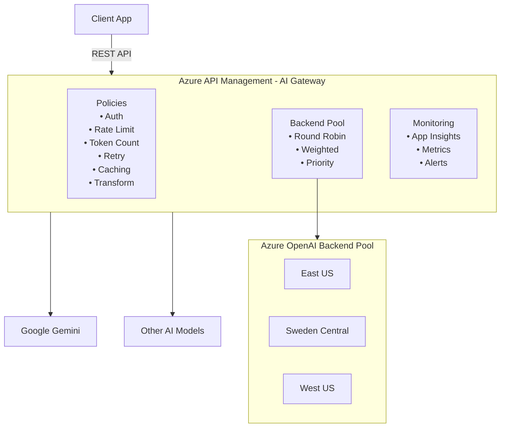
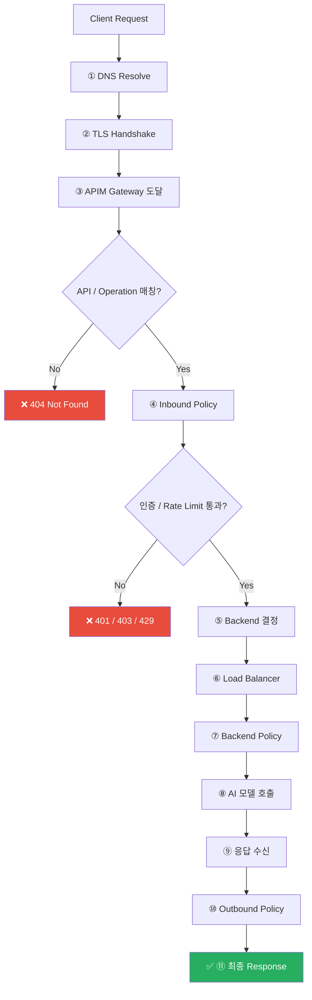

# Azure API Management AI Gateway 실습 레포지토리

Azure API Management(APIM)을 활용하여 다양한 AI 모델(Azure OpenAI, Google Gemini, Anthropic Claude 등)을 통합 관리하는 **AI Gateway** 패턴을 실습하는 레포지토리입니다.

## Lab 진행 상태

| Lab | 제목 | 상태 |
|-----|------|------|
| Lab 1 | APIM 기본 설정 | ✅ 완료 |
| Lab 2 | Azure OpenAI 백엔드 연결 | ✅ 완료 |
| Lab 3 | 백엔드 풀 & 로드밸런싱 | ✅ 완료 |
| Lab 4 | AI 전용 정책 (Rate Limit, Caching, Retry) | ✅ 완료 |
| Lab 5 | 멀티 모델 Gateway (Gemini, Claude 등) | 🔄 확인중 |
| Lab 6 | 모니터링 & 로깅 | ✅ 완료 |
| Lab 7 | 고급 패턴 (A/B 테스트, Content Safety 등) | 🔄 확인중 |
| Lab 8 | 리소스 정리 | ✅ 완료 |

## 이런 요구사항이 있다면, 이 실습으로 해결하세요

> 💡 아래 비즈니스 시나리오 중 하나라도 해당되면, 해당 Lab을 따라하면 바로 적용할 수 있습니다.

### Lab 1–2: APIM 기본 설정 & Azure OpenAI 연결

| # | 비즈니스 요구사항 |
|---|-----------------|
| 1 | Azure OpenAI API 키를 개발자에게 직접 노출하지 않고, **중앙 게이트웨이**를 통해서만 접근시키고 싶다 |
| 2 | AI 호출에 대한 **인증/인가를 Managed Identity**로 관리하여 키 유출 위험을 없애고 싶다 |
| 3 | 여러 팀이 같은 Azure OpenAI를 사용하되, **Subscription Key별로 사용량을 추적**하고 싶다 |
| 4 | AI API 호출에 대한 **감사 로그**(누가, 언제, 어떤 모델을 호출했는지)를 남기고 싶다 |
| 5 | 내부 서비스가 Azure OpenAI를 호출할 때, **단일 엔드포인트 URL**만 알면 되게 하고 싶다 |

### Lab 3: 백엔드 풀 & 로드밸런싱

| # | 비즈니스 요구사항 |
|---|-----------------|
| 1 | Azure OpenAI가 한 리전에서 장애 나도 **서비스가 중단되지 않도록** 멀티 리전으로 구성하고 싶다 |
| 2 | 특정 리전(PTU)에 트래픽을 70% 보내고, 나머지를 PayGo 리전으로 **분산**하고 싶다 |
| 3 | 429(Rate Limit) 에러가 연속 발생하면 **자동으로 다른 리전으로 전환**(Circuit Breaker) 되게 하고 싶다 |
| 4 | Primary 리전이 복구되면 **수동 개입 없이 자동으로 트래픽을 복원**하고 싶다 |
| 5 | 백엔드 풀만으로는 장애 백엔드에 계속 요청이 가는데, **장애 감지 후 자동 제외**되게 하고 싶다 (→ Circuit Breaker 필수) |
| 6 | PTU 리전은 429가 나도 계속 쓰고 싶지만, PayGo 리전은 429 시 **즉시 다른 리전으로 전환**하고 싶다 (→ `acceptRetryAfter` 설정) |
| 7 | 모델 배포 실패(404)나 서버 오류(500) 시에도 **자동으로 정상 리전으로 전환**하고 싶다 (→ Circuit Breaker 에러 코드 커스터마이징) |
### Lab 4: AI 전용 정책 (Rate Limit, Caching, Retry)

| # | 비즈니스 요구사항 |
|---|-----------------|
| 1 | 팀/서비스별로 **분당 토큰 사용량을 제한**하여 한 팀이 전체 할당량을 독점하지 못하게 하고 싶다 |
| 2 | 동일하거나 유사한 질문이 반복될 때 **캐시로 즉시 응답**하여 비용을 절감하고 싶다 |
| 3 | 429 에러 발생 시 클라이언트가 직접 재시도하지 않고, **게이트웨이가 자동 재시도**하게 하고 싶다 |
| 4 | 프롬프트+응답의 **토큰 사용량을 실시간 메트릭**으로 수집하여 비용을 모니터링하고 싶다 |

### Lab 5: 멀티 모델 Gateway (Gemini, Claude 등)

| # | 비즈니스 요구사항 |
|---|-----------------|
| 1 | Azure OpenAI와 Google Gemini를 **동일한 API 포맷**(OpenAI 호환)으로 호출하게 하고 싶다 |
| 2 | 클라이언트 코드 변경 없이 **백엔드 모델을 교체**(예: Gemini -> GPT-5.2)할 수 있게 하고 싶다 |
| 3 | 모델 프로바이더가 장애일 때 **다른 프로바이더로 자동 Fallback**하고 싶다 |
| 4 | 각 프로바이더마다 다른 인증 방식(API Key, OAuth 등)을 **게이트웨이에서 통합 관리**하고 싶다 |
| 5 | 기존 모델 Retirement, 혹은 신규 모델(Claude, Llama 등)을 추가할 때 **클라이언트 배포 없이 게이트웨이 설정만으로** 연결하고 싶다 |

### Lab 6: 모니터링 & 로깅

| # | 비즈니스 요구사항 |
|---|-----------------|
| 1 | 모델별/팀별 **토큰 소비량 대시보드**를 만들어 경영진에게 리포트하고 싶다 |
| 2 | 응답 시간이 P95 기준 3초를 초과하면 **자동 알림**(Slack/Teams/이메일)을 받고 싶다 |
| 3 | 429 에러율이 급증할 때 **용량 확장이 필요한 시점**을 사전에 파악하고 싶다 |
| 4 | AI 호출의 **요청/응답 본문을 로깅**하여 품질 분석(환각 감지 등)에 활용하고 싶다 |
| 5 | 월별 AI 인프라 비용을 **팀/프로젝트별로 차지백(Chargeback)**하고 싶다 |

### Lab 7: 고급 패턴 (A/B 테스트, Content Safety, 스트리밍)

| # | 비즈니스 요구사항 |
|---|-----------------|
| 1 | 새 모델 버전(GPT-4o latest)을 **트래픽 10%로 카나리 배포**하고 성능을 비교하고 싶다 |
| 2 | 사용자 입력에 욕설/유해 콘텐츠가 포함되면 **AI 모델 호출 전에 차단**하고 싶다 |
| 3 | ChatGPT처럼 **실시간 스트리밍 응답**(SSE)을 게이트웨이를 거쳐 제공하고 싶다 |
| 4 | PTU 리전에서 429가 발생하면 **자동으로 PayGo 리전으로 Spillover**하고 싶다 |

---

## 아키텍처 개요



## 핵심 학습 목표

| 영역 | 학습 내용 |
|------|----------|
| **AI Gateway 패턴** | APIM을 AI 모델 앞단의 통합 게이트웨이로 구성 |
| **Backend Pool** | 3개 Azure OpenAI 인스턴스(East US, Sweden, West US) 로드밸런싱 |
| **정책(Policy)** | 토큰 기반 Rate Limiting, Retry, Circuit Breaker, Caching, IP 제한 |
| **멀티 모델** | Azure OpenAI, Gemini, Claude 등 다양한 모델 통합 |
| **모니터링** | Application Insights를 통한 토큰 사용량, 지연 시간 추적 |
| **IaC** | Bicep을 활용한 인프라 자동 배포 |

## APIM 요청 처리 흐름

클라이언트가 AI Gateway에 API 호출을 하면, 요청은 아래 단계를 **순서대로** 거칩니다.  
각 단계에서 조건에 맞지 않으면 즉시 에러를 반환하고, 더 이상 진행하지 않습니다.



> ※ 어떤 단계에서든 에러 발생 시 → `<on-error>` 정책이 실행됩니다

### 단계별 설명

| 단계 | 구간 | 설명 | 실패 시 |
|:----:|------|------|---------|
| ①② | 네트워크 | DNS 해석 + TLS 핸드셰이크로 보안 연결을 맺습니다 | 연결 실패 |
| ③ | APIM 도달 | 요청이 APIM 게이트웨이에 도착합니다 | — |
| ④ | API 매칭 | URL 경로와 HTTP 메서드로 등록된 API/Operation을 찾습니다 | **404** |
| ⑤ | **Inbound** | 인증 → Rate Limit → 캐시 조회 → 라우팅 순서로 정책 실행 | **401/403/429** |
| ⑥ | 라우팅 | 백엔드 풀에서 Round Robin으로 인스턴스를 선택합니다 | — |
| ⑦ | **Backend** | retry 정책으로 429/500 에러 시 다른 인스턴스에 재시도 | **502/504** |
| ⑧⑨ | AI 모델 호출 | 실제 Azure OpenAI 등 백엔드에 요청하고 응답을 받습니다 | **500** |
| ⑩ | **Outbound** | 토큰 메트릭 수집, 캐시 저장, 응답 변환을 수행합니다 | — |
| ⑪ | 응답 반환 | 클라이언트에게 최종 응답을 반환합니다 | — |

> **💡 이 실습을 완료하면**, 위 흐름의 각 단계를 직접 구성하고 테스트할 수 있습니다:
>
> | 단계 | 실습 | 직접 해보는 것 |
> |------|------|--------------|
> | ④ API 매칭 | [Lab 1](labs/lab01-setup-apim/README.md), [Lab 2](labs/lab02-azure-openai-backend/README.md) | APIM 생성, API 등록, 첫 호출 |
> | ⑤ Inbound 정책 | [Lab 4](labs/lab04-policies/README.md) | Rate Limit, 캐시, 인증 정책 적용 |
> | ⑥ 백엔드 풀 | [Lab 3](labs/lab03-backend-pool/README.md) | 3개 리전 로드밸런싱 + 장애 대응 |
> | ⑦ Backend 정책 | [Lab 4](labs/lab04-policies/README.md) | Retry, Circuit Breaker 설정 |
> | ⑧ 멀티 모델 | [Lab 5](labs/lab05-multi-model-gateway/README.md) | Gemini 등 다양한 모델 통합 |
> | ⑩ Outbound/모니터링 | [Lab 6](labs/lab06-monitoring/README.md) | 토큰 메트릭, App Insights 대시보드 |
> | 전체 | [Lab 7](labs/lab07-advanced-patterns/README.md) | IP 필터, Content Safety, 스트리밍 |
> | 정리 | [Lab 8](labs/lab08-cleanup/README.md) | 리소스 삭제, soft delete purge |
>
> 정책이 어느 섹션(inbound/backend/outbound)에 들어가는지 상세 설명은 [📖 정책 레퍼런스](docs/policy-reference.md)를 참고하세요.

## 레포지토리 구조

```
AI Gateway/
├── README.md                           # 이 파일
├── .gitignore
│
├── infra/                              # 인프라(Bicep) 코드
│   ├── main.bicep                      # 메인 배포 파일
│   ├── modules/
│   │   ├── apim.bicep                  # API Management 리소스
│   │   ├── openai.bicep                # Azure OpenAI 리소스
│   │   ├── gemini-backend.bicep        # Gemini 백엔드 설정
│   │   └── monitoring.bicep            # App Insights & Log Analytics
│   └── parameters/
│       └── dev.bicepparam              # 개발 환경 파라미터
│
├── policies/                           # APIM 정책 XML 파일
│   ├── ai-gateway-policy.xml           # AI Gateway 메인 정책
│   ├── load-balancer-policy.xml        # 백엔드 풀 로드밸런서 정책
│   └── fragments/                      # 재사용 가능한 정책 조각
│       ├── auth-managed-identity.xml   # Managed Identity 인증
│       ├── token-rate-limit.xml        # 토큰 기반 Rate Limiting
│       ├── retry-with-fallback.xml     # 재시도 및 폴백
│       ├── circuit-breaker.xml         # Circuit Breaker 패턴
│       ├── emit-token-metrics.xml      # 토큰 메트릭 수집
│       └── semantic-caching.xml        # 시맨틱 캐싱
│
├── labs/                               # 단계별 실습 가이드 + 테스트 노트북
│   ├── lab01-setup-apim/               # Lab 1: APIM 기본 설정
│   │   └── README.md
│   ├── lab02-azure-openai-backend/     # Lab 2: Azure OpenAI 백엔드 연결
│   │   └── README.md
│   ├── lab03-backend-pool/             # Lab 3: 백엔드 풀 & 로드밸런싱
│   │   ├── README.md
│   │   ├── test-roundrobin.ipynb       # 테스트: 라운드로빈 분산 검증
│   │   └── test-failover.ipynb         # 테스트: 장애 대응 & Circuit Breaker
│   ├── lab04-policies/                 # Lab 4: AI 전용 정책 적용
│   │   ├── README.md
│   │   ├── test-token-limit.ipynb      # 테스트: 요청 수 vs 토큰 기반 제한 비교
│   │   ├── test-ip-filter.ipynb        # 테스트: IP 필터링 & 접근 제어
│   │   └── test-cors-jwt.ipynb         # 테스트: CORS & JWT 인증
│   ├── lab05-multi-model-gateway/      # Lab 5: 멀티 모델 통합 (Gemini 등)
│   │   ├── README.md
│   │   └── test-gemini.ipynb            # 테스트: Gemini 라우팅 & 응답 정규화
│   ├── lab06-monitoring/               # Lab 6: 모니터링 & 로깅
│   │   ├── README.md
│   │   └── test-performance.ipynb      # 테스트: 동시 부하 & 성능 측정
│   ├── lab07-advanced-patterns/        # Lab 7: 고급 패턴
│   │   ├── README.md
│   │   └── test-advanced.ipynb          # 테스트: A/B 라우팅 & SSE 스트리밍
│   └── lab08-cleanup/                  # Lab 8: 리소스 정리
│       └── README.md
│
├── .env.sample                         # 환경 변수 템플릿 (.env용)
│
├── scripts/                            # 배포 & 유틸리티
│   ├── deploy.sh                       # Bicep 배포 스크립트 (.env 자동 생성)
│   ├── cleanup.sh                      # 전체 리소스 정리 (az group delete)
│   └── test-endpoints.http             # VS Code REST Client 간단 테스트
│
└── docs/                               # 추가 문서
    ├── architecture.md                 # 아키텍처 상세 설명│   ├── policy-reference.md             # APIM 정책 레퍼런스 (섹션별 설명 + 예시)    └── portal-deployment-guide.md      # Azure Portal 수동 배포 가이드
```

---

## 사전 준비 사항

- **Azure 구독** (무료 체험 가능)
- **Azure CLI** (v2.50 이상)
- **VS Code** + 확장:
  - [REST Client](https://marketplace.visualstudio.com/items?itemName=humao.rest-client)
  - [Bicep](https://marketplace.visualstudio.com/items?itemName=ms-azuretools.vscode-bicep)
- **Azure OpenAI 리소스** 접근 권한
- (선택) Google Gemini API Key

### Azure CLI 로그인

```bash
az login
az account set --subscription "<구독 ID>"
```

---

## 실습 가이드 (단계별)

### Lab 1: Azure API Management 기본 설정

> 📁 `labs/lab01-setup-apim/`

APIM 인스턴스를 생성하고 기본 구조를 이해합니다.

**주요 작업:**

1. **리소스 그룹 생성**
   ```bash
   az group create --name rg-ai-gw-{suffix} --location koreacentral
   ```

2. **APIM 인스턴스 배포** (Developer 티어 - AI 정책 전체 사용 가능)
   ```bash
   az deployment group create \
     --resource-group rg-ai-gw-{suffix} \
     --template-file infra/main.bicep \
     --parameters infra/parameters/dev.bicepparam
   ```
   > ℹ️ Developer SKU는 배포에 30~45분 소요됩니다. Consumption보다 시간이 걸리지만,
   > `azure-openai-token-limit`, `rate-limit-by-key` 등 AI 전용 정책을 모두 사용할 수 있습니다.

3. **포털 접속** 및 기본 API 구성 확인

**학습 포인트:**
- APIM SKU별 차이 (Developer vs Consumption vs Standard v2)
- API, Product, Subscription 개념
- Gateway URL 확인

---

### Lab 2: Azure OpenAI 백엔드 연결

> 📁 `labs/lab02-azure-openai-backend/`

Azure OpenAI 서비스를 APIM의 백엔드로 연결합니다.

**주요 작업:**

1. **Azure OpenAI 리소스 생성** (3개 리전: East US, Sweden Central, West US)
2. **gpt-4.1-nano 모델 배포** (최저 비용/최고 속도 테스트용)
3. **APIM에 Azure OpenAI API 등록**
   - OpenAPI 스펙 임포트 또는 수동 등록
4. **Managed Identity** 기반 인증 설정
5. **기본 호출 테스트**

**학습 포인트:**
- APIM → Azure OpenAI 연결 방식 (API Key vs Managed Identity)
- `api-version` 쿼리 파라미터 처리
- 요청/응답 변환 정책

---

### Lab 3: 백엔드 풀 & 로드밸런싱

> 📁 `labs/lab03-backend-pool/`

여러 Azure OpenAI 인스턴스를 백엔드 풀로 묶어 부하를 분산합니다.

**주요 작업:**

1. **백엔드 풀(Backend Pool) 구성**
   - 동일 모델(gpt-4.1-nano)이 배포된 3개 Azure OpenAI 엔드포인트 등록
2. **로드밸런싱 정책 적용**
   - Round Robin
   - Weighted (가중치 기반)
   - Priority (우선순위 기반)
3. **장애 시나리오 테스트**
   - 한 백엔드 장애 시 자동 Failover 확인

**정책 예시 (Round Robin):**
```xml
<set-backend-service backend-id="openai-backend-pool" />
```

**학습 포인트:**
- APIM Backend Pool의 로드밸런싱 알고리즘
- Circuit Breaker와 연계한 장애 대응
- 리전 분산을 통한 고가용성

---

### Lab 4: AI 전용 정책 적용

> 📁 `labs/lab04-policies/`

AI 워크로드에 특화된 APIM 정책을 구성합니다.

**주요 작업:**

1. **요청 수 기반 Rate Limiting** (`rate-limit`)
   ```xml
   <rate-limit calls="5" renewal-period="60" />
   ```

2. **토큰 기반 Rate Limiting** (`azure-openai-token-limit`)
   ```xml
   <azure-openai-token-limit
     counter-key="@(context.Subscription.Id)"
     tokens-per-minute="2000"
     estimate-prompt-tokens="true"
     remaining-tokens-header-name="x-ratelimit-remaining-tokens" />
   ```

3. **요청 수 vs 토큰 기반 제한 비교 실습**

4. **조건부 정책 (`<choose>`)으로 티어별 차등 제한**
   - `x-client-id` 헤더 기반으로 premium/standard/free 차등 rate limit 적용
   - Product 없이 API 레벨에서 세분화된 제한 구현

5. **LLM 범용 토큰 제어 (`llm-token-limit`) 실습**
   - `<choose>` + `llm-token-limit` 조합으로 티어별 TPM 차등 적용
   - Azure OpenAI 전용 vs 멀티 LLM 범용 정책 비교

**학습 포인트:**
- 요청 수 제한(`rate-limit`)과 토큰 제한(`azure-openai-token-limit`)의 동작 차이
- Azure OpenAI 전용 vs LLM 범용 정책 선택 기준
- SKU별 정책 지원 범위 (Consumption에서는 토큰 제한 불가)

---

### Lab 5: 멀티 모델 Gateway (Gemini, Claude 등)

> 📁 `labs/lab05-multi-model-gateway/`

Azure OpenAI 외에 다른 AI 모델도 APIM 뒤에 통합합니다.

**주요 작업:**

1. **Google Gemini API 백엔드 등록**
   - API Key 기반 인증 (Named Value 활용)
   - 요청/응답 형식 변환 (OpenAI ↔ Gemini 포맷)

2. **통합 API 인터페이스 구성**
   - 클라이언트는 단일 엔드포인트로 호출
   - APIM이 모델별 백엔드로 라우팅
   ```xml
   <choose>
     <when condition="@(context.Request.Headers
         .GetValueOrDefault("x-model-provider","") == "gemini")">
       <set-backend-service base-url="https://generativelanguage.googleapis.com" />
     </when>
     <otherwise>
       <set-backend-service backend-id="openai-backend-pool" />
     </otherwise>
   </choose>
   ```

3. **응답 정규화**
   - 다양한 모델의 응답을 통일된 포맷으로 변환

**학습 포인트:**
- 멀티 프로바이더 AI Gateway 패턴
- 요청/응답 변환 정책 (`set-body`, `rewrite-uri`)
- API 추상화를 통한 백엔드 독립성

---

### Lab 6: 모니터링 & 로깅

> 📁 `labs/lab06-monitoring/`

AI Gateway의 성능과 사용량을 모니터링합니다. APIM 내장 Analytics와 Application Insights의 차이를 이해하고, 비즈니스 시나리오에 맞는 모니터링 전략을 수립합니다.

**주요 작업:**

1. **APIM Analytics vs Application Insights 비교**
   - APIM 내장 Analytics로 빠른 상태 점검
   - Application Insights로 AI 특화 심층 분석
2. **Application Insights 연동**
3. **토큰 메트릭 수집 정책 적용**
   - 모델별·백엔드별 TPM, 구독별 토큰 사용량
4. **커스텀 메트릭 대시보드 구성**
   - 요청 지연 시간 (P50, P95, P99)
   - 에러율 (429 Too Many Requests 등)
5. **비즈니스 시나리오별 모니터링 전략**
   - 팀별 비용 차지백, 실시간 알림, 응답 품질 분석
6. **알림 규칙 설정**
   - 토큰 사용량 임계치 초과 시 알림

**학습 포인트:**
- APIM Analytics: 설정 없이 바로 쓸 수 있는 빠른 상태 점검
- App Insights: 토큰 비용 추적, 모델별 TPM, 요청/응답 Body 분석
- `emit-metric` / `azure-openai-emit-token-metric` 활용
- KQL(Kusto Query Language)로 로그 분석
- 비즈니스 목적(차지백, 알림, 품질 분석)에 맞는 모니터링 선택

---

### Lab 7: 고급 패턴

> 📁 `labs/lab07-advanced-patterns/`

실전 시나리오에서 활용할 고급 패턴을 실습합니다.

**주요 작업:**

1. **A/B 테스트 라우팅**
   - 트래픽의 일부를 새 모델 버전으로 라우팅
2. **Content Safety 연계**
   - Azure Content Safety로 요청/응답 필터링
3. **Streaming 지원**
   - SSE(Server-Sent Events) 기반 스트리밍 응답 처리
4. **PTU vs PayGo 밸런싱**
   - PTU 우선 사용 + 초과 시 PayGo Spillover

**학습 포인트:**
- 실제 프로덕션 환경의 AI Gateway 운영 전략
- 비용 효율적인 AI 인프라 운영

---

### Lab 8: 리소스 정리 (Clean Up)

> 📁 `labs/lab08-cleanup/`

모든 실습이 끝난 후 Azure 리소스를 정리하여 불필요한 과금을 방지합니다.

**주요 작업:**

1. **배포된 리소스 확인** — 현재 리소스 그룹 상태 점검
2. **리소스 그룹 삭제** — `cleanup.sh`로 전체 삭제
3. **Soft Delete 정리** — OpenAI, APIM soft delete purge

---

## 빠른 시작 (Quick Start)

### 1단계: 배포 (Bicep)

```bash
# 레포지토리 클론
git clone https://github.com/<your-org>/ai-gateway.git
cd ai-gateway

# Azure 로그인
az login

# 인프라 배포 (Developer SKU + AOAI 3개 리전 + App Insights)
./scripts/deploy.sh          # dev 환경 (기본, Developer SKU)
# ⏱️ Developer SKU는 배포에 30~45분 소요됩니다
```

> 💡 **CLI 대신 Azure Portal로 배포하고 싶다면?**  
> [Azure Portal 배포 가이드](docs/portal-deployment-guide.md)를 참고하세요. 동일한 리소스를 Portal UI에서 단계별로 생성하는 방법을 안내합니다.

```bash
```

> 배포가 완료되면 Gateway URL이 출력되고, `.env`가 자동 생성됩니다.

### 2단계: 환경 설정

```bash
# deploy.sh가 자동 생성한 .env에 Subscription Key만 입력
vi .env
# APIM_SUBSCRIPTION_KEY="<키 입력>"
# → Azure Portal → API Management → Subscriptions → Built-in all-access subscription → Show/hide keys
```

### 3단계: 테스트 (노트북)

각 Lab 폴더에 **Jupyter Notebook**이 있습니다. 셀 단위로 실행하면서 실제 응답과 에러 메시지를 직접 확인하세요.

```bash
python -m venv .venv
source .venv/bin/activate   # Windows: .venv\Scripts\activate
pip install -r requirements.txt
```

| 노트북 | 시나리오 | 위치 |
|--------|----------|------|
| 라운드로빈 | 3개 백엔드 균등 분산 검증 | `labs/lab03-backend-pool/test-roundrobin.ipynb` |
| Failover | 장애 백엔드 자동 제외 & 복구 | `labs/lab03-backend-pool/test-failover.ipynb` |
| 호출 제한 | 요청 수 vs 토큰 기반 제한 비교 | `labs/lab04-policies/test-token-limit.ipynb` |
| IP 필터/보안 | 인증 실패, IP 차단, 잘못된 모델 | `labs/lab04-policies/test-ip-filter.ipynb` |
| CORS/JWT | CORS Preflight, JWT 인증 | `labs/lab04-policies/test-cors-jwt.ipynb` |
| 성능 | 응답시간 P50/P90/P99, 동시 부하 | `labs/lab06-monitoring/test-performance.ipynb` |
| Gemini 통합 | OpenAI↔Gemini 라우팅 & 응답 정규화 | `labs/lab05-multi-model-gateway/test-gemini.ipynb` |
| 고급 패턴 | A/B 라우팅 분포, SSE 스트리밍 | `labs/lab07-advanced-patterns/test-advanced.ipynb` |

### 4단계: 정리 (Clean Up)

> 📁 상세 가이드: [Lab 8: 리소스 정리](labs/lab08-cleanup/README.md)

```bash
# 모든 Azure 리소스 삭제 (리소스 그룹 전체 삭제)
./scripts/cleanup.sh
```

---

## 주요 참고 자료

| 리소스 | 링크 |
|--------|------|
| Azure APIM AI Gateway 공식 문서 | [Learn](https://learn.microsoft.com/azure/api-management/api-management-ai-gateway) |
| APIM 정책 레퍼런스 | [Policies](https://learn.microsoft.com/azure/api-management/api-management-policies) |
| Azure OpenAI 전용 APIM 정책 | [AI Policies](https://learn.microsoft.com/azure/api-management/azure-openai-policy-reference) |
| APIM Backend Pool | [Backend Pool](https://learn.microsoft.com/azure/api-management/backends?tabs=bicep) |
| AI Gateway Landing Zone | [Architecture](https://learn.microsoft.com/azure/architecture/ai-ml/guide/azure-openai-gateway-multi-backend) |
| GenAI Gateway Toolkit (GitHub) | [apim-genai-gateway-toolkit](https://github.com/Azure-Samples/apim-genai-gateway-toolkit) |

---

## 기여 방법

이 레포지토리는 학습 목적으로 공개되어 있습니다. Issue나 PR을 통해 개선 사항을 제안해 주세요.

## 라이선스

MIT License
