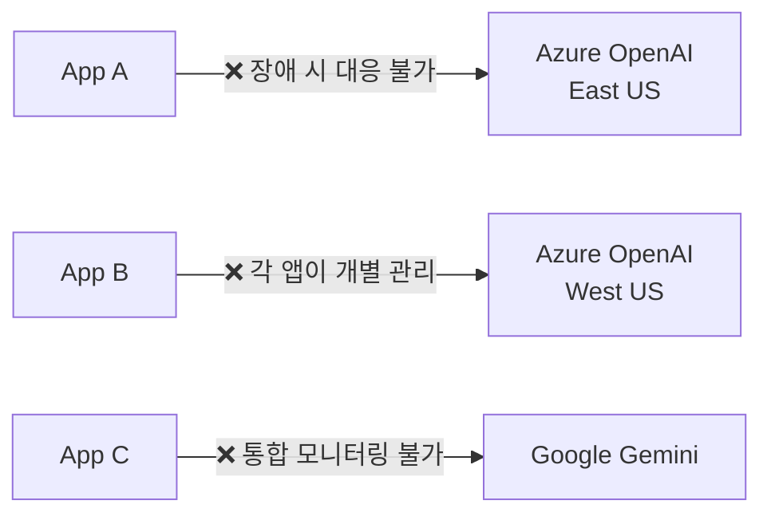
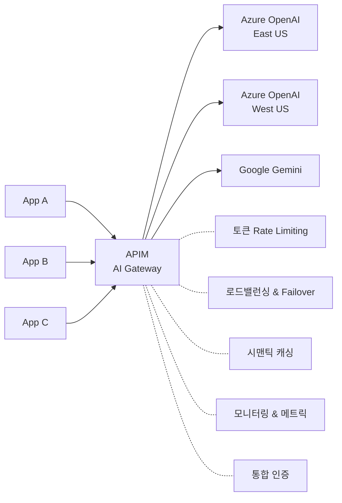

# 아키텍처 상세 설명

## AI Gateway 패턴이란?

AI Gateway는 Azure API Management를 활용하여 다양한 AI 모델 엔드포인트를 단일 진입점(Gateway)으로 통합 관리하는 아키텍처 패턴입니다.

## 왜 AI Gateway가 필요한가?

### 직접 호출의 문제점

### AI Gateway 적용 후

## 핵심 구성 요소

### 1. Backend Pool

여러 AI 모델 인스턴스를 풀로 묶어 관리합니다.

- **Round Robin**: 균등 분배
- **Weighted**: 가중치 기반 분배 (예: PTU 70%, PayGo 30%)
- **Priority**: 우선순위 기반 (Primary/Secondary)

### 2. Circuit Breaker

백엔드 장애 시 자동으로 해당 인스턴스를 풀에서 제외합니다.

- 60초 내 3회 실패 → 회로 열림
- 30초 후 반열림(Half-Open) → 복구 확인
- 성공 시 정상 복귀

### 3. 토큰 기반 Rate Limiting

요청 수가 아닌 **토큰 수** 기반으로 사용량을 제한합니다.

- Prompt 토큰 추정(estimate-prompt-tokens)
- Completion 토큰 실측
- 구독/사용자별 독립적 카운터

### 4. 시맨틱 캐싱

유사한 프롬프트에 대해 이전 응답을 반환합니다.

- Embedding 모델로 유사도 계산
- Score threshold (기본 0.8) 이상이면 캐시 히트
- 비용 절감 + 응답 시간 단축

### 5. 멀티 모델 라우팅

다양한 AI 프로바이더를 단일 인터페이스로 통합합니다.

- 요청/응답 형식 변환 (정규화)
- 헤더/경로 기반 라우팅
- 백엔드 변경 시 클라이언트 영향 없음

## 보안 고려사항

| 항목 | 구현 방식 |
|------|----------|
| 인증 | Managed Identity (APIM → Azure OpenAI) |
| API Key 관리 | Named Values (암호화 저장) |
| 네트워크 | VNet 통합 / Private Endpoint |
| 클라이언트 인증 | Subscription Key / OAuth 2.0 |
| 콘텐츠 필터 | Azure Content Safety 연계 |

## 비용 최적화 전략

1. **PTU + PayGo 밸런싱**: PTU 우선 사용, Spillover 시 PayGo
2. **시맨틱 캐싱**: 반복 질문에 대한 API 호출 절감
3. **토큰 Rate Limiting**: 과도한 사용 방지
4. **모델 선택 최적화**: 간단한 작업은 경량 모델(GPT-4.1-nano) 사용
