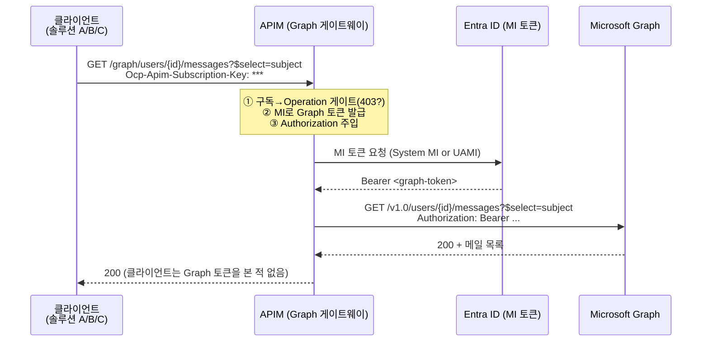
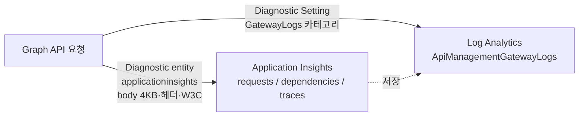
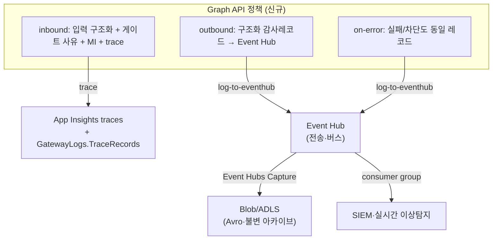
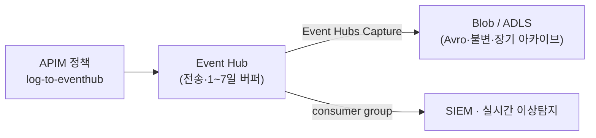

# APIM Graph 게이트웨이 감사 로깅 — 현재 vs 신규 정책 (Lab 11 기준)

> **목표**: APIM 을 "다양한 솔루션의 Microsoft Graph 호출을 대리하는 **Graph 게이트웨이**"로 쓸 때,
> **누가 · 무엇을(어떤 입력으로) · 어떻게 Graph 를 호출해 갔는지**를 **감사(audit) 수준**으로 남길 수 있음을 증명한다.
>
> **결론 먼저**: 현재 배선만으로도 **메타데이터 감사(누가/무엇을/결과)는 이미 상당 부분** 남는다.
> 다만 **① 본문 4~8KB 상한, ② "어떤 정체성으로 Graph 를 불렀는지" 부재, ③ 차단 사유 부재,
> ④ 비밀 원문 노출, ⑤ 불변·장기 보존 부재**의 5개 구멍이 있고, 이는 **Graph API 스코프 정책 1장**
> (`policies/graph-audit-policy.xml`)으로 닫아 **완전한 감사 원장**을 만들 수 있다.

---

## 0. 30초 결론표

| 감사 질문 | 현재 로깅(BEFORE) | 신규 정책(AFTER) |
|---|---|---|
| **누가** 호출했나 (앱/팀) | ✅ `ApimSubscriptionId`·`ProductId`·`CallerIpAddress` (GatewayLogs) | ✅ + `subscriptionName`·`keyHint`(마스킹)·`X-Forwarded-For` 구조화 |
| **무엇을** 요청했나 (입력) | 🟡 `Url`(경로+쿼리)에 뭉쳐 있음, 본문은 ≤4KB(App Insights)만 | ✅ `targetUser`·`$select`·`$filter`·operation 을 **필드 단위**로 분해 |
| **어떻게** Graph 를 불렀나 | 🟡 `BackendUrl`·`BackendResponseCode`는 있음. **발급 정체성은 없음** | ✅ `graphUrl` + **`identity`(System MI vs UAMI client-id)** 명시 |
| **결과/차단 사유** | 🟡 `ResponseCode=403`은 있으나 **왜**인지는 없음 | ✅ `outcome`(allow/deny) + **`denyReason`(규칙 단위)** |
| **본문 무손실** | ❌ 4~8KB 초과 시 잘림 (플랫폼 상한) | ✅ Event Hub→Capture→Blob 로 필요한 필드 무손실 |
| **비밀 위생** | ❌ 구독 키·`Authorization`(MI Bearer)가 로그 대상에 포함 | ✅ 원문 미기록, 마스킹 지문(keyHint)만 |
| **불변·장기 보존** | ❌ 공유 App Insights/LA, 30일 보존 | ✅ Event Hub→Capture→**Blob 불변 저장소**로 분리 (§7) |

범례: ✅ 충분 · 🟡 부분/우회 필요 · ❌ 불가

---

## 1. 무엇을 감사하려는가 — Lab 11 Graph 호출 흐름

Lab 11 은 클라이언트가 **Graph 토큰 없이 APIM 구독 키만** 보내고, APIM 이 **Managed Identity 로 Graph Bearer 를 발급**해
백엔드(`https://graph.microsoft.com/v1.0`)로 대리 호출하는 구조다.



**감사가 답해야 할 3가지 + α**

| 축 | 이 시나리오에서의 구체값 | 어디에 있나 |
|---|---|---|
| **누가(Who)** | 어떤 구독/Product(=어떤 솔루션·팀), 어떤 IP | 구독 키 → Product/Subscription, `CallerIpAddress` |
| **무엇을(What)** | 대상 사용자 ID, `$select`/`$filter`(어떤 필드/조건), operation | 요청 **URL(경로+쿼리)**, 쓰기 시 요청 본문 |
| **어떻게(How)** | 어떤 **정체성**(System MI/어느 UAMI)으로, 어떤 Graph URL 로 | 백엔드 URL, 발급에 쓴 MI/`client-id` |
| **결과** | 200/403, 차단이면 **왜**, 지연/크기 | 응답 코드, 차단 규칙, latency |

> 핵심: 클라이언트는 **구독 키만** 보내므로 "누가"는 **구독/Product 단위**로 식별된다(엔드유저 단위 아님 — MI 는 앱 권한).
> "무엇을"의 대부분은 **URL 의 경로·쿼리스트링**(대상 user-id, `$select`, `$filter`)에 들어 있다는 점이 이 시나리오의 특징이다.

---

## 2. 현재 로깅으로 실제로 보이는 것 (BEFORE)

### 2-1. 현재 배선 (이 repo 의 실제 코드)

Graph API 는 Lab 11 에서 **수동(Portal) 추가**되며, 별도 API 레벨 진단이 없으므로 **서비스 레벨 진단을 그대로 상속**한다.
그 서비스 레벨 설정은 `infra/modules/apim.bicep` 과 `scripts/setup-monitoring.sh` 가 만든다.

```jsonc
// APIM Diagnostic entity "applicationinsights" (→ Application Insights)
// 출처: infra/modules/apim.bicep, scripts/setup-monitoring.sh
{
  "alwaysLog": "allErrors",
  "sampling": { "percentage": 100, "samplingType": "fixed" },
  "logClientIp": true,
  "httpCorrelationProtocol": "W3C",
  "verbosity": "information",
  "metrics": true,
  "frontend": {
    "request":  { "headers": ["Content-Type","Ocp-Apim-Subscription-Key","x-model-provider"], "body": { "bytes": 4096 } },
    "response": { "headers": ["Content-Type","x-ratelimit-remaining-tokens"], "body": { "bytes": 4096 } }
  },
  "backend": {
    "request":  { "headers": ["Content-Type","Authorization"], "body": { "bytes": 4096 } },
    "response": { "headers": ["Content-Type","x-ms-region", ...], "body": { "bytes": 4096 } }
  }
}
```

```bash
# Azure Monitor 진단설정 "apim-to-log-analytics" (→ Log Analytics)
# 출처: scripts/setup-monitoring.sh
logs:    allLogs + audit (categoryGroup)   # = GatewayLogs 등
metrics: AllMetrics
```

여기서 **중요한 이중 구조**를 이해해야 한다. APIM 에는 로깅 파이프라인이 둘이고, **본문/헤더 설정은 App Insights 쪽에만 걸려 있다.**



### 2-2. Application Insights 에 남는 것

공식 문서상 APIM 이 App Insights 로 방출하는 항목:

| 텔레메트리 | 내용 | 이 시나리오에서 |
|---|---|---|
| `requests` | 프론트 요청/응답 (URL, resultCode, duration, operation_Id) | Graph 호출의 **누가/무엇을(URL)/결과**의 뼈대 |
| `dependencies` | 백엔드 요청/응답 (graph.microsoft.com 호출) | **어떻게(백엔드 URL)** + 백엔드 상태/지연 |
| `exceptions` | 실패 요청 | 403/5xx 흐름 |
| `traces` | `trace` 정책이 남긴 메시지 | **현재는 Graph 에 trace 정책이 없어 비어 있음** |

- 본문: 이 repo 는 frontend/backend **4KB** 로깅 → Graph `/users` 목록이나 메일 본문은 **초과 시 잘림**.
- 헤더: 프론트 `Ocp-Apim-Subscription-Key`, 백엔드 `Authorization` 이 로그 대상에 포함 → **비밀이 텔레메트리에 유입될 수 있음(위생 문제)**.
- 상관관계: `operation_Id`(W3C)로 프론트↔백엔드 조인 가능.

> 근거: APIM→App Insights 는 Request/Dependency/Exception/Trace 를 방출하며, **payload 로깅 기본값은 0바이트**라 명시적으로 켜야 한다(이 repo 는 4096). 본문 로깅 상한은 플랫폼상 **8,192 bytes** 다(Lab 10 에서도 8KB 한계로 Event Hub 를 도입).

### 2-3. Log Analytics `ApiManagementGatewayLogs` 에 남는 것

진단설정(GatewayLogs)로 들어오는 테이블의 **실제 컬럼**(공식 스키마)을 감사 3축에 매핑하면:

| 축 | GatewayLogs 컬럼 (현재 채워짐) | 비고 |
|---|---|---|
| 누가 | `ApimSubscriptionId`, `ProductId`, `UserId`, `CallerIpAddress`, `Region`, `ClientTlsVersion` | 구독/Product 단위 식별 ✅ |
| 무엇을 | `Method`, `Url`, `OperationId`, `OperationName`, `ApiId`, `RequestSize` | **`Url` 에 경로+쿼리(`$select`/`$filter`/user-id) 포함** ✅ |
| 어떻게 | `BackendId`, `BackendUrl`, `BackendMethod`, `BackendResponseCode`, `BackendTime` | Graph 백엔드 호출 메타 ✅ / **발급 정체성은 없음** ❌ |
| 결과 | `ResponseCode`, `IsRequestSuccess`, `TotalTime`, `Errors`, `LastErrorReason` | 403 은 보이나 **사유(규칙)는 없음** 🟡 |
| 본문 | `RequestBody`, `ResponseBody`, `BackendRequestBody`, `BackendResponseBody` | **컬럼은 있으나 기본 비어 있음** ⚠️ |
| 추적 | `TraceRecords` | **trace 정책이 있어야 채워짐 → 현재 비어 있음** ⚠️ |

> ⚠️ **함정**: 본문/`TraceRecords` 컬럼은 존재하지만, 채워지려면 **GatewayLogs 파이프라인용 진단엔티티(`azuremonitor`)에 payload 설정**과 **`trace` 정책**이 필요하다.
> 이 repo 는 payload 설정을 **App Insights 쪽에만** 걸었으므로, **GatewayLogs 의 본문 컬럼은 현재 비어 있다.** (메타데이터 컬럼은 정상 수집)

### 2-4. 현재 상태 판정

**이미 감사에 근접한 것** (별도 작업 없이):
- ✅ **누가**: 구독/Product/IP 로 "어느 솔루션이 불렀나"가 남는다.
- ✅ **무엇을(대부분)**: `Url` 에 대상 user-id·`$select`·`$filter` 가 포함돼 "무슨 데이터를 조회했나"가 사실상 남는다.
- ✅ **어떻게(부분)**: `BackendUrl`/`BackendResponseCode` 로 Graph 호출 자체는 남는다.
- ✅ **결과/지연/상관관계**.

**감사로서의 5대 구멍**:
1. ❌ **본문 상한 4~8KB** — 대량 응답(사용자 목록·메일 본문)은 잘리거나(App Insights) 비어 있다(GatewayLogs).
2. ❌ **발급 정체성 부재** — System MI 인지 어느 UAMI(권한별)인지 **어디에도 안 남는다.** 옵션 B(진짜 격리)의 핵심 증거가 빠진다.
3. ❌ **차단 사유 부재** — 403 이 "정책 게이트"인지 "Graph 권한 거부"인지, 어떤 규칙 때문인지 구분이 안 된다.
4. ❌ **비밀 위생** — 구독 키/`Authorization`(MI Bearer)이 로그 대상에 포함 → 감사 로그에 비밀이 남는 안티패턴.
5. ❌ **불변·장기 보존 부재** — 운영 텔레메트리와 같은 워크스페이스(30일)라, 개변 방지·장기 보존·접근 분리가 없다.

---

## 3. 신규 정책으로 추가되는 것 (AFTER)

### 3-1. 설계 — Graph API 스코프 감사 정책

`policies/graph-audit-policy.xml` 한 장으로 위 5개 구멍을 닫는다. 3계층으로 남긴다:



- **inbound `trace`**: 요청 즉시 App Insights `traces` 로 남고, **GatewayLogs `TraceRecords` 컬럼을 채운다**(비어 있던 컬럼 활성화).
- **outbound `log-to-eventhub`**: 완료 응답에서 **구조화 JSON 감사레코드**를 Event Hub 로 무손실 전송(4~8KB 상한 회피). 이후 **Event Hubs Capture** 가 Blob/ADLS 에 Avro 로 자동 적재(§7).
- **on-error `log-to-eventhub`**: 차단/오류도 누락 없이 기록.

### 3-2. 정책 이전/이후 (전문 비교)

**BEFORE — Lab 11 현재 정책** (인증 + 403 게이트만, 로깅 0):

```xml
<policies>
  <inbound>
    <base />
    <choose>
      <when condition="...graph-users && /messages">   <return-response>403</return-response> </when>
      <when condition="...graph-mail  && !/messages">  <return-response>403</return-response> </when>
      <!-- ... sharepoint 게이트 ... -->
    </choose>
    <authentication-managed-identity resource="https://graph.microsoft.com" />
  </inbound>
  <backend><base /></backend>
  <outbound><base /></outbound>   <!-- 감사 로깅 없음 -->
  <on-error><base /></on-error>   <!-- 실패 기록 없음 -->
</policies>
```

**AFTER — 감사 강화 정책** (핵심 추가분 발췌, 전문은 [`policies/graph-audit-policy.xml`](../policies/graph-audit-policy.xml)):

```xml
<inbound>
  <base />
  <!-- ① 입력을 필드로 분해 -->
  <set-variable name="auditTargetUser" value="@(context.Request.MatchedParameters.ContainsKey("user-id") ? ... : "-")" />
  <set-variable name="auditSelect" value="@(context.Request.OriginalUrl.Query.GetValueOrDefault("$select","-"))" />
  <set-variable name="auditFilter" value="@(context.Request.OriginalUrl.Query.GetValueOrDefault("$filter","-"))" />
  <!-- ② 비밀은 마스킹 지문만 -->
  <set-variable name="auditKeyHint" value="@{ var k=...Headers.GetValueOrDefault("Ocp-Apim-Subscription-Key",""); return k=="" ? "-" : k.Substring(0,3)+"***"; }" />
  <set-variable name="auditIdentity" value="system-assigned" />   <!-- 옵션 B에선 각 분기서 UAMI로 덮어씀 -->

  <choose> <!-- 기존 게이트 + 차단 사유 기록 -->
    <when condition="...graph-users && /messages">
      <set-variable name="auditDeny" value="graph-users는 메일 조회 불가" />
      <return-response><set-status code="403"/>...</return-response>
    </when>
    <!-- ... -->
  </choose>

  <authentication-managed-identity resource="https://graph.microsoft.com" />

  <!-- ③ 요청 레그 trace → traces + GatewayLogs.TraceRecords 채움 -->
  <trace source="graph-audit" severity="information">
    <message>@($"GRAPH-AUDIT-REQ op={context.Operation.Name} path={context.Request.OriginalUrl.Path}")</message>
    <metadata name="product" value="@(context.Product?.Name ?? "-")" />
    <metadata name="targetUser" value="@((string)context.Variables["auditTargetUser"])" />
    <metadata name="select" value="@((string)context.Variables["auditSelect"])" />
    <metadata name="graphIdentity" value="@((string)context.Variables["auditIdentity"])" />
    <!-- subscriptionId/Name, callerIp, keyHint, filter ... -->
  </trace>
</inbound>

<outbound>
  <base />
  <!-- ④ 완료 레그: 구조화 감사레코드(무손실) -->
  <log-to-eventhub logger-id="graph-audit-eventhub">@{
    return new JObject(
      new JProperty("ts", DateTime.UtcNow.ToString("o")),
      new JProperty("correlationId", context.RequestId),
      new JProperty("caller", new JObject( /* product, subscriptionId/Name, keyHint, callerIp, xff */ )),
      new JProperty("request", new JObject( /* method, operation, clientUrl, targetUser, select, filter */ )),
      new JProperty("graphCall", new JObject( /* identity(=System MI/UAMI), graphUrl, graphHost */ )),
      new JProperty("response", new JObject( /* status, outcome, denyReason, latencyMs, size */ ))
    ).ToString();
  }</log-to-eventhub>
</outbound>

<on-error>
  <base />
  <log-to-eventhub logger-id="graph-audit-eventhub">@{ /* phase=on-error, status, denyReason, lastError ... */ }</log-to-eventhub>
</on-error>
```

### 3-3. 왜 "더 많이·더 자세히" 남는가 — 근거

정책이 로깅을 늘린다는 주장은 **플랫폼 동작 4가지**에 근거한다:

1. **`trace` 정책 → `TraceRecords` 컬럼**: GatewayLogs 스키마의 `TraceRecords` 는 공식 설명이 *"Records emitted by **trace policies**"*. 즉 **정책이 없으면 영구히 비고, 정책을 넣는 순간 채워진다.** (현재 → 신규의 순증)
2. **본문 상한은 진단으로는 못 넘는다**: App Insights payload 로깅은 최대 8,192 bytes(플랫폼 상한). Graph 대량 응답은 여기서 잘린다. **`log-to-eventhub` 는 이 상한과 무관**하게 원하는 필드를 담아 무손실로 보낸다(Lab 10 이 같은 이유로 Event Hub 도입).
3. **정책만이 접근 가능한 컨텍스트**: "어떤 `client-id`(UAMI)로 발급했는가", "어떤 게이트 규칙이 403 을 냈는가"는 **정책 실행 흐름 안에서만** 알 수 있다. 진단·GatewayLogs 는 이 결정 과정을 모른다 → **정책 변수로 남겨야만 감사에 들어온다.**
4. **필드 정규화 & 비밀 제거**: 진단은 헤더/본문을 "있는 그대로" 덤프(→ 비밀 유입, 잘림). 정책은 **필요한 필드만 골라 정규화**하고 비밀은 마스킹한다 → 감사 품질↑, 노출 위험↓.

---

## 4. 필드 단위 이전/이후 비교 (핵심 근거표)

| 감사 필드 | BEFORE (현재) | AFTER (정책) | 정책이 만든 증거 |
|---|:--:|:--:|---|
| 구독/Product ID | ✅ GatewayLogs | ✅ | `context.Subscription.Id`, `context.Product.Name` |
| 구독 표시명 | 🟡 (ID만) | ✅ | `context.Subscription.Name` |
| 호출자 IP / XFF | ✅ / 🟡 | ✅ / ✅ | `context.Request.IpAddress`, `X-Forwarded-For` |
| 구독 키(비밀) | ⚠️ 원문 로그 대상 | ✅ 마스킹 `keyHint` | `Substring(0,3)+"***"` |
| operation 명 | ✅ | ✅ | `context.Operation.Name` |
| 대상 user-id | 🟡 URL 안에 뭉침 | ✅ 독립 필드 | `MatchedParameters["user-id"]` |
| `$select`(가져간 필드) | 🟡 URL 쿼리 | ✅ 독립 필드 | `OriginalUrl.Query["$select"]` |
| `$filter`(조회 조건) | 🟡 URL 쿼리 | ✅ 독립 필드 | `OriginalUrl.Query["$filter"]` |
| 요청 본문(쓰기 시) | 🟡 ≤8KB, 잘림 | ✅ 무손실(EventHub) | `log-to-eventhub` |
| **발급 정체성**(MI/UAMI) | ❌ 없음 | ✅ `identity` | `auditIdentity` 변수 |
| Graph 백엔드 URL | ✅ `BackendUrl` | ✅ `graphUrl` | `context.Request.Url` |
| 응답 코드 | ✅ | ✅ | `context.Response.StatusCode` |
| **차단 사유(규칙)** | ❌ 없음 | ✅ `denyReason` | `auditDeny` 변수 |
| 지연/응답크기 | ✅ / 🟡 | ✅ / ✅ | `context.Elapsed`, `Content-Length` |
| 상관관계 ID | ✅ operation_Id | ✅ `correlationId` | `context.RequestId` |
| 실패/오류 흐름 | 🟡 exceptions | ✅ on-error 레코드 | `on-error` + `context.LastError` |
| 불변·분리 보존 | ❌ | ✅ EventHub→SIEM | 별도 싱크 |

**요약**: 현재는 16개 축 중 **약 8개 ✅ / 6개 🟡 / 2개 ❌**. 정책 적용 후 **15개 ✅ / 1개 🟡**로, 특히
"발급 정체성"과 "차단 사유"라는 **감사에서 가장 중요한 두 공백**이 채워진다.

---

## 5. 감사 로그 조회 예시

**App Insights `traces`(정책 trace) — 누가 어떤 사용자를 select 했나**

```kql
traces
| where message startswith "GRAPH-AUDIT-REQ"
| extend d = customDimensions
| project timestamp,
          product = tostring(d["product"]),
          subscription = tostring(d["subscriptionName"]),
          callerIp = tostring(d["callerIp"]),
          targetUser = tostring(d["targetUser"]),
          select_ = tostring(d["select"]),
          identity = tostring(d["graphIdentity"])
| order by timestamp desc
```

**GatewayLogs — 정책 trace 가 채운 `TraceRecords` 확인**

```kql
ApiManagementGatewayLogs
| where ApiId contains "graph"
| project TimeGenerated, ApimSubscriptionId, ProductId, CallerIpAddress,
          Method, Url, BackendUrl, ResponseCode, TraceRecords
| order by TimeGenerated desc
```

**Event Hub 감사레코드(소비자 측, 예: Stream Analytics/Functions → 저장소/SIEM)** — 무손실 원장. 예: "누가 남의 메일을 조회했나" 이상탐지, "deny 급증" 알림, 장기 보존.

---

## 6. 최종 판정 — "감사 수준" 달성 가능한가?

**가능하다.** 단, "감사"를 두 층으로 나눠 보면:

- **행위 감사(누가·언제·무엇을·어떻게·결과)** → 신규 정책으로 **필드 단위 완전 커버**. ✅
- **원장 감사(무손실·불변·장기·접근분리)** → 정책의 Event Hub 경로 + **아래 3가지 운영 조건**을 갖추면 완성.

**남은 운영 조건(권고)**

1. **비밀 위생**: 진단엔티티의 `Ocp-Apim-Subscription-Key`/`Authorization` 헤더 로깅을 **제거**하고, 정책의 마스킹 `keyHint` 만 남긴다.
2. **PII·보존**: Graph 데이터(메일 제목, UPN 등)는 PII. Event Hub 소비자에서 마스킹하고, 감사 싱크의 **보존기간·RBAC·불변성(immutable storage 또는 잠금 정책)**을 분리 통제한다.
3. **Event Hub → Capture → Blob 준비**(전문 원장 시): 로거 `graph-audit-eventhub` 등록 필요(미등록 시 정책 오류). 최종 아카이브는 **Event Hubs Capture 로 Blob/ADLS** 에 자동 적재한다 — 개념·비교·입문은 **§7**.

> ⚠️ **App Insights `trace` 경로 선행조건(실측으로 확인)**: `trace` 정책이 App Insights `traces` 에 남으려면 ① 진단 `verbosity` 를 **`information` 이상**(기본 `error` 는 information 트레이스를 전부 드롭) ② 설정 변경 후 **게이트웨이 전파(~1~2분) 대기 뒤 트래픽**. 둘 중 하나라도 빠지면 *정책·트래픽은 정상인데 traces 0건* 이 된다. 원인 규명 과정·체크리스트는 **부록 C** 참고.

```bicep
// (참고) infra 초안 — Event Hub + Capture(→Blob) + APIM 로거
resource ehns 'Microsoft.EventHub/namespaces@2022-10-01-preview' = { name: 'ehns-graph-audit-${suffix}', location: location, sku: { name: 'Standard', tier: 'Standard' } }
resource eh 'Microsoft.EventHub/namespaces/eventhubs@2022-10-01-preview' = {
  parent: ehns, name: 'graph-audit'
  properties: {
    messageRetentionInDays: 7, partitionCount: 2
    captureDescription: {                       // ← 받은 이벤트를 Blob 에 Avro 로 자동 적재(코드 0줄)
      enabled: true, encoding: 'Avro', intervalInSeconds: 300, sizeLimitInBytes: 10485760
      destination: { name: 'EventHubArchive.AzureBlockBlob', properties: {
        storageAccountResourceId: storageAccountId, blobContainer: 'graph-audit' } }
    }
  }
}
// 이후 APIM 로거(loggerType: azureEventHub, MI 인증)를 'graph-audit-eventhub' 이름으로 등록
```

---

## 7. 감사 로그를 어디에 쌓나 — Event Hub vs Blob

> "그냥 Blob 에 쌓으면 안 되나?" 에 답하는 절. Event Hub 를 처음 쓰는 독자를 위해 개념부터 정리한다.

### 7-1. 결정적 제약 — APIM 정책에는 `log-to-blob` 이 없다

정책에서 **커스텀 감사 레코드**(누가·무엇을·어떤 신원·deny 사유·전문)를 외부로 내보내는 **네이티브** 수단은 `log-to-eventhub` **하나뿐**이다. Blob 에 "직접" 쓰려면 `정책 → send-request → Azure Function/Logic App → Blob` 처럼 중간 컴포넌트를 직접 만들어 운영해야 한다. → **커스텀 감사 payload 의 유일한 네이티브 출구가 Event Hub** 다.

### 7-2. Event Hub 30초 입문 (처음이라면)

- **무엇** — 초당 수천~수백만 건의 이벤트를 받아내는 **이벤트 버스/큐**(Apache Kafka 호환).
- **누가 던지나** — Producer = **APIM**(`log-to-eventhub`). 이벤트 하나 = 감사 레코드 하나(JSON).
- **누가 읽나** — 여러 Consumer 가 **각자 독립적으로** 같은 스트림을 읽는다(**consumer group**). 예: SIEM·아카이버·이상탐지가 서로 간섭 없이 동시 소비.
- **얼마나 보관** — Event Hub 자체 보존은 **1~7일(임시 버퍼)**. 영구 보관이 아니다.
- **영구 저장은?** — **Event Hubs Capture** 가 받은 이벤트를 **N분 / M바이트마다 Avro 파일로 Blob/ADLS 에 자동 기록**(코드 0줄). ← **여기서 데이터가 Blob 에 쌓인다.**

즉 **당신 직관대로 최종 저장소는 Blob 이 맞다.** 다만 APIM 이 Blob 에 직접 못 쓰므로 Event Hub 를 **입구(on-ramp)** 로 두고, Capture 가 Blob 아카이브를 만든다.



### 7-3. 왜 "Blob 직행 자작" 이 아니라 EH 경유인가

| 관점 | Blob 직접 (정책→Function→Blob 자작) | Event Hub 경유 (→Capture→Blob) |
|---|---|---|
| **네이티브성** | ❌ Function/Logic App 을 만들고 운영 | ✅ `log-to-eventhub` 네이티브. 전문(>8KB)+커스텀 필드 그대로 |
| **팬아웃** | ❌ Blob 은 목적지 — SIEM 실시간 구독 불가 | ✅ consumer group 으로 SIEM·아카이브·이상탐지 **동시 독립 소비** |
| **결합도** | ❌ 요청 경로에서 Blob 에 동기 PUT → Graph 응답이 로깅 지연/실패에 결합 | ✅ fire-and-forget 버퍼 → 요청 경로와 디커플 |
| **소형객체** | ❌ 호출당 blob 1개 = 수백만 초소형 객체 → 스로틀·비용·관리 폭증 | ✅ Capture 가 배치 → **큰 Avro 파일** 소수로 저렴·관리 용이 |

### 7-4. 그럼 "그냥 Blob" 이 맞는 경우도 있다

**메타데이터 수준 감사로 충분**(전문 불필요·8KB 이내)하고, 커스텀 필드·실시간 소비가 필요 없고, 비용 최소화가 목표라면 → **APIM 진단 설정(diagnostic settings) → Storage 계정** 직행이 가장 단순·저렴하다. `ApiManagementGatewayLogs` 를 Blob 에 바로 떨군다. **EH 비용 0.** 단, 전문·커스텀 필드·실시간 팬아웃은 포기.

### 7-5. 세 가지 아카이브 경로 — 언제 무엇을

| 경로 | 얻는 것 | 잃는 것 | 언제 |
|---|---|---|---|
| ① 진단설정 → **Blob 직행** | 최저 비용·최단 구성 | 전문✗·커스텀필드✗·실시간✗ (8KB·고정 스키마) | 메타데이터 감사면 충분할 때 |
| ② **EH → Capture → Blob** *(권장)* | 전문·커스텀 필드·팬아웃·불변 아카이브 | EH 비용(+Capture) | 감사 원장을 제대로 남길 때 |
| ③ EH → **Function** → Blob | 저장 전 변환·마스킹·필터 | 운영 부담(코드/스케일) | 저장 직전 가공이 꼭 필요할 때 |

> 데모 노트북 [`labs/lab11-graph-managed-identity/test-graph-audit-logging.ipynb`](../labs/lab11-graph-managed-identity/test-graph-audit-logging.ipynb) 은 **Option A = App Insights 메타데이터 경로**, **Option B = ②(EH→Capture→Blob)** 를 각각 눈으로 확인하게 해 준다.

---

## 8. 일반화 — "다양한 솔루션의 Graph 게이트웨이"로

이 패턴은 Lab 11 의 3개 Product(users/mail/sharepoint)를 넘어 **N개 솔루션**으로 확장된다:

- 솔루션마다 **Product/구독 키**를 발급 → 감사에서 `product`/`subscriptionName` 으로 자동 분해.
- 권한은 **옵션 B(UAMI별 최소권한)** 를 쓰고, 정책의 `identity` 필드로 **"어느 솔루션이 어떤 권한 정체성으로 Graph 를 불렀는지"**를 원장에 남긴다.
- 결과: **하나의 APIM = 모든 솔루션의 Graph 접근 단일 통제·감사 지점.** "누가 어떤 사용자의 이메일을 언제 어떤 조건으로 가져갔는가"가 **필드 단위로, 무손실로, 불변 저장소에** 남는다 — 목표 달성.

---

## 부록 A. 검증 근거 (공식 문서)

- **APIM→App Insights 방출 항목**(Request/Dependency/Exception/Trace) 및 **payload 기본 0바이트**: *Integrate Azure API Management with Application Insights* (learn.microsoft.com).
- **`ApiManagementGatewayLogs` 컬럼 스키마**(`ApimSubscriptionId`, `ProductId`, `CallerIpAddress`, `Url`, `BackendUrl`, `RequestBody`/`ResponseBody`, **`TraceRecords`="Records emitted by trace policies"** 등): *Azure Monitor Logs reference — ApiManagementGatewayLogs*.
- **본문 8KB 한계·Event Hub 무손실**: 본 repo `labs/lab10-governance-observability/README.md` 3단계.
- **정책 문법**(`log-to-eventhub`, `trace`): 본 repo `docs/policy-reference.md` D·I 절.
- **`log-to-blob` 은 존재하지 않음**: APIM 정책의 네이티브 로깅 출구는 `log-to-eventhub` 뿐 → Blob 은 **Event Hubs Capture**(권장) 또는 `정책→Function` 경유. (§7)

## 부록 B. 적용 방법 (요약)

1. **가장 쉬운 길**: 데모 노트북 [`labs/lab11-graph-managed-identity/test-graph-audit-logging.ipynb`](../labs/lab11-graph-managed-identity/test-graph-audit-logging.ipynb) 실행 — Option A(App Insights, 즉시)와 Option B(Event Hub→Capture→Blob, 옵트인)를 자동으로 적용·조회한다.
2. **수동 적용**: Portal → APIM → APIs → **Microsoft Graph → All operations → Policy** 에 [`policies/graph-audit-policy.xml`](../policies/graph-audit-policy.xml) 붙여넣기. (Event Hub 옵션은 로거 `graph-audit-eventhub` + Capture→Blob 선구성 — §7)
3. (권장) 진단엔티티에서 구독 키/`Authorization` 헤더 로깅 제거.
4. 5절 KQL(App Insights `traces`) / Event Hub·Blob 아카이브로 감사 원장 확인.

## 부록 C. 트러블슈팅 타임라인 & 실측 검증 — "traces 0건" 함정

> 이 문서/노트북은 **실제 배포된 APIM(`apim-ai-gw-aigateway-20260716`) 에 라이브로 적용해 검증**했다. 그 과정에서 *정책은 정상 적용·트래픽도 200/403 정상인데 App Insights `traces` 가 계속 0건* 인 함정을 만났고, 원인을 규명했다. 같은 실수를 피하도록 시간순으로 남긴다.

### C-1. 타임라인 (실측)

| # | 시도 | 결과 | 배운 것 |
|---|---|---|---|
| 1 | verbosity 손 안 대고 정책만 적용 → **즉시** 트래픽 → 6분 재시도 조회 | ❌ 0건 | 정책·트래픽 정상인데 trace 만 안 남음 |
| 2 | `/loggers`·`/diagnostics` 점검 | 🔎 | App Insights 로거·서비스 진단은 있으나 **`verbosity`=null(=error 기본)**, graph API-레벨 진단 없음 |
| 3 | `union * \| summarize count() by itemType` | 🔎 | `request` 는 수집되는데 **`trace` 는 7일간 0건** — trace 정책이 여태 한 번도 방출된 적 없음 |
| 4 | **API-레벨** 진단 verbosity=information → *대기 없이* 트래픽 | ❌ 0건 | verbosity 만으론 부족? |
| 5 | 공식 문서 확인 | 📖 | 조건은 *severity ≥ verbosity* 뿐; **`Ocp-Apim-Trace` 헤더·구독 트레이싱은 미지원(폐기)** |
| 6 | **서비스-레벨** verbosity=information(GET 확인) → *대기 없이* 트래픽 | ❌ 0건 | 설정은 맞는데도 0 → **전파 지연** 의심 |
| 7 | verbosity=information → **150초 대기** → 트래픽 | ✅ **12건** | inbound/outbound·200/403·targetUser·identity·keyHint 전부 |
| 8 | **API-레벨** verbosity + **150초 대기** (전역 미변경) | ✅ **12건** | 전역 안 건드리는 국소 방식으로 재현 → **노트북 채택** |

### C-2. 근본 원인 — 두 조건을 **동시에** 만족해야 한다

1. **App Insights 진단 `verbosity` ≥ `information`** — 기본값은 사실상 `error` 라 `severity="information"` 트레이스를 전부 버린다. `trace` 정책은 *severity ≥ diagnostic verbosity* 일 때만 App Insights 에 남는다(샘플링 영향 없음, 공식 문서).
2. **설정 변경 후 게이트웨이 전파(~1~2분) 대기 후 트래픽** — verbosity·정책 PUT 직후 곧바로 호출하면 *구 설정* 으로 처리돼 누락된다.

### C-3. 실측 증거 (라이브 결과 발췌)

```
phase     path                                          targetUser                            identity         keyHint   code
inbound   /graph/users                                  -                                     system-assigned  7c5d****
outbound  /graph/users                                  -                                     system-assigned            200
inbound   /graph/users/{id}/messages                    cb319021-...                          system-assigned  7c5d****
outbound  /graph/users/{id}/messages                    cb319021-...                          system-assigned            403   ← 차단도 원장에 기록
```

> **누가**(product=`graph-users`·keyHint) · **무엇을**(path·targetUser) · **어떻게**(identity=관리 ID) · **결과**(200/차단 403)가 전부 필드로 남았다 = 감사 수준 달성 확인.

### C-4. ✅ 체크리스트 (같은 실수 방지)

- [ ] 진단 `verbosity` 를 **`information`(또는 `verbose`)** 로. `error`(기본)면 감사 trace 안 남음.
- [ ] verbosity·정책 **변경 후 최소 2분 대기 → 그 다음 트래픽**. (즉시 호출 ✗)
- [ ] 조회는 **App Insights 수집 2~5분 지연** 이 정상 → 조회 셀/쿼리 재실행.
- [ ] `Ocp-Apim-Trace` 헤더로 켜려 하지 말 것 — **폐기됨**. 진단 verbosity 가 유일한 스위치.
- [ ] 가능하면 **서비스(전역) 대신 API-레벨 진단** 으로 국소 적용(다른 API 영향 차단).
- [ ] 빠른 진단: `traces | summarize count() by itemType` 가 0 이면 verbosity/전파 문제. `union * | summarize count() by itemType` 로 *request 는 있는데 trace 만 0* 이면 확진.
- [ ] Option B(Event Hub)는 verbosity 와 무관하지만, **전파 대기**는 동일하게 필요.

> 노트북은 이 두 조건을 `ensure_ai_verbosity()`(API-레벨 verbosity=information) + `wait_propagation(150)` 로 **자동 처리**하고, 원복 시 임시 진단을 삭제한다.
