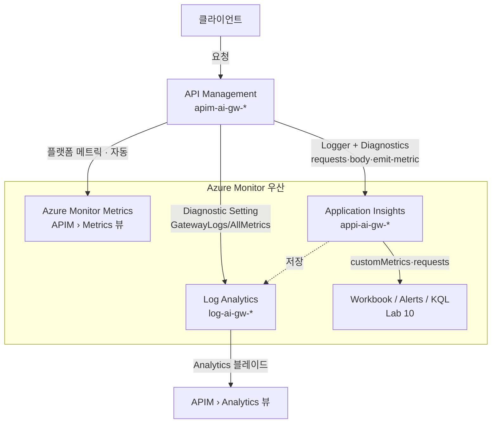
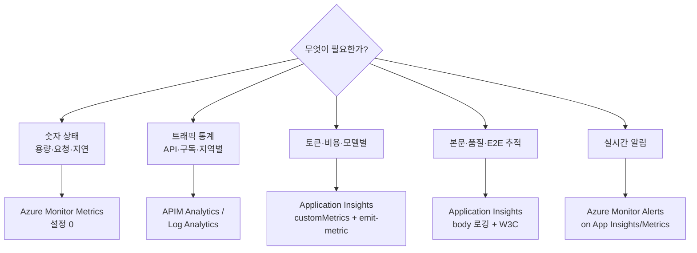

# 로깅 & 관측 리소스 가이드 — Azure Monitor vs Application Insights vs APIM

> **이 문서의 목적**: "어떤 로그가 필요할 때, 어떤 리소스를 (함께) 써야 하는가"를 결정하도록 돕습니다.
> Azure Monitor / Application Insights / API Management(Analytics · Metrics)가 각각 무엇이고,
> **이 레포의 실제 APIM 구성 기준**으로 각 리소스에서 무엇을 볼 수 있는지 정리합니다.

---

## 0. 30초 요약

| 리소스 / 뷰 | 한 줄 정의 | 대표 데이터 | 이 레포에서의 역할 |
|---|---|---|---|
| **Azure Monitor** | Azure 관측의 **상위 우산 플랫폼** (Metrics + Logs + Alerts) | 플랫폼 메트릭, 알림, Workbook | 나머지 전부를 담는 그릇 |
| **Azure Monitor Metrics** | 리소스가 **자동으로** 뿜는 시계열 숫자 (설정 불필요) | APIM Requests/Capacity/Duration | 용량·스로틀링 빠른 감시 |
| **Application Insights** | **앱/게이트웨이 레벨** APM 텔레메트리 (Azure Monitor의 일부) | requests, dependencies, traces, **customMetrics** | 토큰·비용·품질·E2E 추적의 핵심 |
| **APIM › Metrics** | APIM이 Azure Monitor로 보내는 **플랫폼 메트릭 뷰** | Requests, Capacity, Duration | 게이트웨이 상태판 |
| **APIM › Analytics** | **Log Analytics 기반** 내장 대시보드 | API/Operation/Product/구독별 통계 | 트래픽 상태 빠른 점검 |

> 핵심 오해 풀기:
> - **Azure Monitor**는 제품 하나가 아니라 **우산**입니다. Application Insights, Metrics, Log Analytics, Alerts, Workbooks가 전부 그 아래에 있습니다.
> - **Application Insights**는 Azure Monitor "안"의 한 구성요소(APM)이지, 별개 세계가 아닙니다.
> - **APIM의 Analytics와 Metrics는 서로 다른 파이프라인**입니다. Metrics = 플랫폼 시계열(자동), Analytics = Log Analytics 로그 기반 대시보드(진단 설정 필요).

---

## 1. 각 리소스 자세히

### 1-1. Azure Monitor (우산 플랫폼)

모든 Azure 관측 데이터가 흘러드는 최상위 프레임워크. 두 개의 근본 데이터 타입을 가집니다:

- **Metrics(메트릭)**: 가볍고 빠른 **시계열 숫자**. 리소스가 **기본으로** 방출(설정 불필요). 1분 단위, 저비용, 최대 93일 보존. 예) APIM 요청 수, CPU 용량.
- **Logs(로그)**: 구조화된 **이벤트 레코드**. **Log Analytics workspace**에 저장, **KQL**로 쿼리. 진단 설정(Diagnostic Settings)으로 켜야 하고, **수집량(GB) 과금**.

그 위에 얹히는 기능: **Alerts**(알림 규칙), **Workbooks**(대시보드), **Metrics Explorer**.

### 1-2. Application Insights (APM — Azure Monitor의 일부)

애플리케이션/게이트웨이의 **요청 단위 상세 텔레메트리**를 수집하는 APM. 내부적으로 Log Analytics workspace에 데이터를 저장합니다(이 레포는 `appi-ai-gw-*` → `log-ai-gw-*` 연결).

App Insights의 핵심 테이블:

| 테이블 | 담는 것 |
|---|---|
| `requests` | 게이트웨이로 들어온 각 요청 (URL, **resultCode**, duration, operation_Id) |
| `dependencies` | 백엔드(Azure OpenAI 등) 호출 (성공/지연) |
| `customMetrics` | **정책이 방출한 커스텀 지표** (← 토큰 메트릭이 여기) |
| `traces` | 진단 로그 메시지 |
| `exceptions` | 예외 |

### 1-3. API Management 자체의 두 뷰

APIM 블레이드 안에 **성격이 다른** 두 관측 뷰가 있습니다.

#### (a) APIM › **Metrics** (= Azure Monitor 플랫폼 메트릭)
- 별도 설정 없이 **자동** 수집되는 시계열 숫자.
- Portal → APIM → **Metrics**, 또는 Monitor → Metrics에서 동일 데이터.
- 예) `Requests`, `Capacity`, `Duration`. 차원(dimension)으로 응답코드·지역별 분해 가능.

#### (b) APIM › **Analytics** (= Log Analytics 기반 대시보드)
- **진단 설정(Diagnostic Setting)으로 GatewayLogs를 Log Analytics에 보낸 뒤** 보이는 내장 대시보드.
- Portal → APIM → **Analytics**.
- 예) Timeline, Geography, APIs, Operations, Products, Subscriptions, Users.
- ⚠️ 설정 없이 쓰던 Legacy built-in analytics는 **2027년 3월 retire 예정** → 현재는 Log Analytics 연결 방식.

---

## 2. 데이터 흐름 (이 레포 기준)

- **자동(설정 0)**: APIM → Azure Monitor **Metrics**.
- **진단 설정 필요**: APIM → Log Analytics(`GatewayLogs`) → APIM **Analytics** 블레이드.
- **Logger+Diagnostics 필요**: APIM → **Application Insights**(requests, body, customMetrics).

> 이 레포에서 Logger/Diagnostics/진단설정은 `scripts/setup-monitoring.sh`가, App Insights·Log Analytics 리소스는 `infra/modules/monitoring.bicep`(=`deploy.sh`)가 만듭니다.

---

## 3. 실제로 각 리소스에서 "볼 수 있는 것" (이 레포 APIM 기준)

### 3-1. Azure Monitor Metrics (APIM › Metrics) — *자동 수집*

| 메트릭 | 의미 | 분해 차원 |
|---|---|---|
| `Requests` | 게이트웨이 요청 수 | GatewayResponseCode, BackendResponseCode, Location, Hostname |
| `Capacity` | APIM 부하(%) — 스케일 판단 | Location |
| `Duration` (Overall/Backend) | 전체·백엔드 지연 | Location, Hostname |
| `EventHub/Network` 계열 | 부가 메트릭 | — |

➡️ **토큰/비용/본문은 여기 없음.** 순수 플랫폼 상태(용량·스로틀·지연)만.

### 3-2. APIM › Analytics (Log Analytics 기반) — *진단설정 필요*

Portal → APIM → Analytics에서 제공되는 내장 뷰:

- **Timeline** — 시간대별 요청/에러 추이
- **Geography** — 클라이언트 IP 기반 지역 분포
- **APIs / Operations** — API·오퍼레이션별 호출수·평균지연·에러율
- **Products / Subscriptions / Users** — 멀티테넌트 사용량

➡️ **"몇 번 호출/에러"는 알지만, 토큰 수·프롬프트 본문은 못 봄.**

### 3-3. Log Analytics 테이블 (KQL 직접 쿼리) — *진단설정 필요*

| 테이블 | 담는 것 |
|---|---|
| `ApiManagementGatewayLogs` | 요청별 게이트웨이 로그 (URL, 응답코드, 지연, 백엔드, 구독 등) |
| `AzureMetrics` | APIM `AllMetrics` (위 3-1 메트릭의 로그 형태) |

### 3-4. Application Insights — *Logger+Diagnostics 필요 (이 레포의 주력)*

`setup-monitoring.sh`가 켠 구성 덕분에 다음을 볼 수 있습니다:

| 데이터 | 어디에 | 이 레포 설정 |
|---|---|---|
| **요청/응답 상태** | `requests` (resultCode 200/401/**403**/**429**) | 100% 샘플링, W3C 상관관계 |
| **프롬프트/응답 본문** | `traces` / 요청 속성 (frontend·backend body) | **4KB** body 로깅 (frontend+backend) |
| **백엔드 호출** | `dependencies` | Azure OpenAI 등 호출 추적 |
| **토큰 사용량 (핵심)** | `customMetrics` namespace `ai-gateway-metrics` | `azure-openai-emit-token-metric` / `llm-emit-token-metric` 정책 |
| **E2E 추적** | `operation_Id`로 프론트↔백엔드 조인 | `httpCorrelationProtocol: W3C` |

이 레포가 방출하는 **customMetrics 상세**:

- 메트릭 이름: `Total Tokens`, `Prompt Tokens`, `Completion Tokens`
- 차원(dimension): `Subscription ID`, `Provider`, `Model`, `API ID`, `Client IP`

➡️ 덕분에 **"구독 × 프로바이더 × 모델별 토큰/비용"**, **"429/403 차단 추이"**, **"본문 품질 분석"**이 가능. (Lab 6·9·10)

> ⚠️ **customMetrics 사전 활성화 2종 세트**(하나라도 빠지면 항상 비어 있음):
> 1. APIM Diagnostics `metrics: true` (setup-monitoring.sh가 설정)
> 2. Portal → App Insights → Usage and estimated costs → **Custom metrics (Preview) → With dimensions** (CLI 불가, 수동)
> 그리고 emit-token-metric은 **스트리밍(`stream:true`) 응답의 토큰은 못 잡습니다** (APIM 버퍼링 한계 · Lab 6 참고).

---

## 4. "이 로그/컨셉이 필요하면 → 이 리소스" (핵심 결정표)

| 하고 싶은 것 (컨셉) | 주 리소스 | 함께 필요한 것 |
|---|---|---|
| 게이트웨이가 과부하인지 / 스케일할지 | **Azure Monitor Metrics** (`Capacity`) | — (자동) |
| "요청 몇 건, 에러율 얼마" 빠른 점검 | **APIM › Analytics** | Log Analytics 진단설정 |
| API/구독/지역별 트래픽 통계 | **APIM › Analytics** 또는 `ApiManagementGatewayLogs` | Log Analytics 진단설정 |
| **팀(구독)별 토큰 비용 차지백** | **Application Insights** `customMetrics` | `emit-token-metric` 정책 + Subscription ID 차원 |
| **모델·프로바이더별 토큰/TPM** | **Application Insights** `customMetrics` | emit-token-metric (Provider/Model 차원) |
| **429/403 차단 실시간 알림** | **Azure Monitor Alerts** on **App Insights** `requests` | Alert Rule + Action Group |
| **프롬프트/응답 본문**(품질·환각) | **Application Insights** (body 로깅) | Diagnostics frontend/backend body |
| **프론트→백엔드 E2E 추적** | **Application Insights** (`operation_Id`) | W3C 상관관계 |
| **멀티구독·멀티클라우드 종합 대시보드** | **Workbook** (App Insights 위) | customMetrics + Lab 10 `deploy-workbook.sh` |
| 감사/거버넌스 원장 로그 | **Log Analytics** (`audit` categoryGroup) | 진단설정 |

### 자주 쓰는 조합 (레시피)

- **비용/거버넌스 관측** = App Insights `customMetrics` + `emit-token-metric` 정책 + (선택) Workbook
- **운영 상태 감시** = Azure Monitor Metrics(`Capacity`/`Requests`) + Alerts
- **트래픽 감사** = APIM Analytics / Log Analytics `ApiManagementGatewayLogs`
- **품질/디버깅** = App Insights body 로깅 + `traces` + E2E 상관관계

---

## 5. 한눈에 보는 결정 순서도

---

## 6. 비용 관점 (중요)

- **Metrics**(플랫폼 시계열)는 사실상 무료(기본 보존).
- **Logs / Application Insights / APIM Analytics**는 전부 최종적으로 **Log Analytics workspace에 수집량(GB) 기준 과금**.
- 같은 workspace를 공유하면 비용이 합산됩니다. body 로깅(4KB×요청)·100% 샘플링은 편리하지만 수집량을 키우므로, 운영에서는 **샘플링·본문 로깅 범위**를 조정하세요.

---

## 7. 이 레포의 실제 배선 (요약)

| 구성 | 만드는 곳 |
|---|---|
| App Insights(`appi-*`) + Log Analytics(`log-*`) | `infra/modules/monitoring.bicep` (= `deploy.sh`) |
| APIM Logger(`appinsights-logger`) | `scripts/setup-monitoring.sh` |
| APIM Diagnostics (body 4KB, metrics:true, W3C) | `scripts/setup-monitoring.sh` |
| APIM → Log Analytics 진단설정(GatewayLogs/AllMetrics) | `scripts/setup-monitoring.sh` |
| `emit-token-metric` 정책 (customMetrics 방출) | 각 API/Product 정책 (Lab 6·8·9) |
| 종합 Workbook | `labs/lab10-governance-observability/deploy-workbook.sh` |
| "With dimensions" 활성화 | **수동** (Portal, CLI 불가) |

## 참고
- 기능 비교·시나리오 상세: [Lab 6 — 모니터링 & 로깅](../labs/lab06-monitoring/README.md)
- 구독별·멀티클라우드 관측 캡스톤: [Lab 10 — 거버넌스 & 관측](../labs/lab10-governance-observability/README.md)
- **Graph 게이트웨이 감사 로깅(현재 vs 신규 정책)**: [graph-gateway-audit-logging.md](./graph-gateway-audit-logging.md)
- Azure Monitor 가격: https://azure.microsoft.com/pricing/details/monitor/
