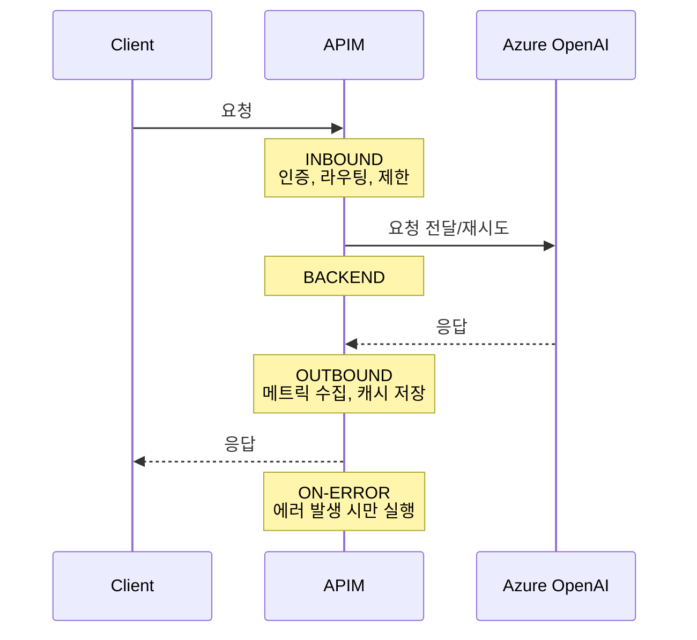

# APIM 정책 레퍼런스 가이드

Azure API Management 정책은 요청/응답 파이프라인의 **4개 섹션**에서 실행됩니다.  
이 가이드는 AI Gateway에서 사용하는 모든 정책의 **위치, 역할, 예시**를 정리합니다.

---

## 정책 파이프라인 구조



### 각 섹션의 역할

| 섹션 | 실행 시점 | 주요 역할 | Portal 위치 |
|------|----------|----------|-------------|
| **`<inbound>`** | 클라이언트 요청이 APIM에 도착 | 인증, Rate Limit, 라우팅, 요청 변환, IP 필터 | Design → Inbound processing |
| **`<backend>`** | APIM이 백엔드로 요청 전달 | 재시도, 요청 포워딩, 타임아웃 설정 | Design → Backend processing |
| **`<outbound>`** | 백엔드 응답을 클라이언트로 반환 | 토큰 메트릭 수집, 캐시 저장, 응답 변환, 디버그 헤더 | Design → Outbound processing |
| **`<on-error>`** | 어떤 섹션에서든 에러 발생 시 | 커스텀 에러 응답, 에러 로깅 | Design → On error |

> **`<base />`** 는 부모(상위) 정책을 상속합니다. 각 섹션 시작에 반드시 포함하세요.

---

## Inbound 정책 (클라이언트 → APIM)

### 1. `authentication-managed-identity` — Managed Identity 인증

APIM이 Azure OpenAI를 호출할 때 API Key 대신 Managed Identity로 인증합니다.

**왜 Inbound인가?** 백엔드 호출 전에 인증 토큰을 준비해야 하므로.

```xml
<inbound>
    <base />
    <!-- APIM의 System Assigned MI로 Azure OpenAI 인증 -->
    <authentication-managed-identity resource="https://cognitiveservices.azure.com" />
</inbound>
```

> AI Foundry 사용 시: `resource="https://ml.azure.com"`

**사전 조건:** APIM에 `Cognitive Services OpenAI User` 역할 할당 필요

---

### 2. `azure-openai-token-limit` — 토큰 기반 Rate Limiting

분당 토큰(TPM) 단위로 API 사용량을 제한합니다. HTTP 요청 횟수가 아닌 **토큰 수** 기준입니다.

**왜 Inbound인가?** 백엔드에 요청을 보내기 전에 할당량을 확인해야 하므로.

```xml
<inbound>
    <base />
    <!-- 구독별 10,000 TPM 제한 -->
    <azure-openai-token-limit
        counter-key="@(context.Subscription.Id)"
        tokens-per-minute="10000"
        estimate-prompt-tokens="true"
        remaining-tokens-variable-name="remainingTokens"
        remaining-tokens-header-name="x-ratelimit-remaining-tokens"
        tokens-consumed-variable-name="tokensConsumed"
        tokens-consumed-header-name="x-ratelimit-tokens-consumed" />
</inbound>
```

**주요 속성:**
| 속성 | 설명 |
|------|------|
| `counter-key` | 제한 단위 (구독별, IP별, API Key별 등) |
| `tokens-per-minute` | 분당 토큰 할당량 |
| `estimate-prompt-tokens` | 요청 시 프롬프트 토큰을 추정하여 사전 차감 |
| `remaining-tokens-header-name` | 클라이언트에게 남은 토큰을 알려주는 응답 헤더 |
| `tokens-consumed-variable-name` | 소비된 토큰 수를 저장할 변수 이름 |
| `tokens-consumed-header-name` | 소비된 토큰 수를 알려주는 응답 헤더 |

**초과 시:** HTTP `429 Too Many Requests` 반환

---

### 3. `azure-openai-semantic-cache-lookup` — 시맨틱 캐시 조회

이전에 유사한 질문이 있었으면 백엔드를 호출하지 않고 캐시된 응답을 반환합니다.

**왜 Inbound인가?** 백엔드 호출 전에 캐시를 확인해서 불필요한 호출을 줄여야 하므로.

```xml
<inbound>
    <base />
    <!-- 유사도 0.8 이상이면 캐시 히트 -->
    <azure-openai-semantic-cache-lookup
        score-threshold="0.8"
        embeddings-backend-id="embedding-backend"
        embeddings-backend-auth="system-assigned" />
</inbound>
```

**동작 원리:**
1. 프롬프트를 임베딩 벡터로 변환
2. 캐시된 프롬프트와 코사인 유사도 비교
3. `score-threshold` 이상이면 캐시된 응답 즉시 반환 (백엔드 호출 생략)

> **참고:** 캐시 저장은 `<outbound>`의 `azure-openai-semantic-cache-store`에서 수행

---

### 4. `set-backend-service` — 백엔드 라우팅

요청을 어느 백엔드(또는 백엔드 풀)로 보낼지 결정합니다.

**왜 Inbound인가?** 백엔드 호출 전에 대상을 결정해야 하므로.

```xml
<inbound>
    <base />
    <!-- 백엔드 풀로 라우팅 (Round Robin 로드밸런싱) -->
    <set-backend-service backend-id="openai-backend-pool" />
</inbound>
```

**변형 — 직접 URL 지정:**
```xml
<inbound>
    <base />
    <!-- 특정 백엔드 URL로 직접 라우팅 -->
    <set-backend-service base-url="https://aoai-eastus-001.openai.azure.com/openai" />
</inbound>
```

**변형 — 조건부 라우팅 (Gemini):**
```xml
<inbound>
    <base />
    <choose>
        <when condition="@(context.Request.Headers
            .GetValueOrDefault("x-model-provider","") == "gemini")">
            <set-backend-service base-url="https://generativelanguage.googleapis.com/v1beta" />
        </when>
        <otherwise>
            <set-backend-service backend-id="openai-backend-pool" />
        </otherwise>
    </choose>
</inbound>
```

---

### 5. `ip-filter` — IP 기반 접근 제어

허용/차단할 IP를 지정합니다.

**왜 Inbound인가?** 요청 처리 가장 첫 단계에서 차단해야 하므로.

```xml
<inbound>
    <base />
    <!-- 특정 IP만 허용 -->
    <ip-filter action="allow">
        <address>203.0.113.10</address>
        <address-range from="10.0.0.0" to="10.0.0.255" />
    </ip-filter>
</inbound>
```

---

### 6. `set-header` / `set-body` — 요청 변환

백엔드에 보내기 전에 헤더나 본문을 변환합니다.

**왜 Inbound인가?** 백엔드가 이해할 수 있는 형식으로 변환해야 하므로.

```xml
<inbound>
    <base />
    <!-- Gemini API Key 헤더 추가 -->
    <set-header name="x-goog-api-key" exists-action="override">
        <value>{{gemini-api-key}}</value>
    </set-header>

    <!-- OpenAI 포맷 → Gemini 포맷 변환 -->
    <set-body>@{
        var body = context.Request.Body.As<JObject>();
        var messages = body["messages"] as JArray;
        // ... Gemini 포맷으로 변환 로직
        return transformedBody.ToString();
    }</set-body>
</inbound>
```

---

### 7. `send-request` — 외부 서비스 호출

정책 내에서 외부 API(예: Content Safety)를 호출합니다.

**왜 Inbound인가?** 백엔드 호출 전에 콘텐츠 검사 등을 수행해야 하므로.

```xml
<inbound>
    <base />
    <!-- Azure Content Safety API로 프롬프트 검사 -->
    <send-request mode="new" response-variable-name="safetyResponse" timeout="10">
        <set-url>https://content-safety-001.cognitiveservices.azure.com/contentsafety/text:analyze?api-version=2024-09-01</set-url>
        <set-method>POST</set-method>
        <set-header name="Content-Type" exists-action="override">
            <value>application/json</value>
        </set-header>
        <authentication-managed-identity resource="https://cognitiveservices.azure.com" />
        <set-body>@{
            var body = context.Request.Body.As<JObject>();
            var text = body["messages"]?.Last?["content"]?.ToString() ?? "";
            return new JObject(new JProperty("text", text)).ToString();
        }</set-body>
    </send-request>

    <!-- 위험 콘텐츠 차단 -->
    <choose>
        <when condition="@{
            var resp = ((IResponse)context.Variables["safetyResponse"]);
            var body = resp.Body.As<JObject>();
            return body["categoriesAnalysis"]?.Any(c => (int)c["severity"] >= 4) == true;
        }">
            <return-response>
                <set-status code="400" reason="Content Safety Violation" />
                <set-body>{"error": "입력 내용이 콘텐츠 안전 정책을 위반합니다."}</set-body>
            </return-response>
        </when>
    </choose>
</inbound>
```

---

### 8. `set-variable` — 변수 설정

이후 정책에서 사용할 변수를 설정합니다.

**왜 Inbound인가?** 요청 처리 초기에 판단 기준을 설정해야 하므로.

```xml
<inbound>
    <base />
    <!-- 스트리밍 여부 감지 -->
    <set-variable name="isStreaming" value="@{
        var body = context.Request.Body.As<JObject>(preserveContent: true);
        return body["stream"]?.Value<bool>() == true;
    }" />
</inbound>
```

---

## Backend 정책 (APIM → Azure OpenAI)

### 9. `retry` — 재시도 (429/500 대응)

백엔드가 429(Rate Limit) 또는 500+(서버 에러)를 반환하면 다른 백엔드로 재시도합니다.

**왜 Backend인가?** 백엔드 호출과 응답 사이에서 재시도 로직을 제어해야 하므로.

```xml
<backend>
    <!-- 429 에러 시 백엔드 풀 내 다른 인스턴스로 재시도 -->
    <retry condition="@(context.Response.StatusCode == 429
                     || context.Response.StatusCode >= 500)"
           count="3"
           interval="1"
           max-interval="10"
           delta="1"
           first-fast-retry="false">
        <set-backend-service backend-id="openai-backend-pool" />
        <forward-request buffer-request-body="true" />
    </retry>
</backend>
```

**주요 속성:**
| 속성 | 설명 |
|------|------|
| `count` | 최대 재시도 횟수 |
| `interval` | 재시도 간격 (초) |
| `max-interval` | 최대 재시도 간격 (지수 백오프 상한) |
| `delta` | 간격 증가량 |
| `first-fast-retry` | 첫 재시도를 즉시 할지 여부 |

> **핵심:** `<set-backend-service>`를 retry 안에 넣으면 재시도 시 풀에서 **다른** 백엔드가 선택됩니다.

---

### 10. `forward-request` — 요청 전달 (스트리밍 지원)

백엔드에 요청을 전달할 때의 동작을 제어합니다.

**왜 Backend인가?** 백엔드로의 실제 HTTP 호출 방식을 제어하므로.

```xml
<backend>
    <!-- SSE 스트리밍: 응답을 버퍼링하지 않고 실시간 전달 -->
    <forward-request timeout="120" buffer-response="false" />
</backend>
```

| 속성 | 설명 |
|------|------|
| `buffer-request-body="true"` | 재시도 시 요청 본문 재사용 (retry와 함께 사용) |
| `buffer-response="false"` | SSE 스트리밍을 위해 응답 버퍼링 비활성화 |
| `timeout` | 백엔드 응답 대기 시간 (초) |

---

## Outbound 정책 (백엔드 → 클라이언트)

### 11. `azure-openai-emit-token-metric` — 토큰 메트릭 수집

Azure OpenAI 응답에 포함된 토큰 사용량을 App Insights로 전송합니다.

**왜 Outbound인가?** 토큰 사용량은 **백엔드 응답**에 포함되어 있으므로.

```xml
<outbound>
    <base />
    <!-- 모델별·백엔드별 토큰 사용량 수집 -->
    <azure-openai-emit-token-metric namespace="ai-gateway-metrics">
        <dimension name="Subscription ID" value="@(context.Subscription.Id)" />
        <dimension name="Client IP" value="@(context.Request.IpAddress)" />
        <dimension name="API ID" value="@(context.Api.Id)" />
        <dimension name="Model" value="@(context.Request.MatchedParameters["deployment-id"])" />
        <dimension name="Backend" value="@(context.Request.Url.Host)" />
    </azure-openai-emit-token-metric>
</outbound>
```

**수집되는 메트릭 (App Insights `customMetrics` 테이블):**
| 메트릭 이름 | 설명 |
|------------|------|
| `Prompt Tokens` | 프롬프트(입력) 토큰 수 |
| `Completion Tokens` | 응답(출력) 토큰 수 |
| `Total Tokens` | 총 토큰 수 |

> **핵심:** `Backend` 차원을 포함해야 각 AOAI 인스턴스별 TPM을 추적할 수 있습니다.

**KQL로 TPM 조회:**
```kql
customMetrics
| where name startswith "ai-gateway-metrics"
| extend model = tostring(customDimensions["Model"])
| extend backend = tostring(customDimensions["Backend"])
| summarize TPM = sum(value) by model, backend, bin(timestamp, 1m)
| render timechart
```

---

### 12. `emit-metric` — 커스텀 메트릭 수집

토큰 외의 커스텀 메트릭(예: 응답 지연 시간)을 수집합니다.

**왜 Outbound인가?** 전체 응답 시간은 백엔드 응답 후에야 계산 가능하므로.

```xml
<outbound>
    <base />
    <!-- 모델별·백엔드별 응답 지연 시간(ms) 수집 -->
    <emit-metric name="ai-gateway-latency" namespace="ai-gateway-metrics">
        <dimension name="API" value="@(context.Api.Name)" />
        <dimension name="Model" value="@(context.Request.MatchedParameters["deployment-id"])" />
        <dimension name="Backend" value="@(context.Request.Url.Host)" />
        <dimension name="Status" value="@(context.Response.StatusCode.ToString())" />
        <value>@(context.Elapsed.TotalMilliseconds)</value>
    </emit-metric>
</outbound>
```

---

### 13. `azure-openai-semantic-cache-store` — 시맨틱 캐시 저장

백엔드 응답을 캐시에 저장합니다. Inbound의 `cache-lookup`과 쌍으로 동작합니다.

**왜 Outbound인가?** 백엔드 **응답**을 저장해야 하므로.

```xml
<outbound>
    <base />
    <!-- 응답을 1시간(3600초) 동안 캐시 -->
    <azure-openai-semantic-cache-store duration="3600" />
</outbound>
```

---

### 14. `set-header` (Outbound) — 응답 헤더 추가

디버깅이나 클라이언트 정보 제공을 위해 응답 헤더를 추가합니다.

**왜 Outbound인가?** 클라이언트에게 돌려보내는 응답에 정보를 추가하므로.

```xml
<outbound>
    <base />
    <!-- 어느 백엔드가 처리했는지 헤더에 표시 (디버깅용) -->
    <set-header name="x-backend-url" exists-action="override">
        <value>@(context.Request.Url.Host)</value>
    </set-header>
</outbound>
```

---

### 15. `set-body` (Outbound) — 응답 변환

백엔드 응답 형식을 클라이언트가 기대하는 형식으로 변환합니다.

**왜 Outbound인가?** 백엔드 **응답**을 변환하므로.

```xml
<outbound>
    <base />
    <choose>
        <!-- Gemini 응답 → OpenAI 포맷으로 변환 -->
        <when condition="@(context.Request.Headers
            .GetValueOrDefault("x-model-provider","") == "gemini")">
            <set-body>@{
                var body = context.Response.Body.As<JObject>();
                var text = body["candidates"]?[0]?["content"]?["parts"]?[0]?["text"]?.ToString() ?? "";
                return new JObject(
                    new JProperty("id", "chatcmpl-" + Guid.NewGuid().ToString("N").Substring(0, 29)),
                    new JProperty("object", "chat.completion"),
                    new JProperty("model", "gemini-2.0-flash"),
                    new JProperty("choices", new JArray(
                        new JObject(
                            new JProperty("index", 0),
                            new JProperty("message", new JObject(
                                new JProperty("role", "assistant"),
                                new JProperty("content", text)
                            )),
                            new JProperty("finish_reason", "stop")
                        )
                    ))
                ).ToString();
            }</set-body>
        </when>
    </choose>
</outbound>
```

---

## On-Error 정책 (에러 핸들링)

### 16. `on-error` — 에러 처리

어떤 섹션에서든 에러가 발생하면 이 섹션이 실행됩니다.

```xml
<on-error>
    <base />
    <!-- 커스텀 에러 응답 예시 -->
    <set-header name="Content-Type" exists-action="override">
        <value>application/json</value>
    </set-header>
    <set-body>@{
        return new JObject(
            new JProperty("error", new JObject(
                new JProperty("code", context.Response.StatusCode.ToString()),
                new JProperty("message", context.LastError.Message)
            ))
        ).ToString();
    }</set-body>
</on-error>
```

---

## 전체 정책 조합 예시 (AI Gateway 완성)

모든 정책을 조합한 프로덕션 수준의 AI Gateway 정책입니다:

```xml
<policies>
    <!-- ══════════════════════════════════════════════════════════ -->
    <!-- INBOUND: 클라이언트 요청이 APIM에 도착했을 때                 -->
    <!-- ══════════════════════════════════════════════════════════ -->
    <inbound>
        <base />

        <!-- 1. Managed Identity 인증 (API Key 대신) -->
        <authentication-managed-identity resource="https://cognitiveservices.azure.com" />

        <!-- 2. 시맨틱 캐시 조회 (캐시 히트 시 토큰 소비 없이 바로 outbound로 이동) -->
        <azure-openai-semantic-cache-lookup
            score-threshold="0.8"
            embeddings-backend-id="embedding-backend"
            embeddings-backend-auth="system-assigned" />

        <!-- 3. 토큰 기반 Rate Limiting (캐시 미스 시에만 토큰 차감) -->
        <azure-openai-token-limit
            counter-key="@(context.Subscription.Id)"
            tokens-per-minute="10000"
            estimate-prompt-tokens="true"
            remaining-tokens-variable-name="remainingTokens"
            remaining-tokens-header-name="x-ratelimit-remaining-tokens"
            tokens-consumed-variable-name="tokensConsumed"
            tokens-consumed-header-name="x-ratelimit-tokens-consumed" />

        <!-- 4. 백엔드 풀 라우팅 (3개 리전 Round Robin) -->
        <set-backend-service backend-id="openai-backend-pool" />
    </inbound>

    <!-- ══════════════════════════════════════════════════════════ -->
    <!-- BACKEND: APIM이 Azure OpenAI에 요청을 보낼 때                -->
    <!-- ══════════════════════════════════════════════════════════ -->
    <backend>
        <!-- 429/500+ 에러 시 풀 내 다른 백엔드로 재시도 -->
        <retry condition="@(context.Response.StatusCode == 429
                         || context.Response.StatusCode >= 500)"
               count="3" interval="1" max-interval="10" delta="1"
               first-fast-retry="false">
            <set-backend-service backend-id="openai-backend-pool" />
            <forward-request buffer-request-body="true" />
        </retry>
    </backend>

    <!-- ══════════════════════════════════════════════════════════ -->
    <!-- OUTBOUND: 백엔드 응답이 클라이언트로 돌아갈 때                 -->
    <!-- ══════════════════════════════════════════════════════════ -->
    <outbound>
        <base />

        <!-- 5. 시맨틱 캐시 저장 (1시간) -->
        <azure-openai-semantic-cache-store duration="3600" />

        <!-- 6. 토큰 메트릭 수집 (모델별·백엔드별 TPM 추적) -->
        <azure-openai-emit-token-metric namespace="ai-gateway-metrics">
            <dimension name="Subscription ID" value="@(context.Subscription.Id)" />
            <dimension name="Client IP" value="@(context.Request.IpAddress)" />
            <dimension name="API ID" value="@(context.Api.Id)" />
            <dimension name="Model" value="@(context.Request.MatchedParameters["deployment-id"])" />
            <dimension name="Backend" value="@(context.Request.Url.Host)" />
        </azure-openai-emit-token-metric>

        <!-- 7. 커스텀 지연 시간 메트릭 -->
        <emit-metric name="ai-gateway-latency" namespace="ai-gateway-metrics">
            <dimension name="API" value="@(context.Api.Name)" />
            <dimension name="Model" value="@(context.Request.MatchedParameters["deployment-id"])" />
            <dimension name="Backend" value="@(context.Request.Url.Host)" />
            <dimension name="Status" value="@(context.Response.StatusCode.ToString())" />
            <value>@(context.Elapsed.TotalMilliseconds)</value>
        </emit-metric>
    </outbound>

    <!-- ══════════════════════════════════════════════════════════ -->
    <!-- ON-ERROR: 에러 발생 시                                      -->
    <!-- ══════════════════════════════════════════════════════════ -->
    <on-error>
        <base />
    </on-error>
</policies>
```

---

## 정책-섹션 빠른 참조표

| 정책 | 섹션 | 이유 | Lab |
|------|------|------|-----|
| `authentication-managed-identity` | **inbound** | 백엔드 호출 전 인증 토큰 준비 | Lab 2 |
| `azure-openai-token-limit` | **inbound** | 요청을 보내기 전 할당량 확인 | Lab 4 |
| `azure-openai-semantic-cache-lookup` | **inbound** | 캐시 히트 시 백엔드 호출 생략 | Lab 4 |
| `set-backend-service` | **inbound** | 라우팅 대상 결정 | Lab 3 |
| `ip-filter` | **inbound** | 가장 먼저 접근 제어 | Lab 7 |
| `set-header` (요청) | **inbound** | 백엔드에 전달할 헤더 설정 | Lab 5 |
| `set-body` (요청) | **inbound** | 백엔드 포맷으로 변환 | Lab 5 |
| `rewrite-uri` | **inbound** | 백엔드 URL 경로 변경 | Lab 5 |
| `send-request` | **inbound** | 외부 서비스 호출 (Safety 등) | Lab 7 |
| `set-variable` | **inbound** | 조건 판단용 변수 설정 | Lab 7 |
| `choose` / `when` | **inbound/outbound** | 조건부 로직 (라우팅/변환) | Lab 5, 7 |
| `return-response` | **inbound** | 조기 차단 (Safety 위반 등) | Lab 7 |
| `retry` | **backend** | 429/500 에러 시 재시도 | Lab 4 |
| `forward-request` | **backend** | 요청 전달 방식 제어 (SSE 등) | Lab 7 |
| `azure-openai-emit-token-metric` | **outbound** | 응답의 토큰 사용량 수집 | Lab 4, 6 |
| `emit-metric` | **outbound** | 커스텀 메트릭 (지연 시간 등) | Lab 6 |
| `azure-openai-semantic-cache-store` | **outbound** | 응답을 캐시에 저장 | Lab 4 |
| `set-header` (응답) | **outbound** | 디버그 헤더 추가 | Lab 3 |
| `set-body` (응답) | **outbound** | 응답 포맷 정규화 | Lab 5 |

---

## 정책 실행 순서

같은 섹션 안에서 정책은 **위에서 아래로 순서대로** 실행됩니다.

```
Inbound 실행 순서 (권장):
  1. ip-filter           ← 가장 먼저: 차단할 요청 즉시 거부
  2. authentication      ← 인증
  3. semantic-cache      ← 캐시 히트 시 바로 outbound로 이동 (토큰 소비 X)
  4. token-limit         ← 캐시 미스 시에만 토큰 차감
  5. set-backend-service ← 라우팅
  6. set-header/set-body ← 요청 변환

  💡 캐시 조회를 토큰 제한보다 먼저 배치해야
     캐시 히트 시 불필요한 토큰 할당량 소비를 방지합니다.

Outbound 실행 순서 (권장):
  1. semantic-cache-store ← 캐시 저장
  2. emit-token-metric    ← 토큰 메트릭 수집
  3. emit-metric          ← 커스텀 메트릭
  4. set-header/set-body  ← 응답 변환
```

---

## 추가 유용한 정책 예시

아래 정책들은 이 실습에서 직접 다루지는 않지만, 프로덕션 AI Gateway에서 자주 사용됩니다.

---

### A. `validate-jwt` — JWT 토큰 검증 (Entra ID / OAuth 2.0)

Subscription Key 대신 **Entra ID(Azure AD) 토큰**으로 인증합니다. 엔터프라이즈 환경에서 가장 많이 쓰는 인증 방식입니다.

**섹션: `<inbound>`** — 요청을 처리하기 전에 토큰을 검증해야 하므로.

```xml
<inbound>
    <base />
    <!-- Entra ID에서 발급한 JWT 토큰 검증 -->
    <validate-jwt header-name="Authorization"
                  failed-validation-httpcode="401"
                  failed-validation-error-message="Unauthorized. Invalid token.">
        <openid-config url="https://login.microsoftonline.com/{tenant-id}/v2.0/.well-known/openid-configuration" />
        <audiences>
            <audience>api://{client-id}</audience>
        </audiences>
        <issuers>
            <issuer>https://sts.windows.net/{tenant-id}/</issuer>
        </issuers>
        <required-claims>
            <!-- 특정 역할이 있는 사용자만 허용 -->
            <claim name="roles" match="any">
                <value>AI.User</value>
                <value>AI.Admin</value>
            </claim>
        </required-claims>
    </validate-jwt>
</inbound>
```

**활용 예시:** 팀별로 다른 역할(`AI.User`, `AI.Admin`)을 부여하고, Admin만 GPT-4o 사용 가능하게 하는 등의 세밀한 접근 제어.

---

### B. `rate-limit-by-key` — 커스텀 키 기반 Rate Limiting

토큰이 아닌 **HTTP 요청 횟수** 기반으로 제한합니다. IP별, 사용자별, 헤더 값별 등 자유롭게 키를 지정할 수 있습니다.

**섹션: `<inbound>`** — 요청을 보내기 전에 제한을 확인해야 하므로.

```xml
<inbound>
    <base />
    <!-- IP별 분당 60회 요청 제한 -->
    <rate-limit-by-key calls="60"
                       renewal-period="60"
                       counter-key="@(context.Request.IpAddress)" />
</inbound>
```

**변형 — JWT claim 기반 (사용자별 제한):**
```xml
<inbound>
    <base />
    <!-- 사용자 이메일 기준 분당 30회 -->
    <rate-limit-by-key calls="30"
                       renewal-period="60"
                       counter-key="@(context.Request.Headers
                           .GetValueOrDefault("Authorization","")
                           .AsJwt()?.Claims["email"]?.FirstOrDefault() 
                           ?? context.Request.IpAddress)" />
</inbound>
```

---

### C. `quota-by-key` — 일/월 단위 사용량 쿼터

Rate Limit보다 **긴 기간**의 할당량을 관리합니다. 월별 호출 횟수나 대역폭 제한에 적합합니다.

**섹션: `<inbound>`**

```xml
<inbound>
    <base />
    <!-- 구독별 일일 10,000회 요청 쿼터 -->
    <quota-by-key calls="10000"
                  renewal-period="86400"
                  counter-key="@(context.Subscription.Id)" />
</inbound>
```

**활용 예시:** 무료 티어 사용자에게 일일 100회, 유료 티어에게 10,000회 제한.

---

### D. `log-to-eventhub` — Event Hub로 실시간 로그 스트리밍

App Insights 외에 **Event Hub**로 요청/응답 데이터를 실시간 스트리밍합니다. 별도 분석 파이프라인(Spark, Databricks 등)이 필요할 때 사용합니다.

**섹션: `<outbound>`** — 완성된 응답 데이터를 로깅하므로.

```xml
<outbound>
    <base />
    <!-- 요청/응답 요약을 Event Hub로 전송 -->
    <log-to-eventhub logger-id="ai-gateway-eventhub">@{
        var body = context.Response.Body.As<JObject>(preserveContent: true);
        var usage = body?["usage"];
        return new JObject(
            new JProperty("timestamp", DateTime.UtcNow.ToString("o")),
            new JProperty("operation_id", context.RequestId),
            new JProperty("subscription_id", context.Subscription.Id),
            new JProperty("api", context.Api.Name),
            new JProperty("model", context.Request.MatchedParameters["deployment-id"]),
            new JProperty("backend", context.Request.Url.Host),
            new JProperty("status_code", context.Response.StatusCode),
            new JProperty("latency_ms", context.Elapsed.TotalMilliseconds),
            new JProperty("prompt_tokens", usage?["prompt_tokens"]?.Value<int>() ?? 0),
            new JProperty("completion_tokens", usage?["completion_tokens"]?.Value<int>() ?? 0),
            new JProperty("total_tokens", usage?["total_tokens"]?.Value<int>() ?? 0)
        ).ToString();
    }</log-to-eventhub>
</outbound>
```

**활용 예시:** 실시간 비용 대시보드, 이상 탐지, 프롬프트 감사(audit) 로그.

---

### E. `cors` — CORS (Cross-Origin Resource Sharing)

브라우저 기반 SPA(React, Vue 등)에서 직접 APIM을 호출할 때 필요합니다.

**섹션: `<inbound>`** — 브라우저의 preflight(OPTIONS) 요청을 가장 먼저 처리해야 하므로.

```xml
<inbound>
    <base />
    <cors allow-credentials="true">
        <allowed-origins>
            <origin>https://my-chatbot-app.azurewebsites.net</origin>
            <origin>http://localhost:3000</origin>
        </allowed-origins>
        <allowed-methods preflight-result-max-age="300">
            <method>POST</method>
            <method>OPTIONS</method>
        </allowed-methods>
        <allowed-headers>
            <header>Content-Type</header>
            <header>Ocp-Apim-Subscription-Key</header>
            <header>Authorization</header>
        </allowed-headers>
    </cors>
</inbound>
```

---

### F. `cache-lookup` / `cache-store` — 일반 응답 캐싱

시맨틱 캐시가 아닌 **정확히 동일한 요청**에 대한 단순 캐싱입니다. Embeddings API처럼 동일한 입력이 반복되는 경우에 효과적입니다.

**섹션: `<inbound>` + `<outbound>`** — 조회는 요청 시, 저장은 응답 시.

```xml
<!-- inbound: 캐시 조회 -->
<inbound>
    <base />
    <cache-lookup vary-by-developer="false"
                  vary-by-developer-groups="false"
                  caching-type="internal">
        <vary-by-header>Ocp-Apim-Subscription-Key</vary-by-header>
        <vary-by-query-parameter>api-version</vary-by-query-parameter>
    </cache-lookup>
</inbound>

<!-- outbound: 캐시 저장 (5분) -->
<outbound>
    <base />
    <cache-store duration="300" />
</outbound>
```

---

### G. `mock-response` — 모의 응답 (개발/테스트용)

백엔드 없이 정의된 응답을 반환합니다. API 설계 단계나 프론트엔드 개발 시 유용합니다.

**섹션: `<inbound>`** — 백엔드를 호출하지 않고 즉시 응답하므로.

```xml
<inbound>
    <base />
    <!-- 개발 환경에서 모의 응답 반환 -->
    <mock-response status-code="200" content-type="application/json">
        <set-body>{
    "id": "chatcmpl-mock-12345",
    "object": "chat.completion",
    "model": "gpt-4.1-nano",
    "choices": [{
        "index": 0,
        "message": {"role": "assistant", "content": "이것은 모의 응답입니다."},
        "finish_reason": "stop"
    }],
    "usage": {"prompt_tokens": 10, "completion_tokens": 8, "total_tokens": 18}
}</set-body>
    </mock-response>
</inbound>
```

**활용 예시:** Azure OpenAI 비용 없이 프론트엔드 연동 테스트, 부하 테스트, CI/CD 파이프라인.

---

### H. `validate-content` — 요청/응답 본문 검증

JSON Schema로 요청 본문의 구조를 검증합니다. 잘못된 요청이 백엔드까지 가는 것을 방지합니다.

**섹션: `<inbound>`** — 백엔드 호출 전에 검증해야 하므로.

```xml
<inbound>
    <base />
    <!-- 요청 본문이 올바른 Chat Completion 형식인지 검증 -->
    <validate-content unspecified-content-type-action="prevent"
                      max-size="102400"
                      size-exceeded-action="prevent"
                      errors-variable-name="validationErrors">
        <content type="application/json" validate-as="json"
                 action="prevent" />
    </validate-content>
</inbound>
```

---

### I. `trace` — 디버깅용 추적 로그

정책 실행 중간에 변수 값이나 상태를 App Insights 트레이스에 기록합니다.

**섹션: 어디서든** — 디버깅이 필요한 위치에 삽입.

```xml
<inbound>
    <base />
    <!-- 디버깅: 어떤 백엔드로 라우팅되는지 추적 -->
    <trace source="ai-gateway" severity="information">
        <message>@($"Routing to backend: {context.Request.Url.Host}, Model: {context.Request.MatchedParameters["deployment-id"]}")</message>
        <metadata name="Subscription" value="@(context.Subscription.Id)" />
        <metadata name="Remaining-Tokens" value="@(context.Variables.GetValueOrDefault<string>("remainingTokens", "N/A"))" />
    </trace>
</inbound>
```

> **주의:** `trace`는 APIM의 **Ocp-Apim-Trace** 헤더가 활성화되었을 때만 동작합니다. 프로덕션에서는 비활성화하세요.

---

### J. `llm-content-safety` — Azure AI Content Safety 통합

Azure AI Content Safety 서비스와 직접 연동하여 프롬프트/응답의 유해 콘텐츠를 자동으로 감지·차단합니다.

**섹션: `<inbound>` (프롬프트 검사) + `<outbound>` (응답 검사)**

```xml
<!-- inbound: 프롬프트에 유해 콘텐츠가 있으면 차단 -->
<inbound>
    <base />
    <llm-content-safety backend-id="content-safety-backend">
        <text-content>
            <category name="Hate" threshold="Medium" />
            <category name="Violence" threshold="Medium" />
            <category name="SelfHarm" threshold="Medium" />
            <category name="Sexual" threshold="Medium" />
        </text-content>
    </llm-content-safety>
</inbound>
```

---

### 추가 정책 빠른 참조표

| 정책 | 섹션 | 용도 | 프로덕션 추천 |
|------|------|------|:---:|
| `validate-jwt` | inbound | Entra ID/OAuth 토큰 인증 | ⭐⭐⭐ |
| `rate-limit-by-key` | inbound | 요청 횟수 기반 제한 (IP별, 사용자별) | ⭐⭐⭐ |
| `quota-by-key` | inbound | 일/월 단위 사용량 쿼터 | ⭐⭐ |
| `log-to-eventhub` | outbound | Event Hub 실시간 로그 스트리밍 | ⭐⭐⭐ |
| `cors` | inbound | 브라우저 SPA 연동 시 필수 | ⭐⭐ |
| `cache-lookup/store` | inbound/outbound | 동일 요청 단순 캐싱 | ⭐⭐ |
| `mock-response` | inbound | 개발/테스트용 모의 응답 | ⭐ |
| `validate-content` | inbound | 요청 본문 JSON 스키마 검증 | ⭐⭐ |
| `trace` | 어디서든 | 디버깅용 추적 로그 | ⭐ |
| `llm-content-safety` | inbound | 유해 콘텐츠 자동 감지·차단 | ⭐⭐⭐ |
