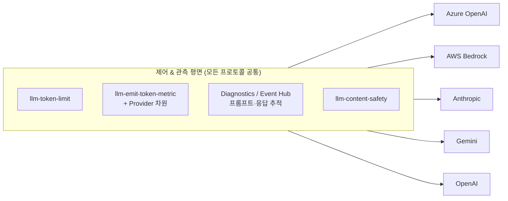

# 설계 문서: 멀티 클라우드 AI Gateway & 통합 관측 랩 (Lab 8–10 + Lab 6 패치)

- **작성일:** 2026-07-16
- **대상 레포:** ChangJu-Ahn/Azure-AI-Gateway-KR
- **상태:** 설계 승인 대기 → 구현(초안 README 작성)

---

## 1. 개요 (Overview)

기존 8개 랩(APIM 기반 AI Gateway)에 **3개의 신규 랩**을 추가하고, 기존 **Lab 6(모니터링)에 소규모 정직한 패치**를 적용한다.

최종 메시지는 하나다:

> **하나의 AI Gateway로 Azure뿐 아니라 AWS Bedrock · Anthropic · OpenAI · Gemini 등 모든 프론티어 모델을,
> 구독(subscriber)별로 격리하여 제어(control)하고 관측(observability)한다.**

이를 위해 세 축을 세운다.

1. **멀티 클라우드 통합** — 단일 OpenAI 호환 계약으로 5개 프로바이더를 통합 (Lab 8)
2. **구독 격리** — Products + Developer Portal 로 API/토큰을 subscriber별 격리 (Lab 9)
3. **통합 관측·거버넌스** — 모든 프로바이더 × 모든 구독의 토큰/프롬프트/비용을 Azure Monitor로 관측 (Lab 10 + Lab 6 패치)

---

## 2. 배경 & 현재 상태 (기존 레포 리뷰 결과)

| 영역 | 현재 상태 | 신규 랩에 대한 시사점 |
|------|----------|----------------------|
| 멀티 모델 | Lab 5에서 **Gemini** 로드밸런싱만 구현 (검증 완료). Claude/Bedrock은 README 언급뿐 | Lab 8은 Lab 5의 로드밸런싱 개념을 재사용해 나머지 프로바이더로 확장 |
| 토큰 제어 | `azure-openai-token-limit` (counter-key = Subscription.Id) | **Azure OpenAI 전용**. 멀티 클라우드는 `llm-token-limit`(프로바이더 무관)로 전환 필요 |
| 토큰 메트릭 | `azure-openai-emit-token-metric` (Subscription/Model/Backend 차원) | 동일 이유로 `llm-emit-token-metric`로 전환 + `Provider` 차원 추가 |
| 프롬프트/응답 로깅 | Lab 6에서 APIM Diagnostics body 로깅 (`bytes: 4096`) | **8KB 하드 한계 + 스트리밍 미포착** → Lab 6 패치 + Lab 10 심화 |
| 구독/Product | `context.Subscription.Id`는 정책에 쓰이나 Product/Developer Portal 랩은 없음 | Lab 9 신규 |
| 대시보드 | Lab 6에서 App Insights KQL + metric alert | Lab 10에서 Provider × Subscription 차원의 Azure Monitor Workbook으로 확장 |

**결론:** 관측/제어의 “깊이”는 이미 훌륭하나 **범위가 Azure OpenAI에 한정**되어 있다. 신규 랩의 핵심은 이 깊이를 **모든 프로토콜/프로바이더/구독으로 확장**하는 것이다.

---

## 3. 목표 / 비목표 (Goals / Non-Goals)

### 목표
- 단일 OpenAI 호환 엔드포인트로 5개 프로바이더 호출 (client는 `model`만 변경)
- 프로바이더 무관 `llm-*` 정책으로 토큰 제어·메트릭·시맨틱 캐시를 **동일하게** 적용
- Products + Developer Portal 기반 **셀프서비스 구독**과 API/토큰 격리
- Provider × Model × Subscription × Product 차원의 통합 관측 + Azure Monitor 대시보드
- 스트리밍 포함 프롬프트/응답의 풀 피델리티 로깅 경로 제시

### 비목표 (YAGNI)
- AWS SigV4 서명 정책 구현 (❌) — Bedrock **Bearer API key(2025)** 로 우회
- 실제 과금 시스템 구축 — 비용은 **추정(KQL 단가 매핑)** 수준까지만
- 신규 인프라 자동 배포 완성 — 본 작업은 **초안 README + 실제 스니펫**까지 (E2E 배포 검증은 후속)
- Lab 6의 대규모 재작성 — **소규모 정직한 패치**만

---

## 4. 시리즈 구조 & 번호

| Lab | 제목 | 변경 |
|-----|------|------|
| Lab 1–5 | (기존, 검증 완료) | 변경 없음 |
| Lab 6 | 모니터링 & 로깅 | 🔧 소규모 패치 (§9) |
| Lab 7 | 고급 패턴 | 변경 없음 |
| **Lab 8** | 멀티 클라우드 통합 게이트웨이 | 🆕 신규 |
| **Lab 9** | Products & 개발자 포털 (구독 격리) | 🆕 신규 |
| **Lab 10** | 구독별 거버넌스 & Azure Monitor 대시보드 | 🆕 신규 |
| Lab 8 → **Lab 11** | 리소스 정리 | 🔁 번호 변경(마지막 유지) |

> 폴더 규칙: `labs/lab08-multicloud-gateway/`, `labs/lab09-products-portal/`, `labs/lab10-governance-observability/`, `labs/lab08-cleanup/ → labs/lab11-cleanup/`.
> README 상단 표(진행 상태)와 각 랩의 “다음 단계” 링크를 함께 갱신한다.

---

## 5. 크로스커팅 테마: `azure-openai-*` → `llm-*` 제어·관측 평면

모든 신규 랩을 관통하는 기술 축. 5개 프로바이더는 모두 **OpenAI 호환 `usage` 필드**를 반환하므로, 프로바이더 무관 `llm-*` 정책이 동일하게 동작한다.

| 기존 (AOAI 전용) | 신규 (프로바이더 무관) | 역할 |
|---|---|---|
| `azure-openai-token-limit` | `llm-token-limit` | 구독별 TPM 제어 |
| `azure-openai-emit-token-metric` | `llm-emit-token-metric` | 토큰 메트릭 (+ `Provider` 차원) |
| `azure-openai-semantic-cache-lookup/store` | `llm-semantic-cache-lookup/store` | 시맨틱 캐시 |
| (신규) | `llm-content-safety` | 입력 안전성 (레포 doc에 이미 참조됨) |



신규 랩은 `policies/fragments/`에 `llm-*` 버전 조각을 **추가**하고(기존 AOAI 조각은 하위 랩 호환을 위해 보존), Lab 8부터 이를 사용한다.

---

## 6. Lab 8 — 멀티 클라우드 통합 게이트웨이

### 6.1 목표
단일 OpenAI 호환 엔드포인트가 5개 프로바이더를 프론트. 클라이언트는 `model`만 변경. 프로바이더별 백엔드 풀(로드밸런싱, Lab 3/5 재사용)과 크로스클라우드 Fallback.

### 6.2 프로바이더 통합 표

| 프로바이더 | 엔드포인트 | 인증 | 포맷 |
|---|---|---|---|
| Azure OpenAI | 기존 (Lab 2/3 백엔드 풀) | Managed Identity | OpenAI 네이티브 |
| OpenAI 직접 | `api.openai.com/v1` | Bearer key | OpenAI 네이티브 |
| AWS Bedrock | `bedrock-runtime.{region}.amazonaws.com/openai/v1` | **Bearer API key (2025 신규)** | OpenAI 호환 |
| Anthropic 직접 | `api.anthropic.com/v1` | Bearer / `x-api-key` | OpenAI 호환 엔드포인트 |
| Google Gemini | 기존 (Lab 5) + `.../v1beta/openai` | API key | OpenAI 호환 |

> **핵심 설계 결정 (Approach A — 통합 OpenAI 계약):** SigV4 미사용. Bedrock의 2025년 Bearer API key + OpenAI 호환 엔드포인트 덕분에 Bedrock도 다른 OpenAI 백엔드와 동일하게 취급.

### 6.3 라우팅
- 클라이언트는 항상 `POST {gateway}/openai/v1/chat/completions` 로 OpenAI 포맷 전송
- Inbound `choose` 정책이 요청 body의 `model` 값(prefix)으로 백엔드 결정 → `set-backend-service`
- 프로바이더별 인증 주입: Azure=Managed Identity, 그 외=Named Value의 Bearer/키 헤더

### 6.4 실습 단계 (초안)
1. 사전 준비 — OpenAI/Bedrock/Anthropic 키를 `.env` → APIM Named Value(secret)
2. 백엔드 등록 — 프로바이더별 backend + credential (다중 키/리전은 풀 구성 → 로드밸런싱)
3. 통합 API 등록 — OpenAI 호환 표면 1개
4. `model` 기반 라우팅 정책 (`choose` → `set-backend-service` + 인증 주입)
5. **`llm-*` 정책 적용** — `llm-token-limit`(구독별), `llm-emit-token-metric`(+`Provider` 차원)
6. 크로스클라우드 Fallback — `retry` + circuit-breaker(기존 fragment 재사용)
7. 테스트 노트북 — 동일 OpenAI SDK로 `model`만 바꿔 5개 프로바이더 호출 + 토큰 메트릭 확인

### 6.5 재사용 / 신규 자산
- 재사용: `retry-with-fallback.xml`, `circuit-breaker.xml`, 백엔드 풀 개념(Lab 3/5)
- 신규: `policies/fragments/llm-token-limit.xml`, `llm-emit-token-metrics.xml`, `model-routing.xml`
- 신규(초안): `infra/modules/*-backend.bicep` 스니펫 (bedrock/anthropic/openai) — 문서 내 스니펫 형태

---

## 7. Lab 9 — Products & 개발자 포털 (구독 격리)

### 7.1 목표
APIM **Products + Subscriptions + Developer Portal**로 각 팀/소비자가 **격리된 구독 키**를 셀프서비스 발급. API와 토큰 예산을 subscriber별 격리.

### 7.2 핵심 개념
- **Product** = API 묶음 + 정책 + 구독 필요(subscriptionRequired)
- Product 설계 예: 티어형(`free`/`standard`) 또는 팀형(`team-a`/`team-b`)
- Product별 정책: `llm-token-limit`(구독별 TPM + `token-quota` 월 토큰 총량) + `quota-by-key`(월 호출 수 상한)
- Developer Portal: 게시(publish), 회원가입/구독 활성화, 개발자 셀프 구독 → 키 발급

### 7.3 실습 단계 (초안)
1. Product 개념 & 티어 설계
2. Product 생성 & Lab 8 통합 API 연결 (`az apim product ...`)
3. Product-level 정책: 구독별 TPM + 월 토큰 quota(token-quota) + 월 호출 수 quota(quota-by-key)
4. 구독 생성 & 키 발급 (팀별)
5. Developer Portal 활성화·브랜딩·게시
6. 셀프서비스 시나리오: 개발자 가입 → 구독 → 자기 키로 호출
7. 테스트: 2개 구독으로 격리 검증 (키/TPM/메트릭 분리)

### 7.4 재사용 / 신규 자산
- 재사용: Lab 8 통합 API, `llm-token-limit`
- 신규: `policies/fragments/quota-by-key.xml` (요청(호출) 예산 조각), Product 별 policy 스니펫
- 신규 문서: `docs/developer-portal-guide.md` (포털 게시/브랜딩 초안); `llm-token-limit.xml` 은 `token-quota`/`token-quota-period` 추가로 확장됨

---

## 8. Lab 10 — 구독별 거버넌스 & Azure Monitor 대시보드 (관측 캡스톤)

### 8.1 목표
모든 **프로바이더 × 구독**에 걸친 거버넌스 + 관측 통합. 스트리밍 포함 풀 피델리티 로깅.

### 8.2 거버넌스
- 구독별 TPM + 월 quota, Product 티어별 차등
- 초과 시 429 + `Retry-After`, 알림 연동

### 8.3 관측 (Lab 6 심화)
- 메트릭 차원 확장: **Provider × Model × Subscription × Product**
- **Azure Monitor Workbook** (+ Dashboard 고정):
  - 구독별 토큰/비용, 프로바이더별 TPM, 구독별 429율, 프롬프트/응답 드릴다운, 크로스클라우드 차지백
- 구독별 Alert 규칙 (토큰 급증 / quota 초과)

### 8.4 풀 피델리티 로깅 (Lab 6 한계 보완 — §9와 연결)
- **Event Hub 로깅 경로**: `log-to-eventhub`로 8KB 초과 프롬프트/응답 무손실 캡처
- **스트리밍**: `stream_options.include_usage: true`로 스트림 종료 시 토큰 usage 확보 + 로깅 전략
- **레닥션/보존**: PII 마스킹, 보존 기간, 접근 제어 가이드

### 8.5 실습 단계 (초안)
1. 거버넌스 정책 정교화 (TPM + quota + 티어)
2. 메트릭 차원 확장 (`Provider` 등)
3. 풀 로깅 경로 (Event Hub) + 스트리밍 usage
4. KQL 확장 (Provider/Subscription 피벗, 크로스클라우드 비용)
5. Azure Monitor Workbook 생성 + Dashboard 고정
6. 구독별 Alert 규칙
7. 검증 노트북

### 8.6 재사용 / 신규 자산
- 재사용: Lab 6 App Insights/KQL 기반, Lab 4 토큰 정책, Lab 9 Product/구독
- 신규: `infra/modules/eventhub-logging.bicep`(초안), Workbook JSON(초안), KQL 세트

---

## 9. Lab 6 패치 (소규모·정직한 보완)

기존 검증 랩을 존중하여 **최소 변경**. 추가 섹션 + 설정 상수 수정 + 전방 참조.

- 신규 섹션 “프롬프트/응답 로깅의 한계와 보완”:
  - **8KB 하드 한계** (구성 불가) — 긴 프롬프트/RAG/응답 잘림
  - **스트리밍(SSE) 미포착** — `stream:true` 응답 body 및 종료 usage 누락
  - **PII/보존** 주의
- 설정 수정: Diagnostics `body.bytes: 4096 → 8192` (한계까지 최대화)
- 전방 참조: 풀 피델리티 캡처는 **Lab 10**으로 링크
- 검증 항목: KQL의 `customDimensions["Request-Body"]` 실제 속성명/테이블을 구현 시 재확인

---

## 10. 공통 사전요건 & 환경 (`.env`)

`.env.sample`에 신규 키 추가(초안):

```bash
# OpenAI 직접
OPENAI_API_KEY="sk-..."
# AWS Bedrock (2025 Bearer API key)
AWS_BEDROCK_API_KEY="..."
AWS_BEDROCK_REGION="us-east-1"
# Anthropic 직접
ANTHROPIC_API_KEY="sk-ant-..."
# (기존) GEMINI_API_KEY_1..3, Azure OpenAI 등
```

모든 시크릿은 APIM **Named Value(secret)** 로 등록하여 정책에서 참조. 클라이언트에는 노출 금지.

---

## 11. 위험 & 완화 (Risks)

| 위험 | 완화 |
|------|------|
| Bedrock SigV4 복잡성 | 2025 Bearer API key + OpenAI 호환 엔드포인트로 우회 (검증됨) |
| 프로바이더별 응답 스키마 차이 | 모두 OpenAI 호환 표면 사용, 차이는 최소 변환 정책으로 흡수 |
| 스트리밍 관측 공백 | `include_usage` + Event Hub 로깅 (Lab 10) |
| 프롬프트 로깅의 PII/비용 | 레닥션·샘플링·보존 가이드, 필요한 라우트에만 활성화 |
| 신규 프로바이더 키 미보유 시 미검증 | 초안은 정확한 스니펫까지, E2E 검증은 후속 태스크로 명시 |
| Bedrock OpenAI 호환 엔드포인트/모델명 지역 편차 | 리전·모델 ARN 확인 단계를 실습에 포함 |

---

## 12. 검증 방법 (초안 단계 기준)

- 각 랩 README의 스니펫이 **문법적으로 정확**하고 기존 포맷(목표/아키텍처/실습 단계)을 따를 것
- 정책 XML은 실제 `llm-*` 스키마와 속성명이 일치할 것
- 상호 링크(진행 표, 다음 단계)가 깨지지 않을 것
- (후속) 실제 키 확보 시 노트북으로 E2E 호출·메트릭 검증

---

## 13. 구현 순서

1. `llm-*` 정책 조각 신규 추가 (`policies/fragments/`)
2. Lab 8 README 초안
3. Lab 9 README 초안 + `docs/developer-portal-guide.md`
4. Lab 10 README 초안 + Workbook/KQL/Event Hub 스니펫
5. Lab 6 패치
6. 폴더 번호 조정(cleanup lab08 → lab11) + 루트 README 진행 표/링크 갱신

---

## 14. 미해결 질문 (사용자 확인 / 구현 중 확정)

- **랩 번호 체계 (확정됨):** 신규 랩 **8/9/10**, cleanup **8→11**. 연속(gap 없음) + cleanup 마지막. 루트 README 진행 표와 “다음 단계” 링크를 함께 갱신.
- Product 설계를 **티어형 vs 팀형** 중 무엇을 기본 예시로 할지 (Lab 9에서 택1 후 다른 방식 노트로)
- `model` 라우팅 키 규칙 (`bedrock/claude-3-5-sonnet` 같은 prefix 규칙 확정)
- Workbook을 JSON 템플릿으로 제공할지, Portal 수동 구성 가이드로 제공할지 (초안은 후자 + JSON 스니펫 병행)
