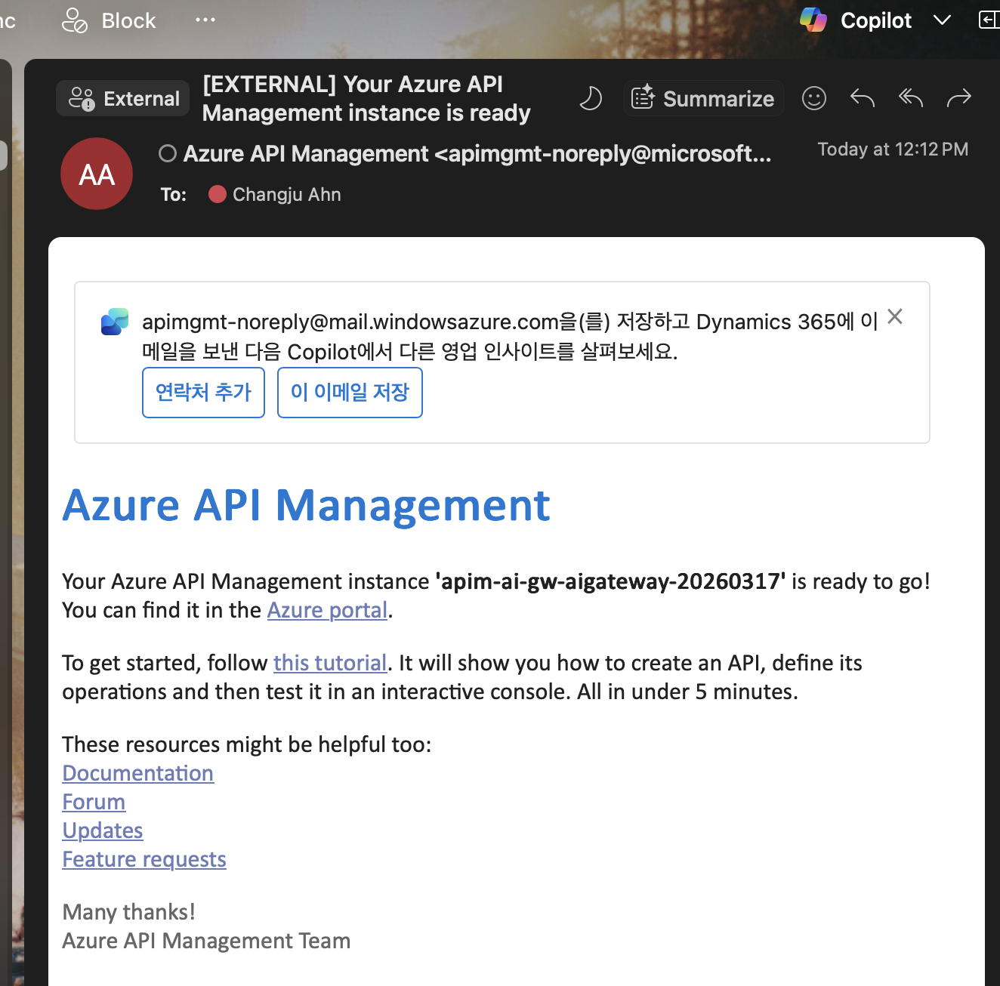
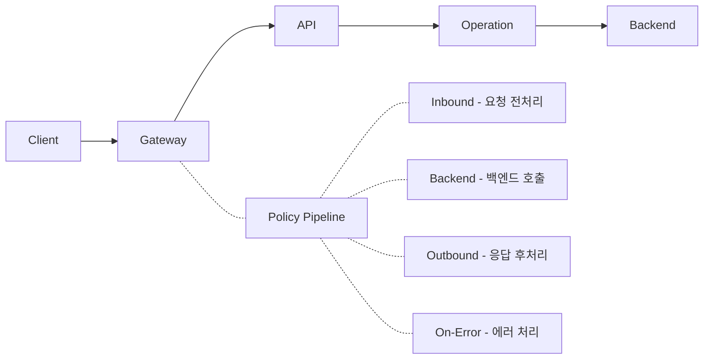

# Lab 1: Azure API Management 기본 설정

이 실습에서는 Azure API Management 인스턴스를 생성하고 기본 구조를 이해합니다.

## 목표

- APIM 인스턴스 생성 (Developer 티어 - AI 정책 전체 지원)
- APIM 포털 구조 이해 (API, Product, Subscription)
- Gateway URL 확인 및 기본 Health Check

## 사전 준비

```bash
az login
az account set --subscription "<구독 ID>"
```

## 실습 단계

### 0단계: 인프라 파라미터 설정

배포 전에 `infra/parameters/dev.bicepparam` 파일을 열어 **본인 환경에 맞게 수정**합니다:

```bicep
using '../main.bicep'

param suffix = 'mygateway-0318'         // ← 고유한 접미사로 변경 (리소스 이름에 사용)
param apimSku = 'Developer'              // Developer 권장 (AI 정책 전체 지원)
param publisherEmail = 'you@example.com' // ← 본인 이메일로 변경 (APIM 관리자 알림용)
param publisherName = 'AI Gateway Lab'
```

| 파라미터 | 설명 | 예시 |
|---|---|---|
| `suffix` | 리소스 이름 접미사. Azure 전역에서 고유해야 함 | `ailab-0318`, `team1-dev` |
| `apimSku` | APIM SKU. **Developer** 권장 | `Developer`, `Consumption` |
| `publisherEmail` | APIM 관리자 이메일 (배포 완료 알림 수신) | `your@email.com` |
| `publisherName` | APIM 게시자 이름 | `AI Gateway Lab` |

> ⚠️ `suffix`는 Azure OpenAI, APIM 등 리소스 이름에 포함됩니다 (예: `apim-ai-gw-{suffix}`).
> 이미 존재하는 이름이면 배포가 실패하므로, 날짜나 이니셜을 포함하여 **고유하게** 지정하세요.

### 1단계: 전체 인프라 배포

```bash
# 프로젝트 루트에서 실행
./scripts/deploy.sh
```

> 💡 `deploy.sh`가 다음을 자동으로 수행합니다:
> 1. 리소스 그룹 `rg-ai-gw-{suffix}` 생성
> 2. Bicep으로 APIM + Azure OpenAI × 3 + 백엔드 풀 + 모니터링 배포
> 3. `.env` 자동 생성 (APIM URL 포함)
>
> ⏱️ **Developer SKU는 배포에 30~45분이 소요됩니다.**
> 터미널에서 `az deployment group create` 명령이 완료될 때까지 기다려야 합니다.
> Azure는 배포 완료 이메일을 보내지 않으므로, 아래 방법으로 확인하세요:
> - **터미널**: `deploy.sh`가 "✅ 배포 완료!" 메시지를 출력할 때까지 대기
> - **Azure Portal**: 리소스 그룹 → **배포(Deployments)** → 상태가 `Succeeded`로 변경 확인
> - **CLI 수동 확인**: `az deployment group show --resource-group rg-ai-gw-{suffix} --name ai-gateway-deployment --query properties.provisioningState`
>
> 배포 대기 중에는 Lab 1 아래의 핵심 개념(SKU 비교, APIM 구성 요소)을 미리 읽어두면 좋습니다.
>
> **모델 배포 용량(TPM):** 기본 **5K TPM**(5,000 토큰/분)으로 배포됩니다.
> 이는 Lab 3의 429/Circuit Breaker 테스트를 쉽게 하기 위한 설정입니다.
> 프로덕션에서는 `infra/modules/openai.bicep`의 `modelCapacity`를 높이세요 (예: 30 = 30K TPM).
>
> 리소스 이름은 `infra/parameters/dev.bicepparam`의 `suffix` 값으로 결정됩니다.
> 재배포 시 이름 충돌을 피하려면 suffix를 변경하세요: `./scripts/deploy.sh dev newSuffix`

### 2단계: 배포 확인

```bash
# 배포된 리소스 목록 확인
set -a; source .env; set +a
az resource list --resource-group $RESOURCE_GROUP --output table

# APIM Gateway URL 확인
echo $APIM_URL
```

실제로 배포가 완료되면 최초 설정한 이메일로 다음과 같은 알림이 공유됩니다.


### 3단계: Python 환경 설정

노트북 테스트를 위한 Python 가상환경을 설정합니다:

```bash
# 프로젝트 루트에서 실행
python -m venv .venv
source .venv/bin/activate   # Windows: .venv\Scripts\activate
pip install -r requirements.txt
```

> 💡 VS Code에서 노트북을 열 때 커널을 `.venv`로 선택하세요:
> 노트북 우상단 **Select Kernel** → **Python Environments** → `.venv`

### 4단계: .env Subscription Key 설정

`deploy.sh`가 생성한 `.env`에 APIM Subscription Key를 입력합니다:

1. Azure Portal → APIM → APIs → **Subscriptions**
2. **Built-in all-access subscription** → **Show/hide keys** 클릭
3. Primary key 복사
4. `.env`에서 `APIM_SUBSCRIPTION_KEY` 값 입력

### 5단계: Azure Portal에서 확인

1. [Azure Portal](https://portal.azure.com) → API Management 서비스
2. 다음 항목 탐색:
   - **APIs**: 등록된 API 목록
   - **Products**: API를 묶는 논리적 단위
   - **Subscriptions**: API 접근 키 관리
   - **Policies**: 요청/응답 처리 파이프라인
   

## 핵심 개념

### APIM SKU 비교

| 항목 | Consumption | Developer | Standard v2 |
|------|------------|-----------|-------------|
| 비용 | 호출당 과금 | 월 ~$50 | 월 ~$300+ |
| SLA | 없음 | 없음 | 99.95% |
| VNet | 불가 | 가능 | 가능 |
| AI 토큰 정책 | ❌ 불가 | ✅ 가능 | ✅ 가능 |
| 배포 시간 | 즉시 | 30~45분 | 30~45분 |
| 용도 | 저사용량 | 개발/테스트 | 프로덕션 |

> ⚠️ **이 실습에서는 Developer SKU를 권장합니다.**  
> Consumption에서는 `azure-openai-token-limit`, `rate-limit-by-key` 등 핵심 AI 정책을 사용할 수 없습니다.  
> `infra/parameters/dev.bicepparam`의 `apimSku`가 `Developer`인지 확인하세요.

### APIM 핵심 구성 요소



## 다음 단계

→ [Lab 2: Azure OpenAI 백엔드 연결](../lab02-azure-openai-backend/README.md)
