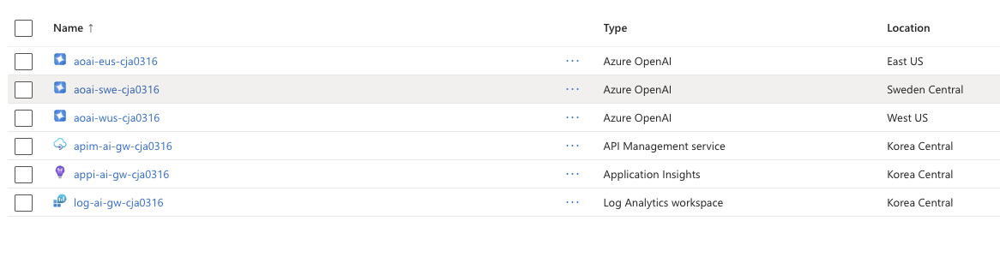
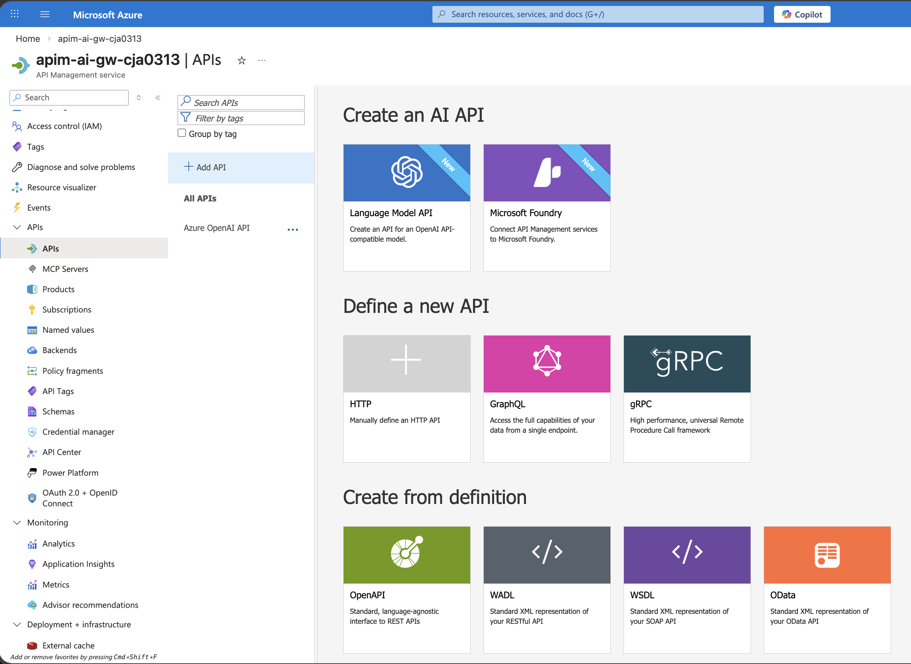
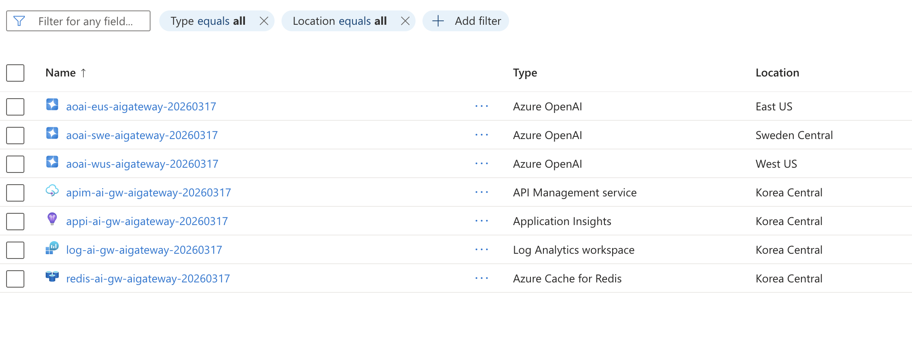

# Lab 2: Azure OpenAI 백엔드 연결

APIM에 Azure OpenAI 서비스를 백엔드로 연결하고 첫 번째 AI 호출을 수행합니다.

## 목표

- `deploy.sh`가 생성한 Azure OpenAI 리소스 구조 이해
- APIM에 Azure OpenAI API 등록 (Portal)
- Managed Identity 기반 인증 확인
- 첫 번째 AI 호출 테스트

## 사전 확인

> Lab 1에서 `deploy.sh`를 실행했다면, 아래 리소스가 **이미 생성**되어 있습니다:
>
> | 리소스 | 이름 패턴 | 위치 |
> |--------|-----------|------|
> | Azure OpenAI × 3 | `aoai-eus-{suffix}`, `aoai-swe-{suffix}`, `aoai-wus-{suffix}` | East US, Sweden Central, West US |
> | gpt-4.1-nano 모델 | 3개 리전 모두 배포 완료 | capacity 5 (5K TPM), GlobalStandard |
> | APIM | `apim-ai-gw-{suffix}` | Korea Central |
> | Managed Identity | APIM → OpenAI 역할 부여 완료 | — |
> | 백엔드 + 백엔드 풀 | `aoai-eastus`, `aoai-swedencentral`, `aoai-westus` | APIM 내부 |
>
> 실제 리소스 이름은 `deploy.sh` 출력 또는 `.env`에서 확인하세요.

```bash
# 환경 변수 로드 (모든 CLI 명령 전에 실행)
set -a; source .env; set +a

# 배포된 리소스 확인
az resource list --resource-group $RESOURCE_GROUP --output table
```


## 실습 단계

### 1단계: APIM에 Azure OpenAI API 등록   
> 여기서는 **방법 B**, 그리고 **Chat Completion**만으로 진행하도록 합니다.



**방법 A: OpenAPI 스펙 임포트**

Azure REST API 공식 스펙을 임포트하면, Chat Completions·Embeddings·Completions 등 모든 Operation이 자동 생성됩니다.

1. Azure Portal → APIM → APIs → **Add API** → **OpenAPI**
2. **OpenAPI specification** URL 입력:
   ```
   https://raw.githubusercontent.com/Azure/azure-rest-api-specs/main/specification/cognitiveservices/data-plane/AzureOpenAI/inference/stable/2025-04-01-preview/inference.json
   ```
3. 설정:
   - Display name: `Azure OpenAI`
   - API URL suffix: `openai`
4. **Create** 클릭

> 💡 임포트 후 자동 생성되는 Operation 예시:
> - `POST /deployments/{deployment-id}/chat/completions`
> - `POST /deployments/{deployment-id}/embeddings`
> - `POST /deployments/{deployment-id}/completions`
>
> 스펙 버전을 바꾸려면 URL의 `2025-04-01-preview` 부분을 원하는 API 버전으로 변경하세요.

**방법 B: 수동 등록 (권장)**

필요한 Operation만 직접 정의합니다. 불필요한 엔드포인트 노출을 방지할 수 있습니다.   
아래는 배포가 완료되었을 때의 예시이고, 이 중에서 하나의 AOAI를 기반으로 입력합니다.


1. Azure Portal → APIM → APIs → **Add API** → **HTTP**
2. 설정:
   - Display name: `Azure OpenAI`
   - Web service URL: `https://<aoai-eus-리소스이름>.openai.azure.com/openai`
     > `deploy.sh` 출력에서 확인하거나: `az cognitiveservices account show --name aoai-eus-<suffix> --resource-group $RESOURCE_GROUP --query 'properties.endpoint' -o tsv`
   - API URL suffix: `openai`
3. Operation 추가:
   - **Add operation** 클릭
     - Display name: `ChatCompletions`
     - Name: `chatcompletions` (자동 입력됨)
     - URL: **POST** `/deployments/{deployment-id}/chat/completions`

**방법 C: Azure AI Foundry 기반 등록**

Azure AI Foundry(구 Azure AI Studio)에서 모델을 배포한 경우, Foundry 프로젝트 엔드포인트를 APIM 백엔드로 연결합니다.

1. **AI Foundry 프로젝트 엔드포인트 확인**

   Azure AI Foundry Portal → 프로젝트 선택 → **Settings** → **Project endpoint** 복사:
   ```
   https://<project-name>.<region>.api.azureml.ms
   ```

   또는 Azure CLI로 확인:
   ```bash
   az ml workspace show \
     --name <ai-foundry-project-name> \
     --resource-group $RESOURCE_GROUP \
     --query "discovery_url" -o tsv
   ```

2. **APIM에 AI Foundry 백엔드 등록**

   Azure Portal → APIM → APIs → **Add API** → **HTTP**
   - Display name: `Azure AI Foundry`
   - Web service URL: `https://<project-name>.<region>.api.azureml.ms`
   - API URL suffix: `ai`

   Operation 추가:
   - POST `/openai/deployments/{deployment-id}/chat/completions` (Azure OpenAI 모델)
   - POST `/models/chat/completions` (Foundry Models-as-a-Service)

3. **인증 설정 — API Key 방식**

   AI Foundry 키를 APIM Named Value에 저장 후 정책에서 사용:
   ```bash
   # AI Foundry 프로젝트 키 확인
   az ml workspace get-keys \
     --name <ai-foundry-project-name> \
     --resource-group $RESOURCE_GROUP
   ```

   ```xml
   <policies>
       <inbound>
           <base />
           <set-header name="Authorization" exists-action="override">
               <value>Bearer {{ai-foundry-api-key}}</value>
           </set-header>
           <set-header name="api-key" exists-action="override">
               <value>{{ai-foundry-api-key}}</value>
           </set-header>
       </inbound>
       <backend>
           <base />
       </backend>
       <outbound>
           <base />
       </outbound>
       <on-error>
           <base />
       </on-error>
   </policies>
   ```

4. **인증 설정 — Managed Identity 방식 (권장)**

   APIM에 AI Foundry 프로젝트에 대한 역할을 부여합니다:
   ```bash
   APIM_PRINCIPAL_ID=$(az apim show --name <apim-name> --resource-group $RESOURCE_GROUP --query identity.principalId -o tsv)

   AI_PROJECT_ID=$(az ml workspace show --name <ai-foundry-project-name> --resource-group $RESOURCE_GROUP --query id -o tsv)

   # Azure AI Developer 역할 부여
   az role assignment create \
     --assignee "$APIM_PRINCIPAL_ID" \
     --role "Azure AI Developer" \
     --scope "$AI_PROJECT_ID"
   ```

   정책:
   ```xml
   <inbound>
       <base />
       <authentication-managed-identity resource="https://ml.azure.com" />
   </inbound>
   ```

5. **호출 테스트**

   ```bash
   # Azure OpenAI 모델 (Foundry 경유)
   curl -X POST "https://<apim-name>.azure-api.net/ai/openai/deployments/gpt-4.1-nano/chat/completions?api-version=2025-04-01-preview" \
     -H "Content-Type: application/json" \
     -H "Ocp-Apim-Subscription-Key: <subscription-key>" \
     -d '{
       "messages": [{"role": "user", "content": "Hello from AI Foundry!"}],
       "max_tokens": 50
     }'
   ```

> 💡 **방법 비교**
>
> | 방법 | 백엔드 | 장점 | 적합한 경우 |
> |------|--------|------|-------------|
> | A: OpenAPI 임포트 | Azure OpenAI 직접 | 전체 Operation 자동 생성 | 빠른 시작, PoC |
> | B: 수동 등록 | Azure OpenAI 직접 | 필요한 것만 노출, 세밀한 제어 | 프로덕션 |
> | C: AI Foundry | AI Foundry 프로젝트 | 멀티 모델(OpenAI+OSS) 통합 관리 | 다양한 모델 사용 시 |

### 2단계: 인증 정책 적용

> `deploy.sh`가 Managed Identity 활성화 + 역할 부여를 이미 완료했기 때문에, 여기서는 **API 정책에 인증을 추가**하는 것만 하면 됩니다.

APIM API에 Managed Identity 인증 정책을 추가합니다.

**정책 에디터 접근 방법:**

1. Azure Portal → 리소스 그룹(`rg-ai-gw-{suffix}`) → APIM 리소스 클릭
2. 왼쪽 메뉴에서 **APIs** 클릭
3. 방금 등록한 **Azure OpenAI** API 선택
4. **All operations** 선택 (모든 Operation에 공통 적용)
5. **Inbound processing** 영역의 **</>** (Code View) 아이콘 클릭
6. 아래 XML로 **전체 교체** 후 **Save**

> 💡 **Portal Design 탭 이해**
>
> Design 탭에서는 요청 흐름에 따라 **3개 영역**이 시각적으로 분리되어 있습니다.
> 각 영역의 **Policies** 바(빨간색)를 클릭하면 해당 단계의 정책을 편집할 수 있습니다:
>
> ```
> 클라이언트 → [ Inbound processing ] → [ Backend ] → [ Outbound processing ] → 클라이언트
> ```
>
> | Portal 영역 | XML 섹션 | 실행 시점 | 용도 예시 |
> |-------------|----------|-----------|-----------|
> | **Inbound processing** | `<inbound>` | 요청이 백엔드로 **전달되기 전** | 인증, Rate Limit, 라우팅, IP 필터 |
> | **Backend** | `<backend>` | 백엔드 **호출 시** | 재시도, 타임아웃, 요청 전달 방식 |
> | **Outbound processing** | `<outbound>` | 백엔드 응답이 클라이언트로 **돌아가기 전** | 메트릭 수집, 캐시 저장, 응답 변환 |
>
> **정책을 어디에 넣느냐에 따라 동작이 달라집니다.** 예를 들어:
> - 인증(`authentication-managed-identity`)은 **Inbound**에 → 백엔드 호출 전에 인증 헤더 추가
> - 재시도(`retry`)는 **Backend**에 → 백엔드 호출 실패 시 다른 서버로 재시도
> - 토큰 메트릭(`emit-token-metric`)은 **Outbound**에 → 응답에서 토큰 사용량 추출
>
> 각 영역의 **</>** 아이콘으로 개별 편집하거나, **All operations** 옆의 **</> Code View**로 전체 XML을 한 번에 편집할 수 있습니다.
>
> 전체 정책 구조에 대한 상세 설명은 [📖 정책 레퍼런스](../../docs/policy-reference.md)를 참고하세요.

이번 Lab에서는 **Inbound processing**에 Managed Identity 인증만 추가합니다:

```xml
<policies>
    <inbound>
        <base />
        <!-- Managed Identity로 Azure OpenAI 인증 -->
        <authentication-managed-identity resource="https://cognitiveservices.azure.com" />
    </inbound>
    <backend>
        <base />
    </backend>
    <outbound>
        <base />
    </outbound>
    <on-error>
        <base />
    </on-error>
</policies>
```

### 3단계: 호출 테스트

`test-backend.ipynb` 노트북을 열고 셀을 순서대로 실행하세요.

> 💡 노트북 실행 전 `.env`에 `APIM_SUBSCRIPTION_KEY`가 입력되어 있어야 합니다. (Lab 1 3단계 참고)

## 핵심 개념

### 인증 방식 비교

| 방식 | 장점 | 단점 |
|------|------|------|
| API Key (pass-through) | 간단함 | 키 노출 위험 |
| **Managed Identity** | 키 관리 불필요, 보안적 | Azure 리소스 간만 가능 |
| Named Value + 정책 | 유연함 | 키 회전 관리 필요 |

## 다음 단계

→ [Lab 3: 백엔드 풀 & 로드밸런싱](../lab03-backend-pool/README.md)
