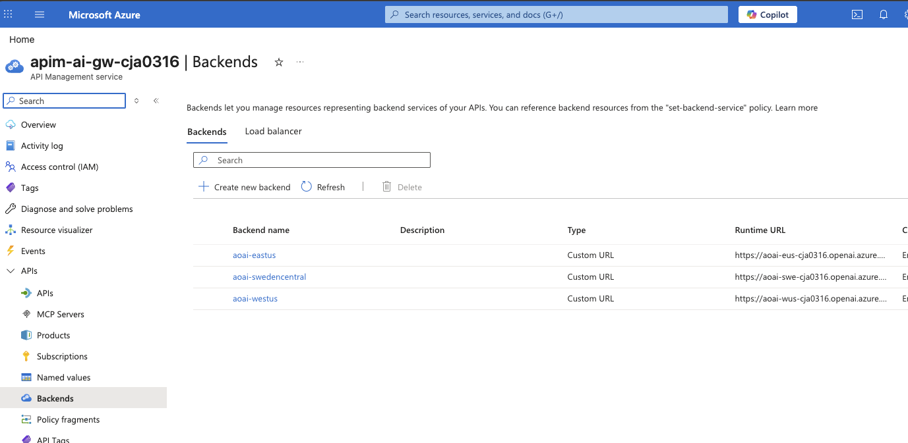
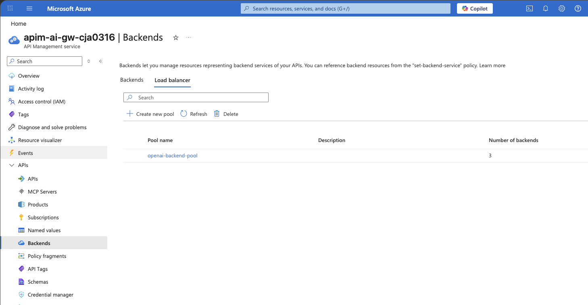
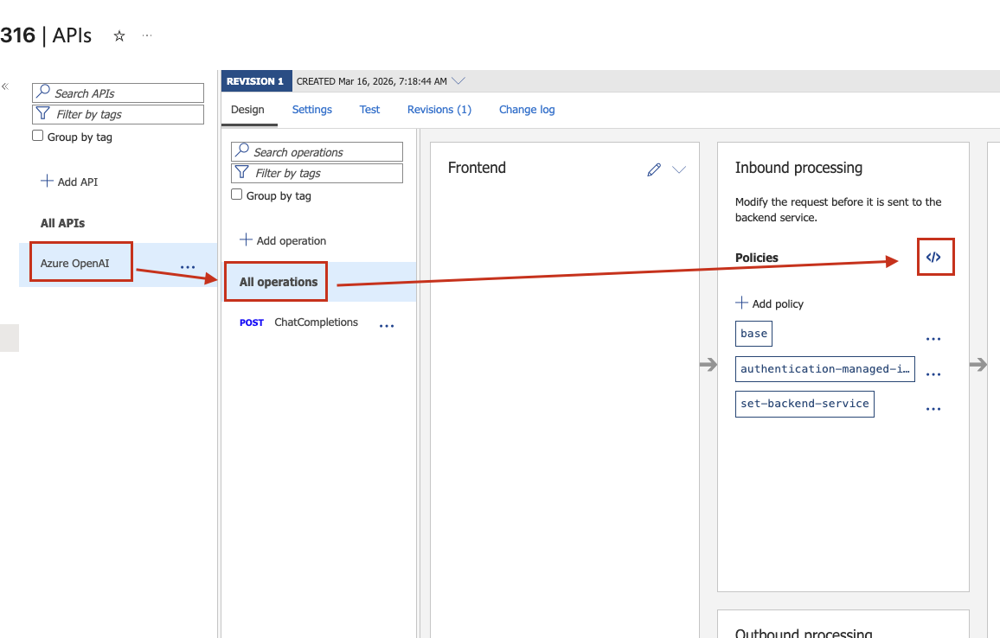
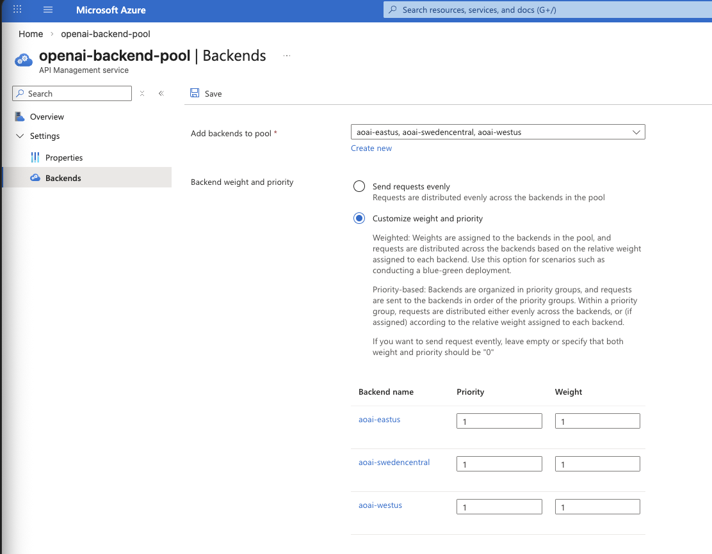
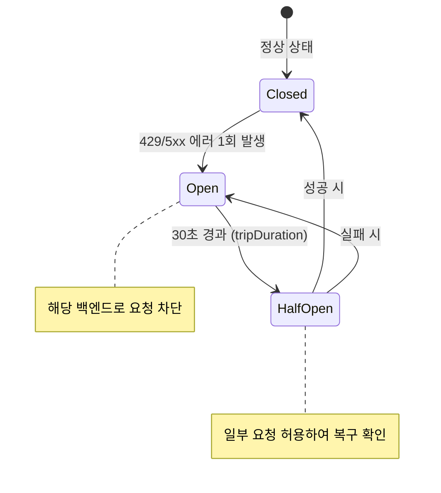

# Lab 3: 백엔드 풀 & 로드밸런싱

여러 Azure OpenAI 인스턴스를 백엔드 풀로 묶어 로드밸런싱과 장애 대응을 구현합니다.

## 목표

- APIM Backend Pool 구성
- 로드밸런싱 전략 적용 (Round Robin, Weighted, Priority)
- Circuit Breaker 패턴 적용
- Failover 시나리오 테스트

## 실습 단계

### 1단계: 개별 백엔드 확인

> `deploy.sh`가 이미 3개 백엔드를 APIM에 등록했습니다. 아래는 Bicep에서 어떻게 구성되는지 보여주는 예시입니다.

```bicep
// infra/modules/apim.bicep — deploy.sh 실행 시 자동 배포됨

resource backend1 'Microsoft.ApiManagement/service/backends@2023-09-01-preview' = {
  parent: apimService
  name: 'aoai-eastus'           // APIM 내부 백엔드 ID (고정값)
  properties: {
    url: 'https://aoai-eus-${suffix}.openai.azure.com/openai'
    protocol: 'http'
    circuitBreaker: {
      rules: [{
        failureCondition: {
          count: 3
          errorReasons: ['Server errors']
          interval: 'PT10S'
          statusCodeRanges: [
            { min: 429, max: 429 }
            { min: 500, max: 503 }
          ]
        }
        name: 'openAiCircuitBreaker'
        tripDuration: 'PT30S'
        acceptRetryAfter: true
      }]
    }
  }
}

resource backend2 'Microsoft.ApiManagement/service/backends@2023-09-01-preview' = {
  parent: apimService
  name: 'aoai-swedencentral'    // APIM 내부 백엔드 ID (고정값)
  properties: {
    url: 'https://aoai-swe-${suffix}.openai.azure.com/openai'
    protocol: 'http'
    circuitBreaker: { /* 동일 설정 */ }
  }
}

resource backend3 'Microsoft.ApiManagement/service/backends@2023-09-01-preview' = {
  parent: apimService
  name: 'aoai-westus'           // APIM 내부 백엔드 ID (고정값)
  properties: {
    url: 'https://aoai-wus-${suffix}.openai.azure.com/openai'
    protocol: 'http'
    circuitBreaker: { /* 동일 설정 */ }
  }
}
```

Portal에서 확인: APIM → Backends에서 3개 백엔드가 등록되어 있는지 확인하세요.


> ⚠️ **중요: 백엔드 풀만으로는 장애 대응이 되지 않습니다**
>
> 백엔드 풀과 Circuit Breaker는 **별개의 기능**입니다. 함께 쓸 때 비로소 완전한 장애 대응이 됩니다:
>
> | 구성 | 정상 시 | **장애 시** |
> |------|---------|:-----------|
> | 백엔드 풀 **단독** | Round Robin 분배 ✅ | 장애 백엔드에도 **계속 요청** → 3번 중 1번 실패 ❌ |
> | 백엔드 풀 + **Circuit Breaker** | Round Robin 분배 ✅ | 429/5xx 3회 연속 → **자동 차단** → 나머지로 Failover ✅ |
>
> 즉, 백엔드 풀만 구성하면 로드밸런싱은 되지만, **장애 백엔드를 자동으로 빼주지는 않습니다.**
> Circuit Breaker가 있어야 "429/5xx 1회 발생 시 → 30초 차단 → 자동 복귀"가 동작합니다.
>
> 현재 `deploy.sh`는 각 백엔드에 아래 Circuit Breaker를 자동 설정합니다:
> ```
> 감지 조건: 429/5xx 에러 1회 발생 시 즉시 발동
> 차단 동작: 해당 백엔드 30초 차단 (tripDuration)
> 자동 복구: 30초 후 Half-Open → 성공 시 Closed
> acceptRetryAfter: false (429를 순수 실패로 카운트)
> ```
>
> 💡 **`acceptRetryAfter` 설정이 중요합니다**
>
> | 설정 | 동작 | 적합한 경우 |
> |------|------|-------------|
> | `acceptRetryAfter: true` | 429 응답의 `Retry-After` 헤더를 존중하고 **대기 후 재시도** → Circuit Breaker가 트립하지 않음 | 일시적 과부하를 견디며 같은 백엔드를 계속 쓰고 싶을 때 |
> | `acceptRetryAfter: false` | 429를 **즉시 실패로 카운트** → Circuit Breaker 정상 발동 → 다른 백엔드로 Failover | 장애 백엔드를 빠르게 제외하고 다른 리전으로 전환하고 싶을 때 |
>
> **비즈니스 시나리오 예시:**
> - **`true` 적합:** 단일 리전에 PTU(예약 용량)가 있어서, 일시적 429여도 해당 리전을 계속 쓰는 게 비용상 유리한 경우
> - **`false` 적합:** 고객 대면 서비스에서 응답 지연 없이 즉시 다른 리전으로 전환해야 하는 경우 (이 실습의 기본값)
>
> ⚠️ **감지할 에러 코드도 확인하세요**
>
> 기본 설정은 `429, 500-503`만 감지합니다. 실제 운영에서 발생할 수 있는 다른 에러 코드(404 등)는 **별도로 추가**해야 합니다:
>
> | 에러 코드 | 발생 상황 | 기본 포함 여부 |
> |-----------|----------|:-:|
> | **429** | Rate Limit 초과 (TPM/RPM) | ✅ |
> | **500-503** | 서버 에러, 서비스 불가 | ✅ |
> | **404** | 모델 삭제, 배포 실패, 잘못된 엔드포인트 | ❌ 수동 추가 필요 |
> | **408** | 요청 타임아웃 | ❌ 필요시 추가 |
>
> 예를 들어 특정 리전의 모델이 삭제되면 404가 반환되지만, 기본 Circuit Breaker는 이를 감지하지 못합니다.
> `test-failover.ipynb`의 Phase 5에서 이 시나리오를 직접 테스트합니다.

### 2단계: 백엔드 풀 확인

> 백엔드 풀도 `deploy.sh`가 이미 생성했습니다. Portal에서 APIM → Backends → `openai-backend-pool`을 확인하세요.

```bicep
// infra/modules/apim.bicep — deploy.sh 실행 시 자동 배포됨
resource backendPool 'Microsoft.ApiManagement/service/backends@2023-09-01-preview' = {
  parent: apimService
  name: 'openai-backend-pool'
  properties: {
    type: 'Pool'
    pool: {
      services: [
        { id: '/backends/${backend1.name}', priority: 1, weight: 1 }  // East US
        { id: '/backends/${backend2.name}', priority: 1, weight: 1 }  // Sweden Central
        { id: '/backends/${backend3.name}', priority: 1, weight: 1 }  // West US
      ]
    }
  }
}
```


### 3단계: 로드밸런서 정책 적용

Lab 2에서 등록한 API의 정책을 수정하여 백엔드 풀로 요청을 라우팅합니다.

> 💡 **단일 백엔드 vs 백엔드 풀**
>
> Lab 2에서는 API 등록 시 Web service URL에 East US 엔드포인트 하나만 넣었습니다.
> 이 상태에서도 `set-backend-service`로 **개별 백엔드 하나**를 지정할 수 있습니다:
>
> ```xml
> <!-- 단일 백엔드 사용 (풀 없이) -->
> <set-backend-service backend-id="aoai-eastus" />
> ```
>
> 하지만 이 경우 해당 리전이 다운되면 **전체 서비스가 중단**됩니다.
>
> | | 단일 백엔드 | 백엔드 풀 |
> |---|---|---|
> | **설정** | `backend-id="aoai-eastus"` | `backend-id="openai-backend-pool"` |
> | **장애 대응** | 수동 전환 필요 | 자동 Failover (Circuit Breaker) |
> | **부하 분산** | 불가 | Round Robin / Weighted / Priority |
> | **용도** | 개발/테스트, 단일 리전 | **프로덕션 권장** |
>
> 이번 단계에서 백엔드 풀을 적용합니다.

1. Azure Portal → APIM → **APIs** → **Azure OpenAI** 선택
2. **All operations** 선택
3. **Inbound processing** 영역의 **</>** 클릭
4. 아래 XML로 **전체 교체** 후 **Save**

```xml
<policies>
    <inbound>
        <base />
        <authentication-managed-identity resource="https://cognitiveservices.azure.com" />
        <set-backend-service backend-id="openai-backend-pool" />
    </inbound>
    <backend>
        <base />
    </backend>
    <outbound>
        <base />
    </outbound>
    <on-error>
        <base />
    </on-error>
</policies>
```


### 4단계: 로드밸런싱 전략

백엔드 풀의 분산 방식은 **priority**(우선순위)와 **weight**(가중치)로 결정됩니다.

이 설정은 Portal에서 직접 확인·수정할 수 있습니다:

1. Azure Portal → APIM → **Backends** → `openai-backend-pool` 클릭
2. **Pool** / Backend 탭에서 각 백엔드의 **Priority**와 **Weight** 값 확인
3. 값을 변경 후 **Save**

> 💡 **priority와 weight 동작 원리:**
> - **priority**: 숫자가 같은 백엔드끼리 먼저 사용. 그 그룹이 모두 실패하면 다음 priority로 넘어감
> - **weight**: 같은 priority 내에서 요청 분배 비율 결정 (weight 5 vs 3이면 약 62% vs 38%)

#### Round Robin (균등 분배)

```
Priority: 1, Weight: 1  →  East US       ── 33%
Priority: 1, Weight: 1  →  Sweden Central ── 33%
Priority: 1, Weight: 1  →  West US       ── 33%
```

모든 백엔드가 동일 priority·weight이므로 **순서대로 균등 분배**됩니다.
현재 `deploy.sh`의 기본 설정입니다.

#### Weighted (가중치 기반)

```
Priority: 1, Weight: 5  →  East US       ── 50%
Priority: 1, Weight: 3  →  Sweden Central ── 30%
Priority: 1, Weight: 2  →  West US       ── 20%
```

특정 리전에 더 많은 트래픽을 보내고 싶을 때 사용합니다.
예: East US에 PTU(예약 용량)가 있으면 해당 리전의 weight를 높게 설정.

#### Priority (우선순위 기반 - Failover)

```
Priority: 1, Weight: 1  →  East US       ── 주 백엔드
Priority: 2, Weight: 1  →  Sweden Central ── East US 실패 시 사용
Priority: 3, Weight: 1  →  West US       ── 위 두 개 모두 실패 시 사용
```

**Primary → Secondary → Tertiary** 순서로 Failover됩니다.
Circuit Breaker가 동작하면 다음 priority 그룹으로 자동 전환됩니다.



### 5단계: 로드밸런싱 검증 테스트

실제로 3개 백엔드로 요청이 분산되는지 확인합니다.

**사전 조건:** 어떤 백엔드가 응답했는지 확인하기 위해, API 정책에 **응답 헤더**를 추가합니다.

1. Azure Portal → APIM → **APIs** → **Azure OpenAI** → **All operations**
2. **Inbound processing** 영역의 **</>** 클릭 (전체 XML 편집)
3. 아래 XML로 **전체 교체** 후 **Save**

> 💡 3단계 정책에 `<outbound>` 섹션이 추가된 것입니다.
> `<outbound>`에 `set-header`를 넣으면 **백엔드 응답이 클라이언트로 돌아갈 때** 헤더가 추가됩니다.

```xml
<policies>
    <inbound>
        <base />
        <authentication-managed-identity resource="https://cognitiveservices.azure.com" />
        <set-backend-service backend-id="openai-backend-pool" />
    </inbound>
    <backend>
        <base />
    </backend>
    <outbound>
        <base />
        <!-- 어떤 백엔드가 응답했는지 헤더로 확인 -->
        <set-header name="x-backend-url" exists-action="override">
            <value>@(context.Request.Url.Host)</value>
        </set-header>
    </outbound>
    <on-error>
        <base />
    </on-error>
</policies>
```

**노트북 테스트:**

- 라운드로빈 분산 확인: `labs/lab03-backend-pool/test-roundrobin.ipynb`
- 장애 우회/복구 확인: `labs/lab03-backend-pool/test-failover.ipynb`

환경 변수를 먼저 설정한 뒤 각 노트북 셀을 순서대로 실행하세요.

**기대 결과:**
| 백엔드 | 요청수 | 비율 |
|---|---|---|
| aoai-eus-{suffix}.openai.azure.com | 4 | 33% |
| aoai-swe-{suffix}.openai.azure.com | 4 | 33% |
| aoai-wus-{suffix}.openai.azure.com | 4 | 33% |

**VS Code REST Client:** `scripts/test-endpoints.http`의 `Lab 3` 섹션에서 호출 #1~#4를 반복 실행하며 응답 헤더의 `x-backend-url` 값을 비교하세요.

**장애 시나리오 테스트:**

1. East US 엔드포인트에 과도한 요청을 보내 429 에러를 유발
2. Circuit Breaker가 동작하여 Sweden Central/West US로 자동 Failover 확인
3. Trip Duration(30초) 후 East US가 다시 풀에 포함되는지 확인

## 핵심 개념

### Circuit Breaker 동작 흐름



## 다음 단계

→ [Lab 4: AI 전용 정책 적용](../lab04-policies/README.md)
