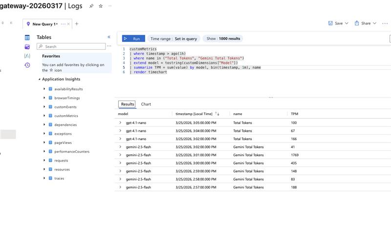
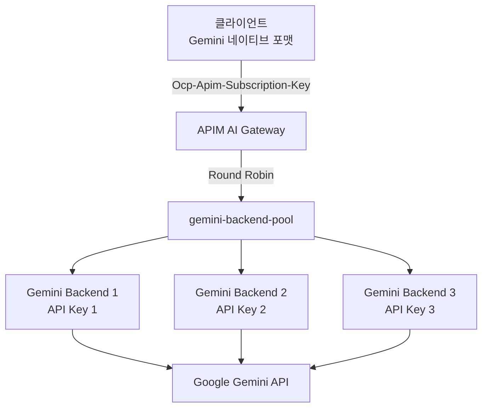
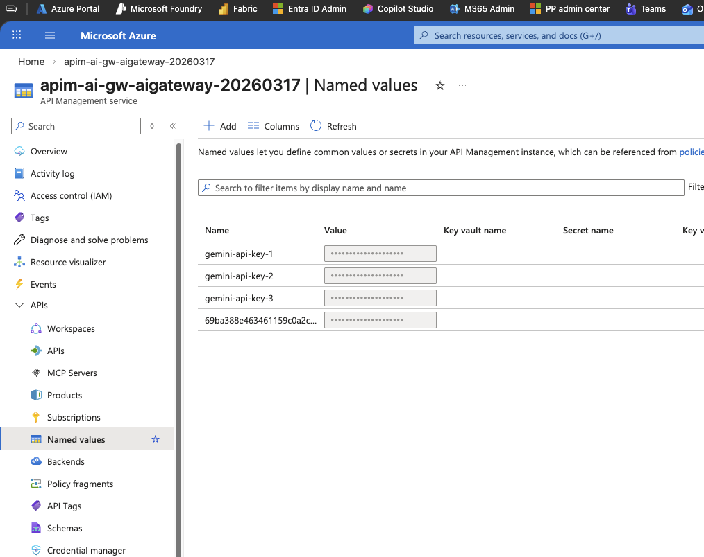
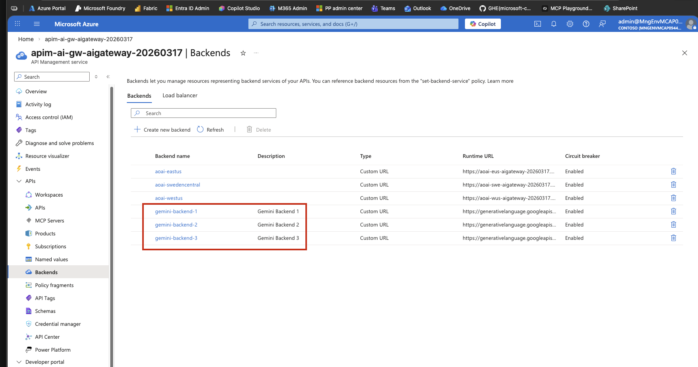
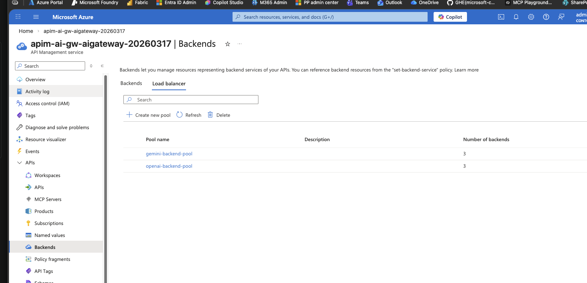
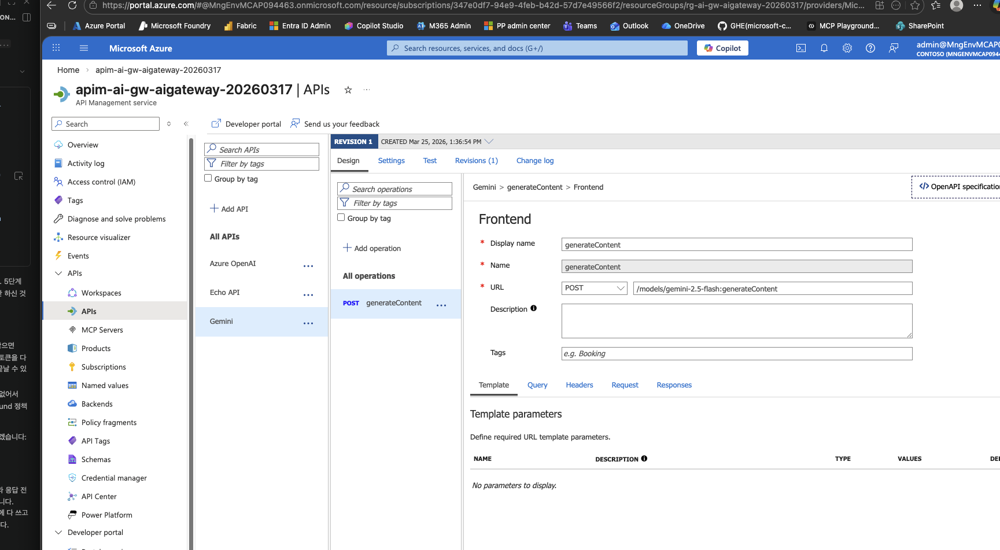

# Lab 5: Gemini 로드밸런싱 Gateway

Google Gemini API Key 3개를 APIM 백엔드 풀로 묶어 로드밸런싱합니다. Lab 3에서 Azure OpenAI 3개를 풀로 구성한 것과 동일한 패턴을 Gemini에 적용합니다.

## 목표

- Gemini API Key 3개를 APIM Named Value로 등록
- Gemini 백엔드 3개 생성 (credentials에 API Key 포함)
- 백엔드 풀(`gemini-backend-pool`)로 묶어 로드밸런싱
- Gemini 전용 API 등록
- **Gemini 네이티브 포맷**으로 직접 호출 (변환 정책 없음)
- AI Gateway를 통해 Azure OpenAI, Gemini를 한 꺼번에 관리


## 아키텍처



> 💡 **이전 버전과의 차이**
>
> OpenAI 포맷으로 보내고 APIM이 변환하는 방식도 가능하지만,
> 이번 Lab에서는 **Gemini 네이티브 포맷을 그대로 사용**합니다.
> 덕분에 APIM 정책이 `set-backend-service` **단 1줄**이면 됩니다.
>
> | | 변환 방식 | 네이티브 방식 (이번 Lab) |
> |---|---|---|
> | 클라이언트 포맷 | OpenAI | Gemini |
> | APIM 정책 | 요청/응답 변환 (~40줄) | `set-backend-service` (1줄) |
> | 장점 | 클라이언트 통일 | 정책 최소화, 디버깅 용이 |

## 사전 준비

`.env` 파일에 Gemini API Key 3개가 입력되어 있어야 합니다:

```bash
# .env
GEMINI_API_KEY_1="AIzaSy..."
GEMINI_API_KEY_2="AIzaSy..."
GEMINI_API_KEY_3="AIzaSy..."
```

> 💡 [Google AI Studio](https://aistudio.google.com/apikey)에서 API Key를 발급합니다.

## 실습 단계

### 1단계: Named Value 등록 (API Key 3개)

Gemini API Key를 APIM Named Value에 시크릿으로 저장합니다. 정책에서 `{{gemini-api-key-1}}` 형태로 참조합니다.

```bash
set -a; source .env; set +a

# Key 1
az apim nv create \
  --resource-group $RESOURCE_GROUP \
  --service-name $APIM_NAME \
  --named-value-id gemini-api-key-1 \
  --display-name "Gemini-API-Key-1" \
  --value "$GEMINI_API_KEY_1" \
  --secret true

# Key 2
az apim nv create \
  --resource-group $RESOURCE_GROUP \
  --service-name $APIM_NAME \
  --named-value-id gemini-api-key-2 \
  --display-name "Gemini-API-Key-2" \
  --value "$GEMINI_API_KEY_2" \
  --secret true

# Key 3
az apim nv create \
  --resource-group $RESOURCE_GROUP \
  --service-name $APIM_NAME \
  --named-value-id gemini-api-key-3 \
  --display-name "Gemini-API-Key-3" \
  --value "$GEMINI_API_KEY_3" \
  --secret true
```

**확인:** Azure Portal → APIM → **Named values** → `gemini-api-key-1`, `gemini-api-key-2`, `gemini-api-key-3` 이 Secret 타입으로 등록되어 있는지 확인하세요.


### 2단계: Gemini 백엔드 3개 등록

동일한 Gemini API 엔드포인트를 가리키지만, **각각 다른 API Key**를 사용하는 백엔드 3개를 등록합니다.
Circuit Breaker를 설정하여 429(Rate Limit)/5xx 에러 시 해당 백엔드를 자동 차단합니다.

> 💡 **왜 같은 URL인데 백엔드를 3개 만들까?**
>
> Gemini API는 URL이 동일하지만, API Key별로 별도의 Rate Limit(분당 요청 수, TPM)이 적용됩니다.
> 백엔드를 분리하면 APIM이 키별로 트래픽을 분산하여 **총 처리량을 3배**로 늘릴 수 있습니다.
>
> | 구성 | 분당 요청 한도 |
> |---|---|
> | Key 1개 단독 사용 | 15 RPM (무료 티어 기준) |
> | Key 3개 로드밸런싱 | **45 RPM** (3배) |

> ⚠️ `az apim backend create`는 Circuit Breaker를 지원하지 않으므로 REST API를 사용합니다.

```bash
set -a; source .env; set +a

SUBSCRIPTION_ID=$(az account show --query id -o tsv)
APIM_RID="/subscriptions/${SUBSCRIPTION_ID}/resourceGroups/${RESOURCE_GROUP}/providers/Microsoft.ApiManagement/service/${APIM_NAME}"

for i in 1 2 3; do
  az rest --method PUT \
    --url "https://management.azure.com${APIM_RID}/backends/gemini-backend-${i}?api-version=2024-06-01-preview" \
    --body "{
      \"properties\": {
        \"url\": \"https://generativelanguage.googleapis.com/v1beta\",
        \"protocol\": \"http\",
        \"description\": \"Gemini Backend ${i}\",
        \"credentials\": {
          \"header\": {
            \"x-goog-api-key\": [\"{{gemini-api-key-${i}}}\"],
            \"x-backend-id\": [\"gemini-backend-${i}\"]
          }
        },
        \"circuitBreaker\": {
          \"rules\": [{
            \"failureCondition\": {
              \"count\": 3,
              \"errorReasons\": [\"Server errors\"],
              \"interval\": \"PT10S\",
              \"statusCodeRanges\": [{\"min\":429,\"max\":429},{\"min\":500,\"max\":503}]
            },
            \"name\": \"geminiCircuitBreaker\",
            \"tripDuration\": \"PT30S\",
            \"acceptRetryAfter\": false
          }]
        }
      }
    }"
done
```

> 💡 **credentials.header에 Named Value를 참조하는 이유**
>
> `{{gemini-api-key-1}}` 형태로 1단계에서 등록한 Named Value를 참조합니다.
> 백엔드 풀이 라운드로빈으로 백엔드를 선택하면 **해당 백엔드의 API Key가 자동으로 사용**됩니다.
> 정책에서 별도로 Key를 분배할 필요가 없어서 정책이 훨씬 간결해집니다.
> Named Value는 Secret 타입이므로 키가 평문으로 노출되지 않습니다.

**확인:** Azure Portal → APIM → **Backends** → `gemini-backend-1`, `gemini-backend-2`, `gemini-backend-3`이 등록되어 있는지 확인하세요.



> 💡 **Circuit Breaker 설정:**
> - 429/5xx 에러 3회 발생 시 해당 백엔드 30초 차단
> - 차단 후 나머지 백엔드로 자동 Failover
> - Lab 3과 동일한 패턴입니다

### 3단계: 백엔드 풀 생성

3개 백엔드를 하나의 풀로 묶어 Round Robin 로드밸런싱을 구성합니다.

> ⚠️ **백엔드 풀 생성은 CLI로 직접 지원되지 않아 REST API를 사용합니다.**

```bash
set -a; source .env; set +a

# 2단계에서 설정한 변수가 없으면 다시 실행
# SUBSCRIPTION_ID=$(az account show --query id -o tsv)
# APIM_RID="/subscriptions/${SUBSCRIPTION_ID}/resourceGroups/${RESOURCE_GROUP}/providers/Microsoft.ApiManagement/service/${APIM_NAME}"

az rest --method PUT \
  --url "https://management.azure.com${APIM_RID}/backends/gemini-backend-pool?api-version=2024-06-01-preview" \
  --body '{
    "properties": {
      "type": "Pool",
      "pool": {
        "services": [
          { "id": "/backends/gemini-backend-1", "priority": 1, "weight": 1 },
          { "id": "/backends/gemini-backend-2", "priority": 1, "weight": 1 },
          { "id": "/backends/gemini-backend-3", "priority": 1, "weight": 1 }
        ]
      }
    }
  }'
```

**확인:** Azure Portal → APIM → **Backends** → `gemini-backend-pool`이 Pool 타입으로 생성되어 있는지 확인하세요.

> 💡 **Round Robin 동작:** priority와 weight가 모두 동일(1:1:1)이므로 요청이 3개 백엔드에 균등 분배됩니다.
> Lab 3에서 Azure OpenAI 풀을 구성한 것과 동일한 방식입니다.


### 4단계: Gemini API 등록

APIM에 Gemini 전용 API를 등록합니다.

1. Azure Portal → APIM → **APIs** → **+ Add API** → **HTTP** (Manually define an HTTP API)
2. 아래 값을 입력:

| 항목 | 값 |
|---|---|
| Display name | `Gemini` |
| Name | `gemini` |
| API URL suffix | `gemini` |

3. **Create** 클릭

4. Operation 추가: **+ Add operation**

| 항목 | 값 |
|---|---|
| Display name | `generateContent` |
| URL | **POST** `/models/gemini-2.5-flash-lite:generateContent` |

5. **Save** 클릭

> 이제 `{APIM_URL}/gemini/models/gemini-2.5-flash-lite:generateContent`으로 호출할 수 있습니다.


### 5단계: Gemini API 정책 적용

등록한 Gemini API의 **All operations**에 정책을 적용합니다.

> 💡 API Key는 백엔드 `credentials`에, URI는 Operation URL에 이미 설정되어 있으므로,
> 정책에서는 **백엔드 풀 라우팅**만 하면 됩니다.
> 클라이언트가 Gemini 네이티브 포맷으로 직접 보내므로 요청/응답 변환도 필요 없습니다.

**적용 방법:**
1. Azure Portal → APIM → **APIs** → **Gemini** → **All operations** 선택
2. **Inbound processing** 영역의 **</>** 클릭 (Code View)
3. 아래 XML로 **전체 교체** 후 **Save**

```xml
<policies>
    <inbound>
        <base />
        <set-backend-service backend-id="gemini-backend-pool" />
    </inbound>
    <backend>
        <base />
    </backend>
    <outbound>
        <base />
        <!-- 어떤 백엔드가 응답했는지 헤더로 확인 -->
        <set-header name="x-backend-id" exists-action="override">
            <value>@(context.Request.Headers.GetValueOrDefault("x-backend-id", "unknown"))</value>
        </set-header>
        <!-- Gemini 응답 body에서 토큰 수를 파싱하여 App Insights customMetrics에 전송 -->
        <set-variable name="gemini-usage" value="@{
            var body = context.Response.Body.As<JObject>(preserveContent: true);
            return body["usageMetadata"]?.ToString() ?? "{}";
        }" />
        <emit-metric name="Gemini Total Tokens" namespace="ai-gateway-metrics"
                     value="@{
            var usage = JObject.Parse((string)context.Variables["gemini-usage"]);
            return (double)(usage["totalTokenCount"] ?? 0);
        }">
            <dimension name="Model" value="gemini-2.5-flash-lite" />
            <dimension name="Backend ID" />
        </emit-metric>
        <emit-metric name="Gemini Prompt Tokens" namespace="ai-gateway-metrics"
                     value="@{
            var usage = JObject.Parse((string)context.Variables["gemini-usage"]);
            return (double)(usage["promptTokenCount"] ?? 0);
        }">
            <dimension name="Model" value="gemini-2.5-flash-lite" />
            <dimension name="Backend ID" />
        </emit-metric>
        <emit-metric name="Gemini Completion Tokens" namespace="ai-gateway-metrics"
                     value="@{
            var usage = JObject.Parse((string)context.Variables["gemini-usage"]);
            return (double)(usage["candidatesTokenCount"] ?? 0);
        }">
            <dimension name="Model" value="gemini-2.5-flash-lite" />
            <dimension name="Backend ID" />
        </emit-metric>
    </outbound>
    <on-error>
        <base />
    </on-error>
</policies>
```

> 💡 **Gemini 토큰 → App Insights 연동 원리**
>
> `azure-openai-emit-token-metric`은 Azure OpenAI 전용이라 Gemini에 동작하지 않습니다.
> 대신 `emit-metric` 정책으로 Gemini 응답의 `usageMetadata`를 직접 파싱하여
> `customMetrics`에 전송합니다. 이렇게 하면 Azure OpenAI와 Gemini 토큰을
> **동일한 KQL 쿼리**로 조회할 수 있습니다.
>
> | 정책 | 대상 | 파싱 방식 |
> |---|---|---|
> | `azure-openai-emit-token-metric` | Azure OpenAI | 자동 |
> | `emit-metric` + C# | Gemini (이 정책) | 수동 (`usageMetadata` 파싱) |
>
> ⚠️ `emit-metric`을 사용하려면 Lab 6에서 설명하는 **APIM Diagnostics `metrics: true`** 설정과
> **App Insights Custom metrics 활성화**가 필요합니다.
> 이 설정 없이도 노트북에서 응답 body로 직접 토큰을 확인할 수 있습니다.

> Lab 3의 Azure OpenAI 정책(`set-backend-service` + `authentication-managed-identity`)과 비교하면,
> Gemini는 인증이 `credentials.header`로 처리되므로 정책이 더 간결합니다.
>
> | | Lab 3 (Azure OpenAI) | Lab 5 (Gemini) |
> |---|---|---|
> | 인증 | 정책: `authentication-managed-identity` | 백엔드: `credentials.header` |
> | 라우팅 | 정책: `set-backend-service` | 동일 |
> | 포맷 변환 | 불필요 | 불필요 (네이티브 호출) |

### 6단계: 테스트

**단일 호출 테스트 (Gemini 네이티브 포맷):**
```bash
set -a; source .env; set +a

curl -s -X POST "${APIM_URL}/gemini/models/gemini-2.5-flash-lite:generateContent" \
  -H "Content-Type: application/json" \
  -H "Ocp-Apim-Subscription-Key: ${APIM_SUBSCRIPTION_KEY}" \
  -d '{
    "contents": [{
      "role": "user",
      "parts": [{"text": "Hello! Say hi in Korean."}]
    }],
    "generationConfig": {"maxOutputTokens": 100}
  }' | jq .
```

**기대 응답 (Gemini 네이티브 포맷):**
```json
{
  "candidates": [
    {
      "content": {
        "parts": [{"text": "안녕하세요! (Annyeonghaseyo!)"}],
        "role": "model"
      },
      "finishReason": "STOP"
    }
  ],
  "usageMetadata": {
    "promptTokenCount": 8,
    "candidatesTokenCount": 12,
    "totalTokenCount": 20
  }
}
```

**로드밸런싱 검증 (연속 호출):**

> 💡 `credentials.header`로 설정한 API Key는 응답 헤더에 노출되지 않습니다.
> 로드밸런싱 분배는 Gemini 응답이 **모두 성공(200)하는지**로 확인합니다.
> 3개 키 중 하나가 Rate Limit에 걸리면 Circuit Breaker가 해당 백엔드를 차단하고 나머지로 전환됩니다.

```bash
echo "=== Gemini 로드밸런싱 테스트 (12회 호출) ==="
for i in $(seq 1 12); do
  STATUS=$(curl -s -o /dev/null -w "%{http_code}" -X POST "${APIM_URL}/gemini/models/gemini-2.5-flash-lite:generateContent" \
    -H "Content-Type: application/json" \
    -H "Ocp-Apim-Subscription-Key: ${APIM_SUBSCRIPTION_KEY}" \
    -d '{"contents":[{"role":"user","parts":[{"text":"Hi"}]}],"generationConfig":{"maxOutputTokens":10}}')
  echo "  요청 #${i}: HTTP ${STATUS}"
  sleep 1
done
```

**기대 결과:** 12회 모두 HTTP 200 성공

**노트북 테스트:** `labs/lab05-multi-model-gateway/test-gemini.ipynb`

**VS Code REST Client:** `scripts/test-endpoints.http`의 `Lab 5` 섹션 참조

## 핵심 개념

### API Key 로드밸런싱의 장점

Lab 3에서는 **서로 다른 리전**의 Azure OpenAI를 로드밸런싱했습니다.
이번 Lab에서는 **동일한 서비스**를 **여러 API Key**로 분산합니다.

| | Lab 3 (Azure OpenAI) | Lab 5 (Gemini) |
|---|---|---|
| **분산 대상** | 서로 다른 리전/인스턴스 | 동일 서비스, 다른 API Key |
| **분산 목적** | 리전 장애 대응 + 부하 분산 | Rate Limit 우회 + 처리량 증대 |
| **인증 방식** | Managed Identity (공통) | API Key (백엔드별 다름) |
| **백엔드 URL** | 리전별 다름 | 모두 동일 |

### 이 패턴이 유용한 경우

1. **무료 티어 확장**: API Key당 Rate Limit이 있을 때 키를 분산하여 총 처리량 증대
2. **비용 분산**: 여러 프로젝트/계정의 크레딧을 활용
3. **장애 격리**: 특정 키가 차단되어도 나머지로 서비스 지속

## 다음 단계

→ [Lab 6: 모니터링 & 로깅](../lab06-monitoring/README.md)
