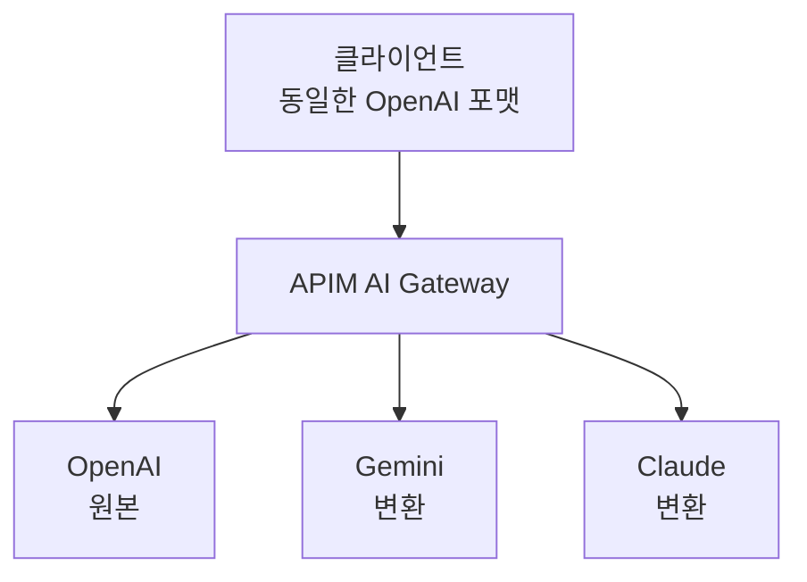

# Lab 5: 멀티 모델 Gateway (Gemini, Claude 등)

Azure OpenAI 외에 Google Gemini, Anthropic Claude 등 다양한 AI 모델을 APIM 뒤에 통합하여 단일 게이트웨이로 운영합니다.

## 목표

- Google Gemini API를 APIM 백엔드로 등록
- 모델 프로바이더별 라우팅 정책 구성
- 요청/응답 형식 변환 (정규화)
- 통합 API 인터페이스 제공

## 실습 단계

### 1단계: Gemini API 백엔드 등록

**API Key를 Named Value로 저장:**

```bash
set -a; source .env; set +a

az apim nv create \
  --resource-group $RESOURCE_GROUP \
  --service-name $APIM_NAME \
  --named-value-id gemini-api-key \
  --display-name "Gemini API Key" \
  --value "<YOUR_GEMINI_API_KEY>" \
  --secret true
```

> 💡 Gemini API Key는 [Google AI Studio](https://aistudio.google.com/apikey)에서 발급합니다.

**백엔드 등록:**

```bicep
resource geminiBackend 'Microsoft.ApiManagement/service/backends@2023-09-01-preview' = {
  parent: apimService
  name: 'gemini-backend'
  properties: {
    url: 'https://generativelanguage.googleapis.com/v1beta'
    protocol: 'http'
  }
}
```

### 2단계: 모델 프로바이더별 라우팅

클라이언트가 `x-model-provider` 헤더로 모델을 선택할 수 있게 합니다.

1. Azure Portal → APIM → **APIs** → **Azure OpenAI** → **All operations**
2. **Inbound processing** 영역의 **</>** 클릭 (Code View — 전체 XML 편집)
3. 아래를 참고하여 정책을 수정합니다

> **적용 위치: Inbound processing** — 요청이 들어올 때 헤더를 확인하고 백엔드를 선택합니다.

```xml
<!-- Inbound processing에 적용 -->
<inbound>
    <base />
    <choose>
        <!-- Gemini 라우팅 -->
        <when condition="@(context.Request.Headers
            .GetValueOrDefault("x-model-provider","") == "gemini")">
            <set-backend-service base-url="https://generativelanguage.googleapis.com/v1beta" />
            <set-header name="x-goog-api-key" exists-action="override">
                <value>{{gemini-api-key}}</value>
            </set-header>
            <rewrite-uri template="/models/gemini-2.0-flash:generateContent" />
        </when>
        <!-- 기본: Azure OpenAI 백엔드 풀 -->
        <otherwise>
            <authentication-managed-identity resource="https://cognitiveservices.azure.com" />
            <set-backend-service backend-id="openai-backend-pool" />
        </otherwise>
    </choose>
</inbound>
```

### 3단계: 요청 형식 변환 (OpenAI → Gemini)

클라이언트가 OpenAI 포맷으로 보내면, APIM이 Gemini 포맷으로 변환합니다.

> **적용 위치: Inbound processing** — 2단계의 `<choose>` 블록 안 Gemini `<when>` 조건에 `set-body`를 추가합니다.

```xml
<!-- inbound 섹션의 <choose> → <when condition="gemini"> 안에 추가 -->
<when condition="@(context.Request.Headers
    .GetValueOrDefault("x-model-provider","") == "gemini")">
    <!-- 요청 본문 변환: OpenAI → Gemini -->
    <set-body>@{
        var body = context.Request.Body.As<JObject>();
        var messages = body["messages"] as JArray;
        var contents = new JArray();

        foreach (var msg in messages) {
            var role = msg["role"].ToString() == "assistant" ? "model" : "user";
            contents.Add(new JObject(
                new JProperty("role", role),
                new JProperty("parts", new JArray(
                    new JObject(new JProperty("text", msg["content"].ToString()))
                ))
            ));
        }

        return new JObject(
            new JProperty("contents", contents),
            new JProperty("generationConfig", new JObject(
                new JProperty("maxOutputTokens",
                    body["max_tokens"] != null ? (int)body["max_tokens"] : 1024)
            ))
        ).ToString();
    }</set-body>
</when>
```

### 4단계: 응답 형식 변환 (Gemini → OpenAI)

Gemini의 응답을 OpenAI 포맷으로 정규화하여 클라이언트에 반환합니다.

> **적용 위치: Outbound processing** — 백엔드 응답이 클라이언트로 돌아가기 전에 포맷을 변환합니다.

```xml
<!-- Outbound processing에 적용 -->
<outbound>
    <base />
    <choose>
        <when condition="@(context.Request.Headers
            .GetValueOrDefault("x-model-provider","") == "gemini")">
            <set-body>@{
                var body = context.Response.Body.As<JObject>();
                var candidates = body["candidates"] as JArray;
                var text = candidates?[0]?["content"]?["parts"]?[0]?["text"]?.ToString() ?? "";

                return new JObject(
                    new JProperty("id", "chatcmpl-" + Guid.NewGuid().ToString("N").Substring(0, 29)),
                    new JProperty("object", "chat.completion"),
                    new JProperty("model", "gemini-2.0-flash"),
                    new JProperty("choices", new JArray(
                        new JObject(
                            new JProperty("index", 0),
                            new JProperty("message", new JObject(
                                new JProperty("role", "assistant"),
                                new JProperty("content", text)
                            )),
                            new JProperty("finish_reason", "stop")
                        )
                    )),
                    new JProperty("usage", new JObject(
                        new JProperty("prompt_tokens", body["usageMetadata"]?["promptTokenCount"] ?? 0),
                        new JProperty("completion_tokens", body["usageMetadata"]?["candidatesTokenCount"] ?? 0),
                        new JProperty("total_tokens", body["usageMetadata"]?["totalTokenCount"] ?? 0)
                    ))
                ).ToString();
            }</set-body>
        </when>
    </choose>
</outbound>
```

### 5단계: 테스트

**Azure OpenAI 호출 (기본):**
```bash
set -a; source .env; set +a

curl -X POST "${APIM_URL}/openai/deployments/gpt-4.1-nano/chat/completions?api-version=2025-04-01-preview" \
  -H "Content-Type: application/json" \
  -H "Ocp-Apim-Subscription-Key: ${APIM_SUBSCRIPTION_KEY}" \
  -d '{"messages":[{"role":"user","content":"Hello!"}],"max_tokens":100}'
```

**Gemini 호출 (동일 포맷, 헤더만 변경):**
```bash
curl -X POST "${APIM_URL}/openai/deployments/gpt-4.1-nano/chat/completions?api-version=2025-04-01-preview" \
  -H "Content-Type: application/json" \
  -H "Ocp-Apim-Subscription-Key: ${APIM_SUBSCRIPTION_KEY}" \
  -H "x-model-provider: gemini" \
  -d '{"messages":[{"role":"user","content":"Hello!"}],"max_tokens":100}'
```

두 호출 모두 **동일한 OpenAI 응답 포맷**으로 반환됩니다.

다음 시나리오를 순서대로 수동 테스트합니다:
1. Azure OpenAI 라우팅 (기본) → 응답의 `model` 필드 확인
2. Gemini 라우팅 (`x-model-provider: gemini`) → 응답이 OpenAI 포맷으로 정규화되는지 확인
3. 잘못된 Provider 헤더 → 기본 OpenAI로 Fallback 확인

**VS Code REST Client:** `scripts/test-endpoints.http`의 `Lab 5` 섹션 참조

## 핵심 개념

### 멀티 모델 Gateway의 장점



1. **백엔드 추상화**: 클라이언트는 백엔드 변경을 인지할 필요 없음
2. **포맷 통일**: 다양한 모델의 API를 단일 인터페이스로 제공
3. **전환 용이성**: 모델 교체 시 정책만 수정하면 됨
4. **비용 최적화**: 모델별 비용/성능에 따라 유연하게 라우팅

## 다음 단계

→ [Lab 6: 모니터링 & 로깅](../lab06-monitoring/README.md)
