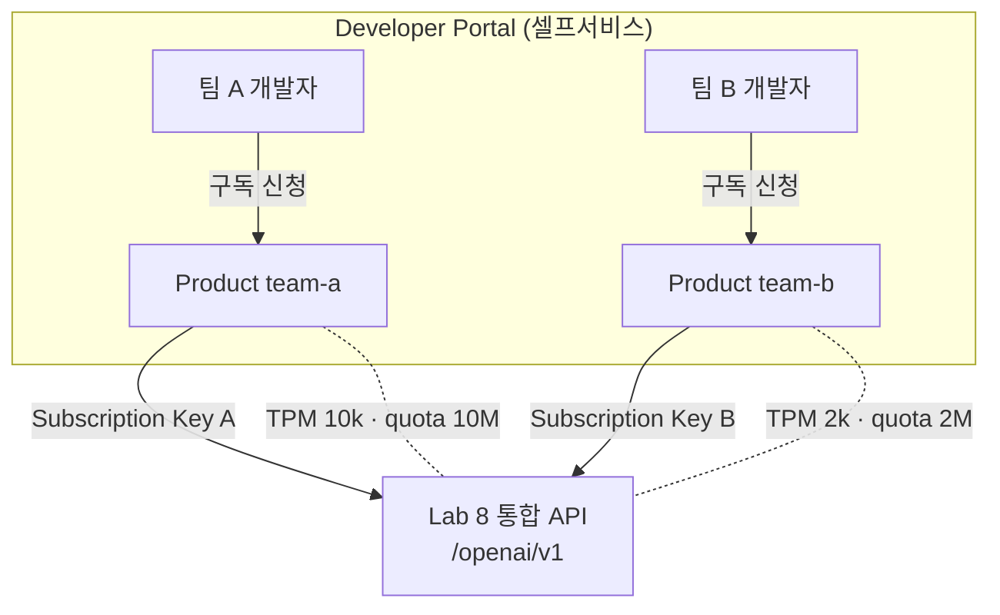

# Lab 9: Products & 개발자 포털 (구독 격리)

> 🚧 **드래프트** — 스니펫은 정확하나, 실제 배포 후 E2E 검증 예정입니다.

APIM Products · Subscriptions · Developer Portal 로 각 팀이 **격리된 구독 키**를 셀프서비스로 발급받게 합니다. API 접근과 토큰 예산을 subscriber 별로 격리합니다.

## 목표

- Product 로 API + 정책 + 구독요건을 묶기
- Product 별 **토큰 예산**(`llm-token-limit`: 분당 TPM + 월 토큰 quota) + **요청 예산**(`quota-by-key`: 월 호출 수) 적용
- Developer Portal 게시 & 셀프서비스 구독
- 2개 구독으로 격리(키/TPM/메트릭 분리) 검증

## Product 설계

이 Lab 은 **팀형** Product 를 기본 예시로 사용합니다.

| Product | 대상 | 분당 토큰 (TPM) | 월 토큰 quota | 월 호출 수 (요청) | 구독 승인 |
|---|---|---|---|---|---|
| `team-a` | 팀 A | 10,000 | 10,000,000 | 100,000 | 자동 |
| `team-b` | 팀 B | 2,000 | 2,000,000 | 20,000 | 관리자 승인 |

토큰 quota 는 `llm-token-limit token-quota`(초과 시 403), 호출 수 quota 는 `quota-by-key`(초과 시 403)로 각각 제어되며, 분당 TPM 은 순간 폭증 방지(429)용이다.

> 💡 티어형(`free`/`standard`)으로 바꾸려면 Product 이름과 한도만 교체하면 됩니다.
> 두 Product 모두 Lab 8의 통합 API 를 포함합니다.

## 아키텍처



## 실습 단계

### 1단계: Product 생성 & 통합 API 연결

```bash
# team-a: 자동 승인
az apim product create --resource-group $RESOURCE_GROUP --service-name $APIM_NAME \
  --product-id team-a --product-name "Team A" \
  --subscription-required true --approval-required false --state published

# team-b: 관리자 승인
az apim product create --resource-group $RESOURCE_GROUP --service-name $APIM_NAME \
  --product-id team-b --product-name "Team B" \
  --subscription-required true --approval-required true --state published

# 통합 API 를 각 Product 에 추가 (API_ID 는 Lab 8에서 만든 API 이름)
az apim product api add --resource-group $RESOURCE_GROUP --service-name $APIM_NAME \
  --product-id team-a --api-id multicloud-openai
az apim product api add --resource-group $RESOURCE_GROUP --service-name $APIM_NAME \
  --product-id team-b --api-id multicloud-openai
```

### 2단계: Product 정책 — 구독별 TPM + 월 quota

Portal → APIM → Products → team-a → Policies (또는 `az apim product` REST). team-a 예시:

```xml
<policies>
    <inbound>
        <base />
        <!-- 토큰 기반 제어: 분당 TPM(429) + 월 토큰 총량(403) -->
        <llm-token-limit counter-key="@(context.Subscription.Id)"
            tokens-per-minute="10000"
            token-quota="10000000" token-quota-period="Monthly"
            estimate-prompt-tokens="true"
            remaining-tokens-header-name="x-ratelimit-remaining-tokens"
            remaining-quota-tokens-header-name="x-quota-remaining-tokens" />
        <!-- 요청 기반 제어: 월 호출 수 상한 -->
        <quota-by-key calls="100000" renewal-period="2592000"
            counter-key="@(context.Subscription.Id)" />
    </inbound>
    <backend><base /></backend>
    <outbound><base /></outbound>
    <on-error><base /></on-error>
</policies>
```

> team-b 는 `tokens-per-minute="2000"`, `token-quota="2000000"`, `calls="20000"` 으로 낮춰 차등 적용합니다.
> `counter-key`가 `context.Subscription.Id` 이므로 **구독마다 독립된 카운터**가 유지됩니다(격리).

> 💡 구독별 토큰 한도는 **Product 스코프**에 두어 중앙 관리하며, 같은 `counter-key`(Subscription.Id)를 여러 스코프에서 쓰면 카운터가 공유된다는 점에 유의하세요.

### 3단계: 구독 생성 & 키 발급

```bash
az apim subscription create --resource-group $RESOURCE_GROUP --service-name $APIM_NAME \
  --name sub-team-a --display-name "Sub Team A" \
  --scope "/products/team-a"

# Primary key 확인
az apim subscription show --resource-group $RESOURCE_GROUP --service-name $APIM_NAME \
  --sid sub-team-a --query primaryKey -o tsv
```

### 4단계: 격리 검증

- 두 구독 키로 각각 호출 → 한 팀이 TPM 을 소진해도 다른 팀은 영향 없음
- `x-ratelimit-remaining-tokens` 헤더가 구독별로 독립적으로 감소

## 핵심 개념

- **Product** = API + 정책 + 구독요건 묶음
- **구독 키** = subscriber 격리의 단위 (API 접근 + 토큰 카운터)
- **Developer Portal** = 셀프서비스 구독 창구 → [개발자 포털 가이드](../../docs/developer-portal-guide.md)
- **counter-key** `@(context.Subscription.Id)` 를 사용하면 구독별로 TPM·quota 가 독립적으로 집계됩니다.

## 다음 단계

→ [Lab 10: 구독별 거버넌스 & Azure Monitor 대시보드](../lab10-governance-observability/README.md)
