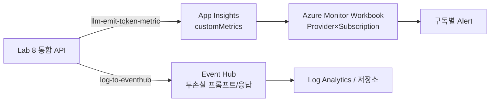

# Lab 10: 구독별 거버넌스 & Azure Monitor 대시보드

> 🚧 **드래프트** — 스니펫은 정확하나, 실제 배포 후 E2E 검증 예정입니다.

모든 **프로바이더 × 구독**에 걸친 토큰·비용·프롬프트를 하나의 관측 평면에서 통제합니다. Lab 6의 App Insights 관측을 멀티 클라우드·멀티 구독으로 확장하고, 스트리밍/대용량 프롬프트까지 풀 피델리티로 캡처합니다.

## 목표

- Provider × Model × Subscription × Product 차원 토큰 메트릭
- 구독별 TPM + 월 quota 거버넌스 (Lab 9 확장)
- Event Hub 로깅으로 8KB 초과·스트리밍 프롬프트/응답 무손실 캡처
- Azure Monitor Workbook + 구독별 Alert

## 관측 범위 (Lab 6 대비 확장)

| 항목 | Lab 6 | Lab 10 (이번) |
|---|---|---|
| 토큰 메트릭 대상 | Azure OpenAI | **모든 프로바이더** (Provider 차원) |
| 구독 구분 | Subscription ID | Subscription **+ Product** |
| 프롬프트/응답 로깅 | Diagnostics body (≤8KB, 스트리밍 미포착) | **Event Hub** 무손실 + 스트리밍 usage |
| 대시보드 | KQL 쿼리 | **Azure Monitor Workbook** + Dashboard 고정 |
| 알림 | 서비스 단위 | **구독별** 토큰 급증/quota 초과 |

## 아키텍처



## 실습 단계

### 1단계: 프로바이더별·구독별 토큰 (KQL)

Lab 8 통합 API에 적용된 `llm-emit-token-metrics` 조각은 `Provider`, `Subscription ID`, `Model` 차원을 포함하므로, 아래 KQL을 App Insights에서 바로 실행할 수 있습니다.

```kql
customMetrics
| where name in ("Total Tokens", "Prompt Tokens", "Completion Tokens")
| where timestamp > ago(24h)
| extend provider = tostring(customDimensions["Provider"])
| extend subscriptionId = tostring(customDimensions["Subscription ID"])
| extend model = tostring(customDimensions["Model"])
| summarize totalTokens = sum(value) by provider, subscriptionId, model
| order by totalTokens desc
```

### 2단계: 크로스클라우드 구독별 비용 추정

```kql
customMetrics
| where name == "Total Tokens"
| where timestamp > ago(1d)
| extend provider = tostring(customDimensions["Provider"])
| extend subscriptionId = tostring(customDimensions["Subscription ID"])
| summarize tokens = sum(value) by provider, subscriptionId
| extend estCostUsd = case(
    provider == "bedrock", tokens * 0.000003,
    provider == "anthropic", tokens * 0.000003,
    provider == "gemini", tokens * 0.0000005,
    provider == "openai", tokens * 0.000005,
    tokens * 0.000002)   // azure 기본
| order by estCostUsd desc
```

> 단가는 예시값입니다. 실제 청구 요율은 각 프로바이더 콘솔에서 확인하세요.

### 3단계: Event Hub 무손실 로깅 (8KB 한계·스트리밍 보완)

Lab 6 Diagnostics body 로깅은 **8192바이트에서 잘리고 스트리밍(SSE) 응답을 포착하지 못합니다.**
전체 프롬프트/응답을 남기려면 Event Hub 경로를 사용합니다.

```bicep
// infra/modules/eventhub-logging.bicep (초안)
resource ehNamespace 'Microsoft.EventHub/namespaces@2022-10-01-preview' = {
  name: 'ehns-ai-gateway-${suffix}'
  location: location
  sku: { name: 'Standard', tier: 'Standard' }
}
resource eh 'Microsoft.EventHub/namespaces/eventhubs@2022-10-01-preview' = {
  parent: ehNamespace
  name: 'ai-gateway-logs'
  properties: { messageRetentionInDays: 1, partitionCount: 2 }
}
```

APIM Event Hub logger 등록 후, 정책에 추가:

```xml
<!-- Inbound: 전체 프롬프트 캡처 -->
<log-to-eventhub logger-id="eventhub-logger">@{
    return new JObject(
        new JProperty("subscriptionId", context.Subscription.Id),
        new JProperty("provider", (string)context.Variables.GetValueOrDefault("provider", "unknown")),
        new JProperty("requestBody", context.Request.Body.As<string>(preserveContent: true))
    ).ToString();
}</log-to-eventhub>
```

> Event Hub 는 크기 제한이 훨씬 커서 8KB 초과 프롬프트도 무손실로 남습니다.
> 스트리밍 응답의 토큰은 4단계(`include_usage`)로 확보합니다.

### 4단계: 스트리밍(SSE) 응답의 토큰 확보

스트리밍(`stream: true`)에서는 APIM 이 응답 본문을 버퍼링하지 못해 토큰이 누락됩니다.
클라이언트가 `stream_options.include_usage: true` 를 보내면, 스트림 마지막 청크에 `usage` 가 포함됩니다.

```json
{ "model": "openai/gpt-4o", "stream": true,
  "stream_options": { "include_usage": true },
  "messages": [{ "role": "user", "content": "..." }] }
```

> ⚠️ **레닥션/보존:** 프롬프트/응답에는 PII 가 포함될 수 있습니다. Event Hub 소비자 단에서
> 마스킹하고, Log Analytics 보존 기간과 접근 권한(RBAC)을 정책으로 통제하세요.
> 민감 라우트에만 body 로깅을 활성화하는 것을 권장합니다.

### 5단계: Azure Monitor Workbook

Portal → Azure Monitor → **Workbooks** → **+ New** → 아래 쿼리들을 타일로 추가:
- 프로바이더별 TPM (timechart)
- 구독별 토큰 Top 10 (barchart)
- 구독별 429율 (timechart)
- 크로스클라우드 비용 추정 (table)

> Workbook 은 JSON 으로 export/공유 가능합니다. (Advanced Editor → Gallery Template)

### 6단계: 구독별 Alert

```bash
# "Total Tokens" 는 App Insights 커스텀 메트릭이므로, 알림 스코프는 App Insights 리소스여야 합니다.
AI_RESOURCE_ID=$(az monitor app-insights component show \
  -g $RESOURCE_GROUP -a $APP_INSIGHTS_NAME --query id -o tsv)
az monitor metrics alert create --name alert-sub-token-spike \
  --resource-group $RESOURCE_GROUP \
  --scopes $AI_RESOURCE_ID \
  --condition "total 'customMetrics/Total Tokens' > 500000" \
  --window-size 15m --evaluation-frequency 5m \
  --description "구독 토큰 급증 감지"
```

## 핵심 개념

- 하나의 게이트웨이가 모든 프로토콜을 제어(제한/quota)하고 관측(토큰/프롬프트/비용)한다
- Provider 차원으로 멀티 클라우드를, Subscription/Product 차원으로 멀티 테넌트를 분해한다
- 8KB·스트리밍 한계는 Event Hub + include_usage 로 보완한다

## 다음 단계

→ [Lab 11: 리소스 정리](../lab11-cleanup/README.md) | [메인 README](../../README.md)
