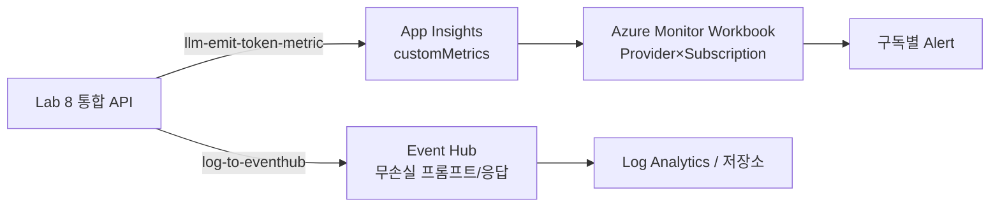

# Lab 10: 구독별 거버넌스 & Azure Monitor 대시보드

> ✅ **App Insights KQL 관측 경로 라이브 검증됨** — [`test-governance-observability.ipynb`](./test-governance-observability.ipynb)
> 로 실제 배포에서 **구독별 토큰(customMetrics)·비용 추정·429/403 거버넌스 추이(requests)** 를 E2E 확인했습니다.
> Event Hub 무손실 로깅·Alert 스니펫은 배포용 참조이며, **Azure Monitor Workbook 은 배포 가능한 템플릿+스크립트로 라이브 배포까지 검증**했습니다.

모든 **프로바이더 × 구독**에 걸친 토큰·비용·프롬프트를 하나의 관측 평면에서 통제합니다. Lab 6의 App Insights 관측을 멀티 클라우드·멀티 구독으로 확장하고, 스트리밍/대용량 프롬프트까지 풀 피델리티로 캡처합니다.

## 목표

- Provider × Model × Subscription × Product 차원 토큰 메트릭
- 구독별 TPM + 월 quota 거버넌스 (Lab 9 확장)
- Event Hub 로깅으로 8KB 초과·스트리밍 프롬프트/응답 무손실 캡처
- Azure Monitor Workbook + 구독별 Alert

## 관측 범위 (Lab 6 대비 확장)

| 항목 | Lab 6 | Lab 10 (이번) |
|---|---|---|
| 토큰 메트릭 대상 | Azure OpenAI | **모든 프로바이더** (Provider 차원) |
| 구독 구분 | Subscription ID | Subscription **+ Product** |
| 프롬프트/응답 로깅 | Diagnostics body (≤8KB, 스트리밍 미포착) | **Event Hub** 무손실 + 스트리밍 usage |
| 대시보드 | KQL 쿼리 | **Azure Monitor Workbook** + Dashboard 고정 |
| 알림 | 서비스 단위 | **구독별** 토큰 급증/quota 초과 |

## 아키텍처



## 실습 단계

### 1단계: 프로바이더별·구독별 토큰 (KQL)

Lab 8 통합 API에 적용된 `llm-emit-token-metrics` 조각은 `Provider`, `Subscription ID`, `Model` 차원을 포함하므로, 아래 KQL을 App Insights에서 바로 실행할 수 있습니다.

```kql
customMetrics
| where name in ("Total Tokens", "Prompt Tokens", "Completion Tokens")
| where timestamp > ago(24h)
| extend provider = tostring(customDimensions["Provider"])
| extend subscriptionId = tostring(customDimensions["Subscription ID"])
| extend model = tostring(customDimensions["Model"])
| summarize totalTokens = sum(value) by provider, subscriptionId, model
| order by totalTokens desc
```

### 2단계: 크로스클라우드 구독별 비용 추정

```kql
customMetrics
| where name == "Total Tokens"
| where timestamp > ago(1d)
| extend provider = tostring(customDimensions["Provider"])
| extend subscriptionId = tostring(customDimensions["Subscription ID"])
| summarize tokens = sum(value) by provider, subscriptionId
| extend estCostUsd = case(
    provider == "anthropic", tokens * 0.000003,
    provider == "gemini", tokens * 0.0000005,
    provider == "openai", tokens * 0.000005,
    tokens * 0.000002)   // azure 기본
| order by estCostUsd desc
```

> 단가는 예시값입니다. 실제 청구 요율은 각 프로바이더 콘솔에서 확인하세요.

### 3단계: Event Hub 무손실 로깅 (8KB 한계·스트리밍 보완)

Lab 6 Diagnostics body 로깅은 **8192바이트에서 잘리고 스트리밍(SSE) 응답을 포착하지 못합니다.**
전체 프롬프트/응답을 남기려면 Event Hub 경로를 사용합니다.

```bicep
// infra/modules/eventhub-logging.bicep (초안)
resource ehNamespace 'Microsoft.EventHub/namespaces@2022-10-01-preview' = {
  name: 'ehns-ai-gateway-${suffix}'
  location: location
  sku: { name: 'Standard', tier: 'Standard' }
}
resource eh 'Microsoft.EventHub/namespaces/eventhubs@2022-10-01-preview' = {
  parent: ehNamespace
  name: 'ai-gateway-logs'
  properties: { messageRetentionInDays: 1, partitionCount: 2 }
}
```

APIM Event Hub logger 등록 후, 정책에 추가:

```xml
<!-- Inbound: 전체 프롬프트 캡처 -->
<log-to-eventhub logger-id="eventhub-logger">@{
    return new JObject(
        new JProperty("subscriptionId", context.Subscription.Id),
        new JProperty("provider", (string)context.Variables.GetValueOrDefault("provider", "unknown")),
        new JProperty("requestBody", context.Request.Body.As<string>(preserveContent: true))
    ).ToString();
}</log-to-eventhub>
```

> Event Hub 는 크기 제한이 훨씬 커서 8KB 초과 프롬프트도 무손실로 남습니다.
> 스트리밍 응답의 토큰은 4단계(`include_usage`)로 확보합니다.

### 4단계: 스트리밍(SSE) 응답의 토큰 확보

스트리밍(`stream: true`)에서는 APIM 이 응답 본문을 버퍼링하지 못해 토큰이 누락됩니다.
클라이언트가 `stream_options.include_usage: true` 를 보내면, 스트림 마지막 청크에 `usage` 가 포함됩니다.

```json
{ "model": "openai/gpt-4o", "stream": true,
  "stream_options": { "include_usage": true },
  "messages": [{ "role": "user", "content": "..." }] }
```

> ⚠️ **레닥션/보존:** 프롬프트/응답에는 PII 가 포함될 수 있습니다. Event Hub 소비자 단에서
> 마스킹하고, Log Analytics 보존 기간과 접근 권한(RBAC)을 정책으로 통제하세요.
> 민감 라우트에만 body 로깅을 활성화하는 것을 권장합니다.

### 5단계: Azure Monitor Workbook (구독별 · 멀티클라우드 리포팅) — ✅ 배포 검증됨

> ✅ 이 Workbook 은 실제 App Insights 에 배포·조회까지 라이브 검증했습니다.
> 타일을 손으로 만들 필요 없이 **배포 가능한 템플릿 + 원커맨드 스크립트**를 제공합니다.

**구성물**
- [`workbook-template.json`](./workbook-template.json) — 상단 **필터(시간범위 · 토큰 쿼터 기준 · 구독 멀티선택)** + **8개 리포팅 타일**. App Insights 리소스 ID 는 `__APP_INSIGHTS_ID__` 플레이스홀더로 이식성 확보.
- [`deploy-workbook.sh`](./deploy-workbook.sh) — RG 내 App Insights 를 자동 탐색해 플레이스홀더를 치환하고 `Microsoft.Insights/workbooks` 리소스로 배포(멱등). 실행:

```bash
cd labs/lab10-governance-observability
RESOURCE_GROUP=<APIM 이 있는 RG> ./deploy-workbook.sh
# 출력된 포털 딥링크로 바로 열기 → Monitor → Workbooks 에서도 확인 가능
# 삭제: az rest --method DELETE --url "<출력된 workbook resource id>?api-version=2023-06-01"
```

**상단 파라미터** (전 타일 연동)
| 파라미터 | 타입 | 기본값 | 용도 |
|---|---|---|---|
| `TimeRange` | 시간범위 | 1일 | 대시보드 전체 시간창 |
| `QuotaTokens` | 텍스트 | `2000000` | 구독당 토큰 쿼터 기준(① 사용률 계산) |
| `Subscription` | 멀티선택 | 전체 | 구독(테넌트)별 필터 · `requests` 에서 목록 자동 조회 |

**8개 타일** (`customMetrics`=토큰/쿼터/비용 · `requests`=요청률/지연/차단/프롬프트)

| # | 타일 | 시각화 | 무엇을 보나 |
|---|---|---|---|
| ① | 구독별 토큰 쿼터 사용 현황 | table | 구독별 사용 토큰·쿼터·**사용률 %** |
| ② | 구독별 **TPM** | timechart | 분당 토큰 |
| ③ | 구독별 **요청률(RPS)** | timechart | 분당 요청수(=/60 → RPS) |
| ④ | **프로바이더별** 토큰 분해 | piechart | Azure/OpenAI/Anthropic/Gemini 비중 |
| ⑤ | 구독 × 프로바이더 **비용 추정** | table | 프로바이더 단가 × 토큰 |
| ⑥ | **거버넌스 차단 추이** | barchart | 429(TPM) · 403(quota) · 401(무인증) |
| ⑦ | 구독별 **SLO** | table | 성공률 · P50/P95 지연 |
| ⑧ | **프롬프트/응답 감사** | table | 최근 요청·응답 본문(≤300자) |

핵심 타일 KQL (전체는 템플릿 참조):

```kusto
// ① 구독별 토큰 쿼터 사용 현황 (사용률 %)
customMetrics
| where name == 'Total Tokens'
| extend sub = tostring(customDimensions['Subscription ID'])
| where isnotempty(sub) and sub in ({Subscription})
| summarize ['사용 토큰'] = sum(value) by ['구독'] = sub
| extend ['쿼터'] = toreal({QuotaTokens}), ['사용률 %'] = round(100.0 * ['사용 토큰'] / {QuotaTokens}, 1)
| order by ['사용 토큰'] desc
```

```kusto
// ③ 구독별 요청률 (건/분 · RPS = 값/60)
requests
| extend sub = tostring(customDimensions['Subscription Name'])
| where isnotempty(sub) and sub in ({Subscription})
| summarize ['요청/분'] = count() by sub, bin(timestamp, 1m)
```

```kusto
// ④ 프로바이더별 토큰 분해 (멀티클라우드)
customMetrics
| where name == 'Total Tokens'
| extend prov = tostring(customDimensions['Provider']), sub = tostring(customDimensions['Subscription ID'])
| where sub in ({Subscription})
| summarize ['토큰'] = sum(value) by ['프로바이더'] = prov
| order by ['토큰'] desc
```

```kusto
// ⑥ 거버넌스 차단 추이 (429/403/401)
requests
| extend sub = tostring(customDimensions['Subscription Name'])
| where sub in ({Subscription})
| where resultCode in ('429', '403', '401')
| summarize ['건수'] = count() by resultCode, bin(timestamp, 5m)
```

> 💡 `customMetrics` 는 `Subscription ID`, `requests` 는 `Subscription Name` 을 사용합니다.
> 랩에서는 두 값을 동일하게 설정(구독 displayName=id)하므로 필터가 교차 적용됩니다.

### 6단계: 구독별 Alert

```bash
# "Total Tokens" 는 App Insights 커스텀 메트릭이므로, 알림 스코프는 App Insights 리소스여야 합니다.
AI_RESOURCE_ID=$(az monitor app-insights component show \
  -g $RESOURCE_GROUP -a $APP_INSIGHTS_NAME --query id -o tsv)
az monitor metrics alert create --name alert-sub-token-spike \
  --resource-group $RESOURCE_GROUP \
  --scopes $AI_RESOURCE_ID \
  --condition "total 'customMetrics/Total Tokens' > 500000" \
  --window-size 15m --evaluation-frequency 5m \
  --description "구독 토큰 급증 감지"
```

## 핵심 개념

- 하나의 게이트웨이가 모든 프로토콜을 제어(제한/quota)하고 관측(토큰/프롬프트/비용)한다
- Provider 차원으로 멀티 클라우드를, Subscription/Product 차원으로 멀티 테넌트를 분해한다
- 8KB·스트리밍 한계는 Event Hub + include_usage 로 보완한다

## 다음 단계

→ [Lab 11: 리소스 정리](../lab11-cleanup/README.md) | [메인 README](../../README.md)
