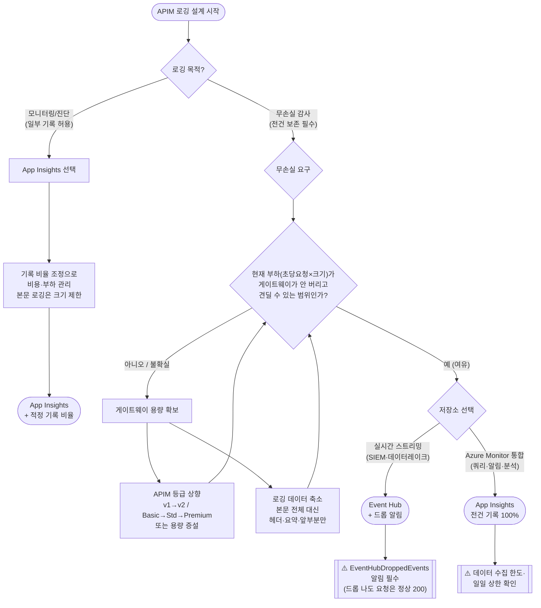

# APIM 로그 저장소 선택 가이드 (의사결정 트리) — App Insights vs Event Hub

> Lab 13 벤치마크 결과([RESULTS.md](./RESULTS.md))에서 도출한 실무 의사결정 가이드.
>
> **📖 용어 풀이**
> - **로그 저장소(sink)**: 로그를 어디에 남길지 — **App Insights**(애저 모니터링) vs **Event Hub**(대용량 수집).
> - **무손실**: 요청을 하나도 안 빼고 전부 기록 / **드롭**: 로그가 버려져 사라짐(유실).
> - **RPS**: 초당 요청 수(부하 세기) / **payload**: 요청 하나의 데이터 크기(8KB·64KB).
> - **SKU**: APIM 등급(성능 티어). Developer < Basic < Standard < Premium.
> - **게이트웨이**: 요청을 실제 처리하는 APIM 본체 / **body**: 요청·응답 본문.
>
> **핵심 전제**: 로그를 안 빼먹느냐(무손실)는 *어떤 저장소를 고르냐*가 아니라 **APIM 등급(SKU)이 부하(초당 요청 수 × 요청 크기)를 견디느냐**로 결정된다.
> 아래 수치들은 **본 실험 환경(Korea Central, Developer v1 / Basic v2)**에서 나온 값이며, 실제 환경에서는 반드시 자체 부하 테스트로 다시 확인해야 한다.

---

## 0. 먼저 답할 3가지 질문

| # | 질문 | 왜 중요한가 |
|---|---|---|
| Q-A | **로깅 목적**이 "일부만 기록해도 되는 모니터링(진단·대시보드)"인가, "전건 무손실 감사(컴플라이언스)"인가? | 저장소 선택의 1차 갈림길 |
| Q-B | **최대 부하**(초당 요청 수)와 **로깅할 데이터 크기**(요청 본문 포함 여부)는? | 무손실 가능 여부 결정 |
| Q-C | 현재/목표 **APIM SKU**는? (Consumption / Developer / Basic / Standard / Premium, v1 vs v2) | 게이트웨이 용량 = 근본 병목 |

---

## 1. 의사결정 트리 (flowchart)

---

## 2. APIM 등급 × 데이터 크기 → 무손실 안전 범위 표

**본 실험에서 관측된 무손실 임계(log-to-eventhub 기준).** "무손실"은 EventHubDroppedEvents=0 또는 EH IncomingMessages가 발신량과 일치함을 의미.

| APIM SKU | payload | 무손실 임계 RPS (관측) | 근거 |
|---|---|---|---|
| **Developer v1** (cap 1) | 8 KB | **≤ ~300 RPS** | 300=드롭0, 400=2,933 드롭, 500=대량 드롭 |
| **Developer v1** (cap 1) | 64 KB | **300에서도 드롭** (41,435) | payload↑ → 임계 급락 |
| **Basic v2** (최소) | 8 KB | **≥ 500 RPS 무손실** | EH IncomingMessages 30,000/분 일정 |

> **읽는 법**:
> - 같은 SKU에서 **payload가 커지면 무손실 임계 RPS가 급락**한다(8KB 300 → 64KB는 300도 실패). 즉 병목은 "초당 요청 수"가 아니라 **초당 처리해야 하는 데이터 총량(요청수 × 크기)**.
> - **SKU를 올리면 같은 부하에서 무손실이 회복**된다(v1 절반 드롭 → v2 무손실, 클라이언트 p99 ~500ms→~30ms).
> - Developer v1은 **무로깅 상태에서도 500 RPS에서 ~89% 포화** → 이 티어의 근본 한계가 500 RPS 부근. 로깅은 이 한계를 더 빨리 드러낼 뿐.

**중요 한계**: 위 숫자는 각 1회 측정·본 환경 전용. **프로덕션 SKU/capacity, 정책 조합, 리전이 다르면 반드시 재측정**하라. 표는 "절대 임계"가 아니라 "이런 식으로 자기 환경의 안전 범위를 직접 그려라"는 방법론이다.

---

## 3. 두 저장소 특성 비교 (선택 근거)

| 관점 | App Insights (applicationInsights) | log-to-eventhub |
|---|---|---|
| 전달 방식 | SDK가 뒤에서 모아 보냄(비동기) | 보내고 확인 안 함(fire-and-forget) |
| 무손실 메커니즘 | **전건 기록(100%)로 설정하면 모두 기록** (본 실험 150,178건 무손실) | 정책은 전건 실행되나 **APIM 큐 한도 도달 시 드롭** |
| 부하 넘칠 때 증상 | 수집량 제한·일일 상한(설정으로 조절) | **로그를 버림**(조용한 유실, 요청은 정상 200) |
| 게이트웨이 부담(처리시간) | 상대적으로 큼(500 RPS서 무로깅 대비 ~7–10배) | 정상 구간에선 더 낮게 보이나, 500 RPS의 낮은 값은 **로그를 버려서(일을 덜 해서) 생긴 착시** |
| 강점 | Azure Monitor 기본 통합: 쿼리·알림·추적 | 높은 처리량 실시간 스트리밍, 외부 시스템(SIEM·데이터레이크·Kafka)으로 실시간 전달 |
| 드롭 관측성 | AppRequests 카운트로 검증 | `EventHubDroppedEvents` vs EH `IncomingMessages` 대조로 "APIM이 버렸나 vs EH가 못 받았나"를 구분 가능 |

> **오해 주의**: "EH가 App Insights보다 빠르다"는 500 RPS에서만의 착시다. 그 구간 EH는 로그를 절반 버리고 있었고, 정상(무손실) 구간(300·400 RPS)에서는 App Insights Duration이 더 낮았다.

---

## 4. 시나리오별 권장 (요약)

| 시나리오 | 권장 | 이유 |
|---|---|---|
| 진단/대시보드, 유실 허용 | **App Insights + 기록 비율 조정** | 부담·비용을 기록 비율로 조절, Azure Monitor 통합 |
| 컴플라이언스 전건 감사, **중·저부하** | **App Insights 100%** 또는 **Event Hub (안전 범위 내)** | 안전 범위 안이면 둘 다 무손실; 통합 우선 AI, 스트리밍 우선 EH |
| 컴플라이언스 전건 감사, **고부하/큰 본문** | **APIM 등급 상향(v2/Premium) + 데이터 축소 → 그다음 저장소** | 무손실은 저장소가 아니라 게이트웨이 용량이 결정 |
| 외부 시스템 실시간 전달(SIEM 등) | **Event Hub + 드롭 알림(EventHubDroppedEvents)** | 스트리밍 목적에 부합, 단 드롭 감시 필수 |
| 본문(요청/응답 전체) 반드시 로깅 | **데이터 크기 제한 + 충분한 등급** | 본문이 클수록 무손실 가능한 RPS가 급락 |

---

## 5. 반드시 지킬 가드레일

1. **드롭은 조용하다.** Event Hub로 로그가 버려져도 요청 자체는 정상(200)으로 응답된다 → **`EventHubDroppedEvents` 알림을 걸지 않으면 감사 유실을 탐지할 수 없다.**
2. **무손실은 저장소 이름이 아니라 실측으로 증명한다.** "Event Hub니까 무손실"이라는 통념을 믿지 말고, 목표 부하에서 드롭 지표(EventHubDroppedEvents)와 EH 도달 수(IncomingMessages)를 직접 확인하라.
3. **데이터 크기가 한계를 좌우한다.** 무손실 한계는 초당 요청 수만이 아니라 `요청 수 × 요청 크기`로 잡아라. 본문 전체를 로깅하면 한계가 크게 낮아진다.
4. **v2 등급은 지표 체계가 다를 수 있다.** 본 실험에서 Basic v2는 드롭·부하·처리시간 지표가 비어, EH 도달 수로 간접 판정했다. **등급별로 "믿을 지표"를 미리 확인**하라.
5. **여유를 둬라.** Developer v1은 로깅 없이도 500 RPS에서 ~89%까지 찼다. 최대 부하 대비 여유 없이 운영하면, 로깅이 한계를 넘게 만드는 방아쇠가 된다.

---

*근거: [RESULTS.md](./RESULTS.md)(질문 1–5, 추가 가설 1–6), 원시 데이터 [EXPERIMENT-LOG.md](./EXPERIMENT-LOG.md). 재현: [REPRODUCE.md](./REPRODUCE.md).*
