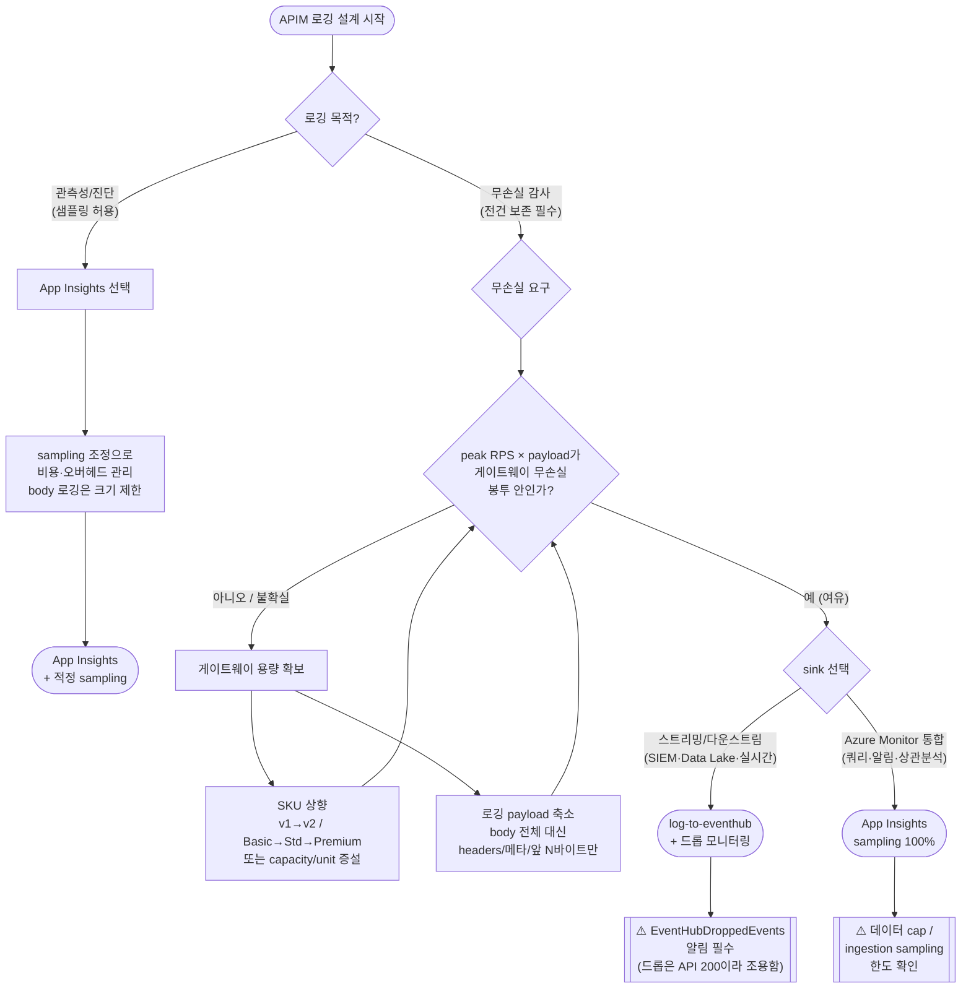

# APIM 로깅 sink 의사결정 트리 — App Insights vs Event Hub

> Lab 13 벤치마크 결과([RESULTS.md](./RESULTS.md))에서 도출한 실무 의사결정 가이드.
> **핵심 전제**: 무손실 로깅의 관건은 *sink 선택*이 아니라 **게이트웨이 SKU 용량 × (RPS × payload)**다.
> 아래 수치 임계값은 **본 실험 환경(Korea Central, Developer v1 cap 1 / Basic v2 최소)**에서 관측된 값이며,
> 실제 환경에서는 반드시 자체 부하 테스트로 보정(calibrate)해야 한다.

---

## 0. 먼저 답할 3가지 질문

| # | 질문 | 왜 중요한가 |
|---|---|---|
| Q-A | **로깅 목적**이 "샘플링 가능한 관측성(진단·대시보드)"인가, "전건 무손실 감사(컴플라이언스)"인가? | sink 선택의 1차 분기 |
| Q-B | **peak 처리량**(RPS)과 **로깅할 payload 크기**(특히 body 포함 여부)는? | 무손실 가능 여부 결정 |
| Q-C | 현재/목표 **APIM SKU**는? (Consumption / Developer / Basic / Standard / Premium, v1 vs v2) | 게이트웨이 용량 = 근본 병목 |

---

## 1. 의사결정 트리 (flowchart)

---

## 2. SKU × payload → 무손실 봉투(envelope) 사이징 표

**본 실험에서 관측된 무손실 임계(log-to-eventhub 기준).** "무손실"은 EventHubDroppedEvents=0 또는 EH IncomingMessages가 발신량과 일치함을 의미.

| APIM SKU | payload | 무손실 임계 RPS (관측) | 근거 |
|---|---|---|---|
| **Developer v1** (cap 1) | 8 KB | **≤ ~300 RPS** | 300=드롭0, 400=2,933 드롭, 500=대량 드롭 |
| **Developer v1** (cap 1) | 64 KB | **300에서도 드롭** (41,435) | payload↑ → 임계 급락 |
| **Basic v2** (최소) | 8 KB | **≥ 500 RPS 무손실** | EH IncomingMessages 30,000/분 일정 |

> **읽는 법**:
> - 같은 SKU에서 **payload가 커지면 무손실 임계 RPS가 급락**한다(8KB 300 → 64KB는 300도 실패). 즉 병목은 "초당 요청 수"가 아니라 **초당 처리 바이트/이벤트량**.
> - **SKU를 올리면 같은 부하에서 무손실이 회복**된다(v1 절반 드롭 → v2 무손실, 클라이언트 p99 ~500ms→~30ms).
> - Developer v1은 **무로깅 상태에서도 500 RPS에서 ~89% 포화** → 이 티어의 근본 한계가 500 RPS 부근. 로깅은 이 한계를 더 빨리 드러낼 뿐.

**중요 한계**: 위 숫자는 각 1회 측정·본 환경 전용. **프로덕션 SKU/capacity, 정책 조합, 리전이 다르면 반드시 재측정**하라. 표는 "절대 임계"가 아니라 "이런 방식으로 자신의 봉투를 그려라"는 방법론이다.

---

## 3. sink 특성 비교 (선택 근거)

| 관점 | App Insights (applicationInsights) | log-to-eventhub |
|---|---|---|
| 전달 방식 | SDK 비동기 배치 | fire-and-forget (정책 실행 중 enqueue) |
| 무손실 메커니즘 | **sampling 100%면 정책 레벨 전건 기록** (본 실험 150,178건 무손실) | 정책은 전건 실행되나 **APIM 큐 한도 도달 시 드롭** |
| 고부하 실패 모드 | ingestion sampling / 데이터 cap (구성으로 제어) | **EventHubDroppedEvents** (조용한 유실, API는 200 유지) |
| 게이트웨이 오버헤드(Duration) | 상대적으로 큼 (500 RPS서 무로깅 대비 ~7–10배) | 정상 구간에선 오히려 App Insights보다 낮게 관측되나, 500 RPS 저Duration은 **드롭(일 안함)의 착시** |
| 강점 | Azure Monitor 네이티브: KQL 쿼리, 알림, 상관분석, end-to-end 추적 | 고throughput 스트리밍, 다운스트림(SIEM/Data Lake/Kafka 컨슈머)로 실시간 팬아웃 |
| 드롭 관측성 | AppRequests 카운트로 검증 | `EventHubDroppedEvents` vs EH `IncomingMessages` 대조로 "APIM이 버림 vs EH가 못 받음" 분리 가능 |

> **오해 주의**: "EH가 App Insights보다 빠르다"는 500 RPS에서만의 착시다. 그 구간 EH는 로그를 절반 버리고 있었고, 정상(무손실) 구간(300·400 RPS)에서는 App Insights Duration이 더 낮았다.

---

## 4. 시나리오별 권장 (요약)

| 시나리오 | 권장 | 이유 |
|---|---|---|
| 진단/대시보드, 유실 허용 | **App Insights + sampling** | 오버헤드·비용을 sampling으로 조절, Azure Monitor 통합 |
| 컴플라이언스 전건 감사, **중·저부하** | **App Insights sampling 100%** 또는 **EH (봉투 내)** | 봉투 안이면 둘 다 무손실; 통합 우선 AI, 스트리밍 우선 EH |
| 컴플라이언스 전건 감사, **고부하/대용량 body** | **SKU 상향(v2/Premium) + payload 축소 → 그다음 sink** | 무손실은 sink가 아니라 게이트웨이 용량이 결정 |
| 다운스트림 실시간 팬아웃(SIEM 등) | **EH + EventHubDroppedEvents 알림** | 스트리밍 목적에 부합, 단 드롭 모니터링 필수 |
| body(요청/응답 전문) 반드시 로깅 | **payload 크기 제한 + 충분한 SKU** | body가 클수록 무손실 임계 RPS 급락 |

---

## 5. 반드시 지킬 가드레일

1. **드롭은 조용하다.** log-to-eventhub 드롭이 나도 API는 200을 반환한다 → **`EventHubDroppedEvents` 알림을 걸지 않으면 감사 유실을 탐지할 수 없다.**
2. **무손실은 sink 라벨이 아니라 실측으로 증명한다.** "EH=무손실"이라는 통념을 믿지 말고, 목표 부하에서 EventHubDroppedEvents / IncomingMessages를 직접 확인하라.
3. **payload가 사이징을 지배한다.** 무손실 임계는 RPS 단독이 아니라 `RPS × payload(bytes)`로 잡아라. body 전체 로깅은 임계를 크게 낮춘다.
4. **v2 SKU는 메트릭 체계가 다를 수 있다.** 본 실험에서 Basic v2는 `EventHubDroppedEvents`/`Capacity`/`Duration`이 비어 EH IncomingMessages로 간접 판정했다. **SKU별로 "권위 지표"를 사전 검증**하라.
5. **여유율을 둬라.** Developer v1은 무로깅에서도 500 RPS에 ~89% 포화였다. peak 대비 헤드룸 없이 운영하면 로깅이 임계를 넘기는 트리거가 된다.

---

*근거: [RESULTS.md](./RESULTS.md)(질문 1–6, 추가 가설 1–6), 원시 데이터 [EXPERIMENT-LOG.md](./EXPERIMENT-LOG.md). 재현: [REPRODUCE.md](./REPRODUCE.md).*
