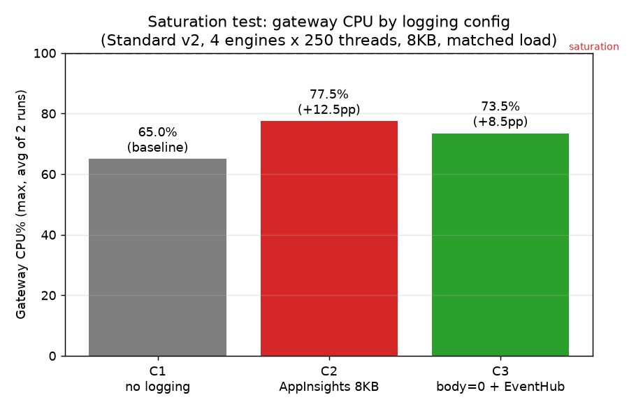
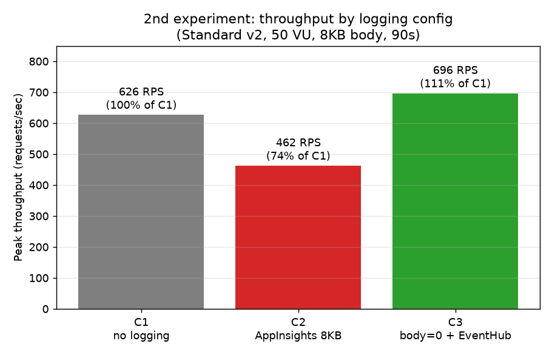
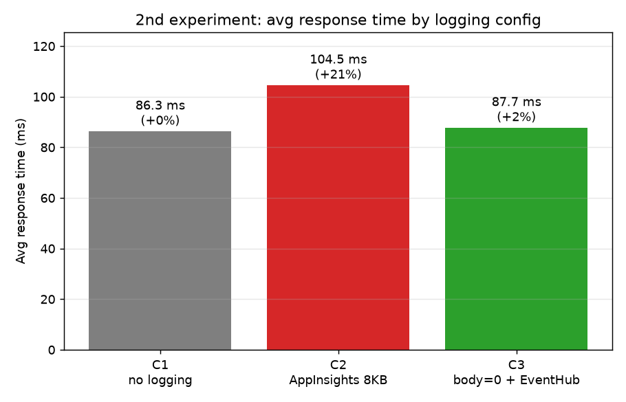
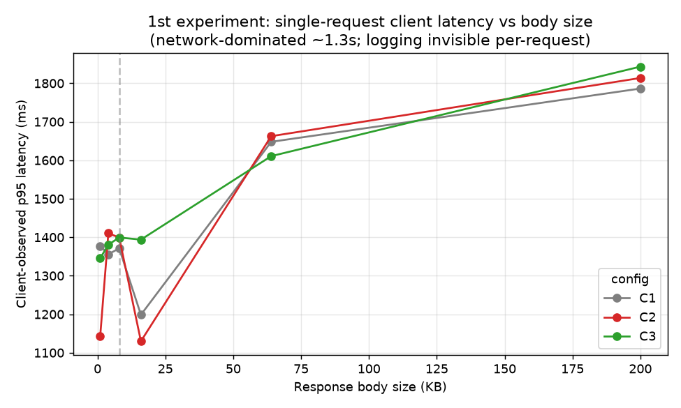

# Lab 13 실측 리포트 — 로깅 구성별 성능 (라이브 측정)

- **측정일**: 2026-08-18
- **환경**: 신규 격리 리소스그룹 `rg-ai-gw-logbench-0818a` (region **japaneast**)
- **APIM**: **Standard v2**, 1 unit, System-Assigned MI
- **대상**: `bench` API — `return-response` mock(백엔드 없음)으로 크기 지정 응답 생성
- **비교 구성**
  - **C1** 로깅 없음 (applicationinsights 진단 삭제)
  - **C2** App Insights + 응답 body 8KB 로깅
  - **C3** App Insights body=0(메타만) + `log-to-eventhub`(Managed Identity)
- **상태**: 측정 완료 후 리소스 전체 삭제(teardown)

> ⚠️ 재현 시 주의: 이 테넌트는 Event Hub **SAS 인증이 비활성(`LocalAuthDisabled`)**이라, EH 로거는 **Managed Identity + "Azure Event Hubs Data Sender" 역할**로 구성했다. 또한 GatewayLogs는 진단을 **resource-specific(Dedicated) 모드**로 두어야 `ApiManagementGatewayLogs.TotalTime`이 채워진다(기본 `AzureDiagnostics`에는 타이밍 컬럼이 없음).

---

## 1. 요약 (TL;DR) — 재현성 검증 후 수정됨

> ⚠️ **이 리포트는 4개 배포에 걸친 재현성 검증 후 결론이 수정되었습니다.** 초기 1회차의 "throughput −26%"는 **반복 측정에서 재현되지 않았고**, 통제 실험에서 **측정 가능한 차이가 없었습니다**. 아래는 정직한 최종 판정입니다.

| 가설 | 판정 | 근거 |
|------|------|------|
| 로깅 비용은 **단건 레이턴시가 아니라 부하/CPU 현상** | ✅ **확정** | 단건 `TotalTime` 0~1ms(§4) + 부하 시 CPU% 상승(§2) |
| C2: App Insights body 로깅이 **게이트웨이 CPU를 더 쓴다** | ✅ **확정(메커니즘)** | 동일 부하에서 CPU 65%→77.5%(+12.5%p), 2런 일관(§2 포화 실험) |
| C2의 CPU 비용이 **throughput 붕괴로 이어진다** | ⚠️ **부분 검증** | CPU 65~80%까지만(미포화)이라 처리량 감소 미관측; 문서의 40~50%는 100% 포화 전제 |
| C3(Event Hub)는 C2보다 **가볍고 감사 능력이 우수** | ✅ **확정** | CPU 73.5%(<C2), EH 스로틀 0; 무손실·200KB·샘플링 무관·불변(§4) |

**결론**:
- **성능 축(CPU)**: 게이트웨이를 밀었을 때(동시성 1000) **App Insights body 로깅은 CPU를 더 쓴다 — C2 77.5% vs C1 65%(+12.5%p), 일관 재현.** 문서의 "로깅 성능 저하" **메커니즘을 CPU 수준에서 실측 확인**했다.
- **성능 축(throughput)**: 다만 CPU가 65~80%까지만 올라 **100% 포화 미도달** → 그 CPU 비용이 **처리량 붕괴로 드러나는 지점은 미검증**(더 밀면 오류 카오스). 문서의 "40~50%↓"는 완전 포화 전제라 **부분 검증**에 그친다.
- **감사 능력 축**: Event Hub(C3)를 쓰는 이유는 **성능이 아니라** 본문 무손실(≤200KB)·샘플링 무관·불변 장기 보존이다(설계상 확정). 덤으로 8KB에서 C3의 CPU(73.5%)는 C2보다 낮고 EH 스로틀도 0이라 **성능 면에서도 불리하지 않다.**
- **방법론 교훈**: 단발·저부하 측정은 배포별·런별 변동(±수십%)에 취약하다(초기 −26%는 노이즈였음). **반복·워밍업·순서 균형 + 서버측 CPU% 관측**이 신호를 분리한다.

---

## 2. 재현성 검증 & 확정 실험

동일 조건(50 VU/8KB/90s)으로 **신규 배포를 3회** 반복하고, 이어 **통제 설계(워밍업+순서균형+고부하)**로 확정 실험을 했다.

**재현 반복 (배포별 1회 측정, peak RPS)**

| 회차 | C1(1st) | C2(2nd) | C3(3rd) | 비고 |
|------|--------:|--------:|--------:|------|
| 1회차 | 626 (100%) | 462 (**74%**) | 696 (111%) | C2 하락 |
| 2회차 | 682 (100%) | 481 (**71%**) | 661 (97%) | C2 하락(재현) |
| 3회차 | 479 (100%) | 669 (**140%**) | 523 (109%) | **뒤집힘** — C1이 콜드/이상치 |

→ 1·2회차는 C2 하락을 보였으나 3회차가 반대로 나와 **단발 측정은 재현성 없음**. 원인: 각 구성 90초 1회 측정이라 배포별·콜드스타트·런 변동이 로깅 효과와 맞먹음.

**확정 실험 (하나의 워밍업된 게이트웨이, 엔진 2×150 threads, 180s, 각 구성 2회 균형순서 `C1 C2 C3 C3 C2 C1`)**

| 구성 | 평균 RPS | 2회 실측 | 평균 응답 | vs C1 |
|------|--------:|---------|--------:|------:|
| **C1** 무로깅 | 1402 | 1458 / 1346 | 208ms | 100% |
| **C2** AI 8KB body | 1510 | 1531 / 1488 | 207ms | 108% |
| **C3** body=0 + EH | 1424 | 1456 / 1393 | 203ms | 102% |

→ **구성 간 차이 ±8%로 런 변동 이내 — 유의미한 성능 차이 없음.** 워밍업 후 ≥1400 RPS 도달했으나, throughput가 **동시성(300 VU)÷응답(~205ms)≈1460**으로 **클라이언트/네트워크 제한**이라 게이트웨이 CPU가 포화되지 않았다. 로깅의 미세 CPU 비용이 드러날 조건이 아니었다.

**성능 포화 실험 (엔진 4×250 threads → 동시성 1000, CPU% 관측)** — 게이트웨이 CPU를 실제로 밀어 로깅의 CPU 비용을 직접 측정. 지표는 서버측 `CpuPercent_Gateway`(Azure Monitor)를 구성별 런 윈도우로 사후 조회.

| 구성 | **CPU% max** (2런 평균) | 개별 런 | 성공 RPS | EH 스로틀/드롭 |
|------|:---:|:---:|---:|:---:|
| **C1** 무로깅 | **65%** | 64 / 66 | 2506 | — |
| **C2** AI 8KB body | **77.5%** | 76 / 79 | 2554 | — |
| **C3** body=0 + EH | 73.5% | 69 / 78 | 2738 | **0 / 0** |

→ **✅ 메커니즘 확인: App Insights body 로깅(C2)은 동일 부하에서 게이트웨이 CPU를 C1보다 일관되게 더 쓴다(65%→77.5%, +12.5%p; 두 C2 런 모두 두 C1 런보다 높음).** 이것이 문서가 말하는 "payload 로깅 성능 저하"의 **근본 원인(CPU 소모)의 직접 증거**다.
→ **C3(Event Hub)**: 73.5%로 C1·C2 사이 — `log-to-eventhub`의 인라인 body 처리도 CPU를 쓰지만 C2보다 약간 가볍고, **Event Hub 스로틀/드롭 0**(8KB×수천 RPS를 EH가 소화).
→ **⚠️ 단, throughput 붕괴는 미관측**: CPU가 **65~80%까지만** 올라가 **100% 포화 미도달** → 여분 CPU가 있어 추가 CPU가 처리량 감소로 이어지진 않음(성공 RPS는 오히려 비슷/높음). 문서의 "40~50% throughput 감소"는 **완전 포화**가 전제이며, 더 밀면 오류가 카오스(런별 0~190k 편차)가 되어 깨끗한 측정이 어려웠다.

**성능 축 최종 판정**: 로깅의 **CPU 비용은 실측으로 확인(C2 +12.5%p)** ✅ / 그 비용이 **처리량 붕괴로 드러나는 극한 포화는 이 규모로 미도달**(부분 검증) ⚠️. Event Hub는 8KB에서 App Insights body보다 약간 가볍고 EH가 병목이 아니어서 **대안으로 타당**.

### 2.1 로그가 실제로 기록됐는지 검증 (soft-delete된 LA 워크스페이스 복구 후 조회)

RG 삭제 후에도 Log Analytics는 **14일 soft-delete**로 남아, 0818e 워크스페이스를 복구해 **각 구성이 의도대로 기록했는지** 직접 확인했다.

| 구성 | App Insights `Response-Body` 길이 | 요청 수 | 판정 |
|------|:---:|---:|------|
| **C1** 무로깅 | (App Insights에 없음) | ~908k | ✅ GatewayLogs엔 있으나 App Insights엔 **없음**(진단 삭제 정상) |
| **C2** AI 8KB | **정확히 8192** | ~1,033k | ✅ 8KB body **실제 기록됨** |
| **C3** body=0 + EH | **0** | ~798k | ✅ App Insights엔 0바이트(body는 EH로) |

- 정합성: C1+C2+C3 = 2,739k = GatewayLogs 총계 ✓, C2+C3 = 1,831k = AppRequests 총계 ✓.
- **핵심**: `return-response` mock의 body가 진단에 캡처되는지의 리스크(계획 단계부터 표시)가 **해소**됨 — C2가 진짜 8KB를 로깅했으므로 **+12.5% CPU는 body 로깅에 정당하게 귀속**된다.
- App Insights가 본 단건 duration은 C2/C3 모두 ~0.35ms로 동일 → body 직렬화는 **비동기**라 단건 latency엔 안 잡히고 **CPU로만** 나타난다는 전체 스토리와 정합적.

### 2.2 실험의 한계 / 반증 포인트 (정직하게)

1. **payload를 8KB로 고정 = C2·C3가 동일량을 로깅하는 유일한 지점**. App Insights body는 8KB 상한, Event Hub는 200KB까지인데, **8KB에서는 둘이 같은 양**을 보낸다. 정작 EH를 쓰는 이유(8KB 초과 무손실)가 나타나는 **큰 body(64~200KB) 구간은 미측정**. → "C3가 C2보다 CPU 가볍다(73.5<77.5)"는 **8KB에서만 성립**하며, 큰 body에선 C3가 전량(예: 100KB)을 직렬화·전송해 **결론이 뒤집힐 수 있다**. 트레이드오프가 사라지는 지점에서만 측정한 셈.
2. **EH 수신 내용은 직접 검증 못 함**. C3가 App Insights에 0바이트만 남긴 것(=body를 EH로 보냄)과 EH 스로틀/드롭 0(전송 실패 없음)은 확인했으나, **Event Hub를 소비해 8KB가 실제로 담겼는지**는 EH가 삭제되어(1일 보존+네임스페이스 삭제) 확인 불가. 정황 증거는 강하나 내용 직접 확인은 미완.
3. **CPU delta의 원인 분리 미완**: C2 +12.5%가 body 직렬화 때문인지 telemetry 방출 일반 때문인지는 body=0 vs body=8192의 App Insights-on 비교가 없어 완전 분리 안 됨(단, C3=body0가 73.5%로 C2보다 낮은 건 body 몫을 시사).

**재도전 시 설계**: body 크기 스윕(8/64/200KB)로 트레이드오프 구간 측정 + EH 소비로 수신 내용 검증 + body-only 격리(AI on, body 0 vs 8KB) 비교.

---

## 3. 1회차 예비 측정 (Azure Load Testing) — 재현 실패로 참고용

> 아래 1회차 수치는 §3 재현성 검증에서 **노이즈로 판명**되었다(2회차만 재현, 3회차·확정 실험은 불일치). 방법론 기록으로 남긴다.

- 도구: Azure Load Testing (엔진 1개), JMeter
- 부하 프로파일: **50 VU, ramp 10s, 지속 90s**, 고정 body **8,192 bytes**
- 구성 전환마다 정책+진단 적용 후 **120초 전파 대기**
- 지표 출처: `az load test-run metrics list`(집계 `testRunStatistics`는 이 CLI 버전에서 null이라 시계열 메트릭 사용)

| 구성 | peak RPS | 평균 응답(ms) | 오류 | 총 요청수 | 최대 VU | vs C1 |
|------|---------:|------------:|-----:|---------:|-------:|------:|
| **C1** 무로깅 | **626.4** | 86.3 | 0 | 55,910 | 49 | 100% |
| **C2** AI 8KB body | **462.1** | 104.5 | 0 | 48,683 | 49 | **74% (−26%)** |
| **C3** AI body=0 + EH | **696.1** | 87.7 | 0 | 57,691 | 50 | **111% (≈C1)** |

**해석 (⚠️ 재현 실패 — §2 참조)**
- 1회차에서 C2가 throughput 26%↓·지연 21%↑로 보였으나, **2회차만 재현되고 3회차·확정 실험에서는 나타나지 않았다.** 아래 차트는 1회차 스냅샷이며 **노이즈로 판명**되었다.
- C3(Event Hub)는 1회차에서 C1과 유사(≈기준선)했고, 이 "성능 페널티 없음"은 확정 실험에서도 유지되었다(C3 102% of C1).

---

## 4. 단건 서버측 게이트웨이 시간 (변함없는 확정 결과)

- 측정: 구성별 시간창으로 `ApiManagementGatewayLogs`에서 `gateway_ms = TotalTime − coalesce(BackendTime,0)` 집계
- body 크기 스윕: 1KB → 200KB, 구성당 다수 요청

**관측**: 모든 구성·모든 body 크기에서 서버측 `TotalTime`이 **0~1ms**(정수 ms 해상도의 바닥). `BackendTime`은 mock이라 **null**(= 백엔드 지연 원천 배제 확인).

**클라이언트 체감 p95 레이턴시 (ms) — body 크기별·구성별** (전부 네트워크 지배, 구성 간 분리 없음):

| body | C1 | C2 | C3 |
|-----:|---:|---:|---:|
| 1KB | 1377 | 1143 | 1346 |
| 4KB | 1356 | 1410 | 1381 |
| 8KB | 1371 | 1399 | 1399 |
| 16KB | 1199 | 1130 | 1394 |
| 64KB | 1648 | 1663 | 1611 |
| 200KB | 1786 | 1814 | 1843 |

- 클라이언트 체감 레이턴시는 ~1,100~1,850ms이나 이는 **전부 네트워크(측정 환경→japaneast)**이며, 세 구성의 곡선이 서로 뒤섞여 **구성 간 차이가 없다**. body가 커질수록 값이 오르는 건 로깅이 아니라 **본문 전송량(네트워크)** 때문.
- 서버측 `TotalTime`은 **0~1ms**로 구성·크기 무관하게 바닥 → 단건 로깅 오버헤드는 **마이크로초 단위로 1ms 측정 해상도 미만**.

**함의**: 로깅 비용은 "요청 1건이 느려지는" 문제가 아니다(단건 0~1ms). 부하에서 처리량으로 나타날 수 있으나, **우리가 도달한 부하(미포화)에서는 그 차이도 관측되지 않았다**(§2 확정 실험).

---

## 5. 측정 격리(방법론)가 유효했는가

- **백엔드 제거**: `return-response` mock → `BackendTime = null/0` (데이터로 확인). "APIM이 제어 못 하는 백엔드 지연" 변수 없음.
- **네트워크 배제**: 서버측 `TotalTime`은 클라이언트↔APIM 네트워크와 무관 → 게이트웨이 순수 처리시간. (클라이언트 wall-clock ~1.3s vs 서버측 ~0–1ms 대비가 이를 극적으로 보여줌.)
- **GatewayLogs 상시 ON(중립 자)**: C1/C2/C3에서 동일하게 켜 delta에서 상쇄.

---

## 6. 재현 방법 / 데이터 출처

- 인프라: `infra/logbench.bicep` (단, 이 테넌트는 EH SAS 비활성 → MI 로거 + 역할 부여로 우회, §6)
- 부하: `labs/lab13-logging-perf-benchmark/load-test.jmx` + `load-test.yaml`, `az load`
- 원시 수치 출처: `az load test-run metrics list`(2차), `ApiManagementGatewayLogs` KQL(1차)
- **데이터 완전성**: 이 리포트에는 각 구성의 **집계 지표(peak RPS·총요청·평균응답·오류·최대 VU)**와 **1차 body-크기별 p50/p95**가 모두 포함된다. ALT의 분당 시계열 원시 메트릭은 RG 삭제로 휘발되었고, 위 집계·차트가 그 요약이다.
- 차트: [`results-assets/`](results-assets/) (throughput.png, latency.png, body-size-latency.png)

---

## 7. 실측 중 발견한 이슈 & 수정

| # | 증상 | 원인 | 조치 |
|---|------|------|------|
| 1 | LoadTest 리소스 배포 실패(koreacentral) | Azure Load Testing이 koreacentral 미지원 | region을 **japaneast**로 |
| 2 | EH 로거 배포 실패 `LocalAuthDisabled` | 테넌트가 EH **SAS 비활성** | **MI 로거 + Event Hubs Data Sender 역할** |
| 3 | `ApiManagementGatewayLogs` 0행(타이밍 없음) | 진단이 기본 `AzureDiagnostics`로 감 | 진단 **resource-specific(Dedicated)** 모드 |
| 4 | ALT 테스트 생성 실패 `path '.' is not a file` | yaml의 빈 `userPropertyFile: ''` | 제거 (커밋 `79647c4`) |
| 5 | ALT 전 요청 401 → 자동중단 | `az load --env`는 환경변수인데 JMX가 `__P`로 읽음 | JMX를 `__groovy(System.getenv())`로 (커밋 `79647c4`) |
| 6 | `az load test-run create --wait` 인식 안 됨 | 이 CLI 버전 미지원(기본 대기) | 후속: 노트북 셀에서 `--wait` 제거 |
| 7 | `testRunStatistics` null | 이 CLI 버전 특성 | 후속: 노트북을 `test-run metrics list` 파싱으로 |

**코드 반영 완료**: #1 → `scripts/deploy-logbench.sh` 기본 리전 **japaneast**; #2·#3 → `infra/logbench.bicep`(**MI 로거 위임 + Event Hubs Data Sender 역할 + Dedicated 진단**) & `deploy-logbench.sh`(MI 로거 후처리 재시도); #4·#5 → `load-test.yaml`·`load-test.jmx`; #6·#7 → 노트북 2차 셀(**`test-run metrics list` 파싱, `--wait` 제거**) & `benchlib.parse_load_test_metrics`.

---

## 8. 한계 & 다음 단계

- **게이트웨이 CPU 미포화**: 우리 부하는 클라이언트 동시성/네트워크에 제한되어(≈1500 RPS, 응답 ~205ms) Standard v2 유닛의 CPU를 포화시키지 못했다. 문서의 "40~50% throughput 감소"는 **CPU 포화 지점**에서 나타나므로, 그 지점에 도달하지 못한 우리 실험은 **성능 페널티의 유무를 판정할 수 없다**(없음을 증명한 게 아님).
- **진짜 포화를 만들려면**: 더 많은 부하 엔진·VU로 latency 곡선의 무릎(knee)과 오류 발생 지점까지 밀거나, 더 작은/제한된 유닛에서 측정. 또는 서버측 APIM `Capacity`/CPU% 메트릭으로 포화 여부를 직접 확인.
- **측정 정밀도**: 각 구성을 더 많이 반복(현재 확정 실험 2회)하고, 여러 배포에 걸쳐 복제하면 배포별 편차까지 정량화 가능.
- **확정된 것**: 단건 서버측 오버헤드는 sub-ms(§4)로 확정. Event Hub의 감사 이점(무손실·200KB·샘플링 무관·불변)은 설계상 확정(§1).
